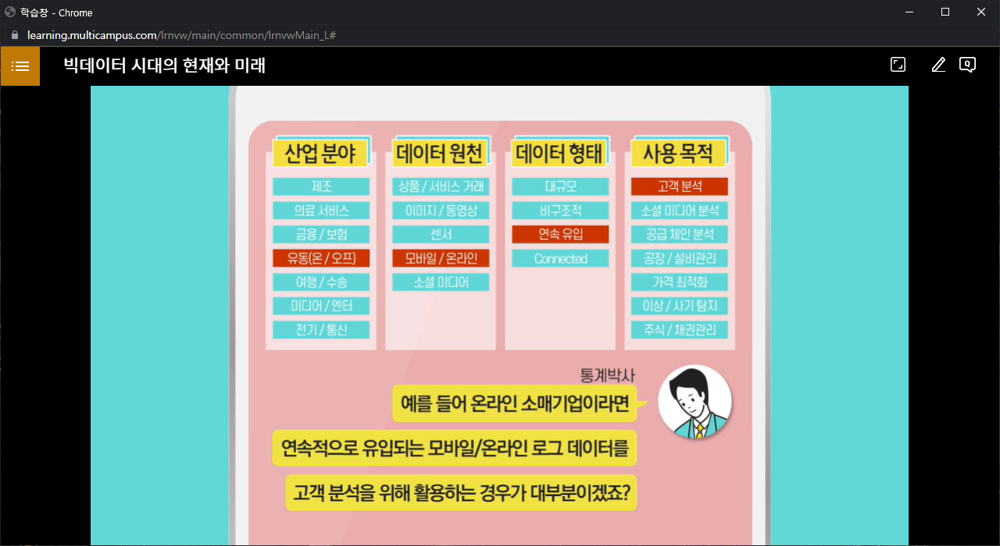

# 빅데이터가 별건가, 알고보면 쉬운 통계상식

### 1. 빅데이터 시대의 현재와 미래

- 데이터가 곧 자본이다(나에게 필요한 자료 분류 필요)

- 기업은 데이터를 어떤일이 왜 발생하였는지를 분석하는데 사용 -> 기계학습(머신러닝, 인공지능)

- 머신 러닝 : 명시적으로 프로그래밍을 하지 않고도 컴퓨터가 데이터 속에서 학습하는 능력

- 빅데이터를 이용한 경쟁우위 선점
- 데이터에 바탕을 둔 사실에 근거한 의사결정

- 데이터를 적극적으로 활용해야 장기적으로 오래 감

- 디지타이징 비즈니스 : 사업을 디지털화하여 혁신을 이뤄야함.
- 빅데이터 5대 핵심기술 : 소셜, 모바일, 사물 인터넷, 클라우드, 인공지능

- 우리는 신이 아닌 이상 모든 일에 근거(데이터)를 제시해야한다.

- 빅데이터 활용(제조,의료서비스,금융/보험, 유동, 여행 수성, 미디어/엔터. 전기/통신)

### 2. 분석, 빅데이터 시대 필수 역량

- 문제 인식과 관련 연구 조사
- 현대의 문맹 - 수맹 : 숫자에 두려움을 갖는 것.
- 현대인의 필요 역량 : 숫자와 통계를 기반으로 하는 분석능력이 반드시 필요함
- 관련 자료를 수집하고 분석해서 필요한 정보를 추출할 수 있는 능력 필요
- 이런 계량적인 정보를 얼마나 능숙하게 다룰 수 있는가

- 변수 : 사람, 상황, 행위 등의 속성을 나타낼 수 있는 대응물
- 자료(Data) : 변수들의 측정치를 모은것
- 나열된 자료에서 변수 사이의 규칙적인 패턴, 즉 변수 간 관련성을 파악하는 단계를 무엇이라 하는가

| ''분석''의 6단계   | 내용                                                         |
| ------------------ | ------------------------------------------------------------ |
| 문제인식           | 문제를 인식하고 그것을 해결하려는 것                         |
| 관련 연구 조사     | 문제와 직 간접적으로 관련된 지식을 문헌등을 통해 조사        |
| 모형화(변수선정)   | 기존 연구 결과를 그대로 적용할지, 아니면 다른 방법을 사용할지.  변수의 선정은 그 변수가 문제 해결에 직접적인 관련이 있는지를 확인 |
| 자료수집(변수측정) | 변수들의 측정치를 모은 것                                    |
| 자료 분석          | 나열된 자료에서 변수 사이의 규칙적인 패턴, 즉 변수 간 관련성을 파악 |
| 결론 도출          | 데이터를 통한 자료 분석 -> 올바른 결론 도출                  |
