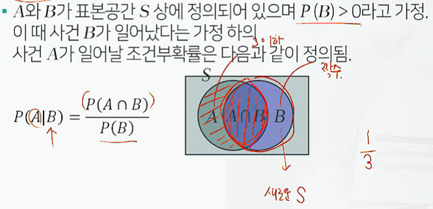

# 2. [ProDS] 통계 이론 및 데이터 시각화

## 1.  확률의 개념과 특징

**확률개념, 확률정의, 확률규직, 여사건, 곱사건, 합사건, 조건부확률, 독립사건**

- 통계학 : 데이터에 담겨진 표면적인 정보를 정확히 요약, 내면에 담긴 의미를 추론 해석하기 위한 학문(데이터의 행간을 파악)

- 모수 : 미지의 정보(후보자의 지지율, 불량률을 온도나 습도로 설명, 다른 변수들과의 관계, 모형을 통해 정의되는 관계)

- 불확실하지만 의사결정에 중요한 모수, 과학적 예측 가능

- 통계적 추론 : 관심 대상을 파악하기 위해 일부의 정보만을 이용

- 확률 : 어떤 사건이 발생할 가능성을 0에서 1사이의 숫자로 표현한 것.

- 확률모형 : 시행을 반복할 때마다 나오는 결과가 우연에 의존하여 매번 달라지는 현상.

- 표본공간 : 확률 실험에서의 모든 관찰 가능한 결과의 집합, S로 표기

  - 동전 **S** = {앞면, 뒷면}, 주사위 S = {1,2,3,4,5,6}

- 사건 : 표본공간의 임의의 부분집합 , A,B 등으로 표기

  - 주사위의 짝수가 나오는 사건 **A** = {2,4,6}
  - 주사위 짝수가 나올 확률 **P[A]** = 3/6

- 고전적 접근(라플라스 정의)

  - n개의 실험결과로 구성된 표본공간에서 각 실험결과가 일어날 가능성이 같은 경우(유한한 경우), m(m<=n) 개의 실험 결과로 구성된 사건 A의 확률을 아래와 같이 정의함.
  - P(A) = m/n

- 상대적 비율에 의한 접근(Richard Von Mises)

  - n번의 반복된 실험 중 어떤 사건 A가 발생한 횟수를 m이라고 할 때, 사건 A의 상대빈도는 m/n 으로 구해짐.
  - 이 실험의 반복 횟수 n을 무한히 증가했을 때, 사건 A의 상대빈도수가 수렴하는 값을 사건 A의 확률로 정의하고자함.

- 확률의 공리

  

  - 상호배반 : 동시발생할 수 없는 상황, 따라서 합사건은 1

- 확률의 규칙(여사건, 곱사건, 합사건)

- 조건부 확률의 정의
  - A와 B가 표본공간 S상에 정의되어 있으며 P(B) > 0 라고 가정.
  - 이 때 사건 B가 일어났다는 가정 하의 사건 A가 일어날 조건부 확률은 다음과 같이 정의됨.
  - 

- 독립사건의 정의
  - 동전을 던지는 실험과 주사위를 동전을 던지는 실험 결과는 서로 영향을 주지 않음.

## 2. 베이즈 정리

분할, 전확률 공식, 베이즈정리

- 베이즈 정리 : 데이터라는 조건이 주어졌을 때의 조건부확률을 구하는 공식, 결과가 주어있을 때 원인인 확률

- 표본공간의 분할 : 

- S : 전체표본분할, B1,B2,B3 = 중복이 없는 원인(동시발생하지 않음 = 상호배반)

- 전확률공식 

- A의 확률은 A와 B끼리 각각 발생하는 교집합의 합과 같다.(역시 상호배반)
- A와 B의 곱사건의 확률의 합 = A

- 예시

- 결과가 주어졌을 때, 원인을 환산하는 계산
- 답 : 0.3703

