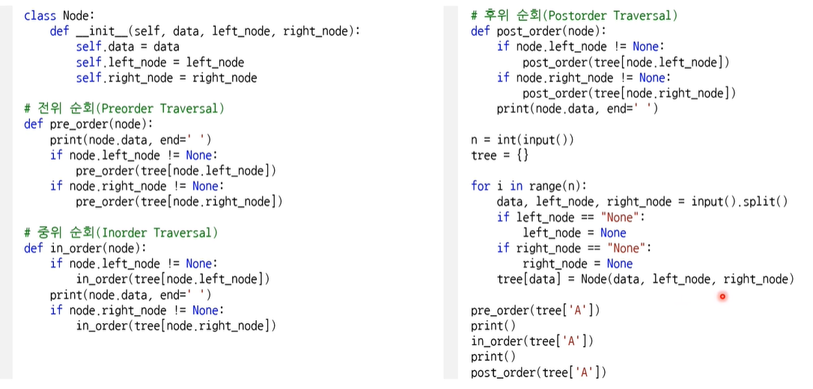
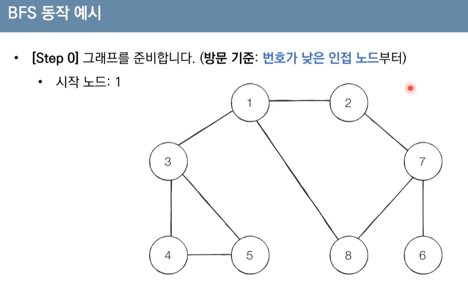
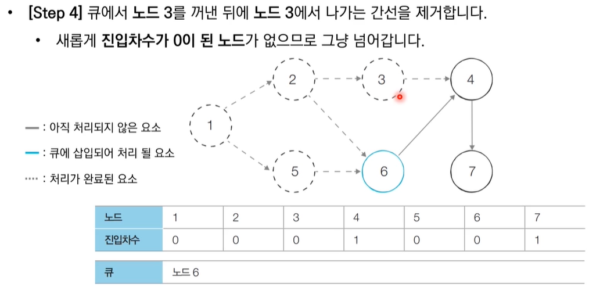
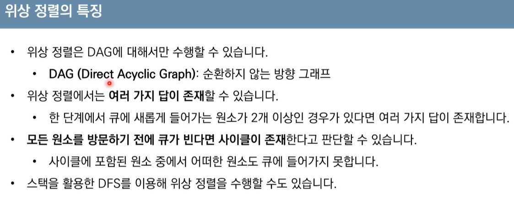
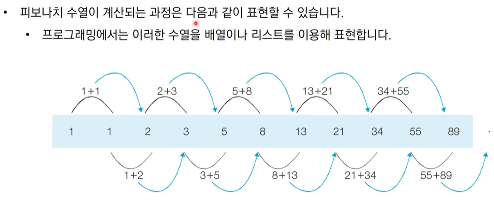
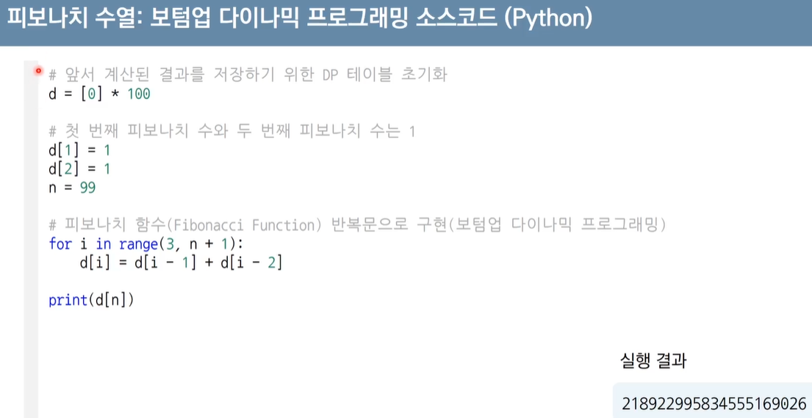
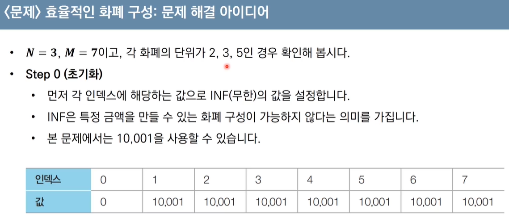
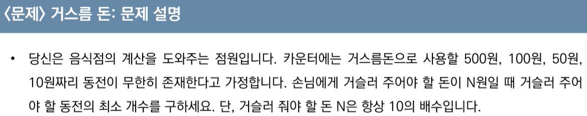
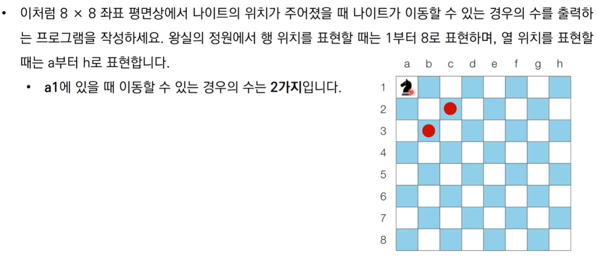
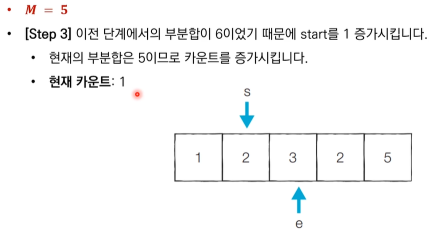

# 최적의 코딩을 결정하는 기본 알고리즘 (멀티캠퍼스 이러닝) - 나동빈


## 1. 가장 기본이 되는 자료구조 : 스택과 큐

- 먼저 들어 온 데이터가 나중에 나가는 형식(선입후출)의 자료구조
- 입구와 출구가 동일한 형태로 스택을 시각화할 수 있습니다.
- 스택 동작 예시
  - 삽입5- 삽입2 - 삽입3 - 삽입7 - 삭제() - 삽입(1) - 삽입(4) - 삭제()

- ```
  # 파이썬에서는 리스트 자료를 이용하여 스택 구현이 가능
  
  stack=[]
  stack.append(5)
  stack.append(2)
  stack.append(3)
  stack.append(7)
  stack.pop()
  stack.append(1)
  stack.append(4)
  stack.pop()
  
  print(stack[::-1])  # 최상단 원소부터 출력
  print(stack)        # 최하단 원소부터 출력
  
  
  [1,3,2,5]
  [5,2,3,1]
  ```

- 큐 자료구조
  - 먼저 들어 온 데이터가 먼저 나가는 형식(선입선출)의 자료구조.
  - 큐는 입구와 출구가 모두 뚫려있는 터널과 같은 형태로 시각화 할 수있음.(은행창구에서 대기하는 사람들)


- 큐 동작 예시


- 큐 구현 예제(파이썬)

- ```
  from collections import deque (효율을 높이기 위함)
  
  ```


- append, popleft

- deque(덱)을 이용해서 불러오는게 더 빠르다


## 2. 우선순위에 따라 데이터를 꺼내는 자료구조

- 우선순위큐 : 우선순위가 가장 높은 데이터를 가장 먼저 삭제하는 자료구조

- 우선순위 큐는 데이터를 우선순위에 따라 처리하고 싶을 때 사용합니다.

  - 예시) 물건 데이터를 자료구조에 넣었다가 가치가 높은 물건부터 꺼내서 확인해야 하는 경우

    | 자료구조    | 추출되는데이터             |
    | ----------- | -------------------------- |
    | 스택        | 가장나중에 삽입된 데이터   |
    | 큐 (Queue)  | 가장 먼저 삽입된 데이터    |
    | 우선순위 큐 | 가장 우선순위가 높은데이터 |

- 우선순위 큐를 구현하는 방법
  - 단순히 리스트를 이용하여 구현
  - 힙(Heap) 을 이용하여 구현할 수 있음
- 단순히 N개의 데이터를 힙에 넣었다가 모두 꺼내는 작업은 정렬과 통일 ( 힙 정렬 )
  - 이 경우 시간 복잡도는 O(NlogN) 입니다.
- 힙(Heap) 의 특징
  - 힙은 완전 이진 트리 자료구조의 일종
  - 힙은 항상 루트 노드(root node) 를 제거합니다.

- 최소 힙 
  - 루트 노드가 가장 작은 값을 가집니다
  - 따라서 가장 작은 데이터가 우선적으로 제거됩니다
- 최대 힙
  - 루트 노드가 가장 큰 값을 가집니다
  - 따라서 값이 큰 데이터가 우선적으로 제거됩니다
- 완전 이진 트리


- 최소 힙 구성 함수 : Min-Heapify()
- 힙 구성 함수를 실행하면 왼쪽에서 오른쪽 예씨로 변경됨


 


- 우선순위 큐 라이브러리를 활용한 힙 정렬 구현 예제 (파이썬)
  - 파이썬의 경우 기본적으로 Min_heap 이 제공됨.
  - Max_heap 을 원할 경우 결과코드에 - 를 붙여 작동하게 할 수 있음.


## 3. 활용도가 높은 자료구조 : 트리 자료구조

### 트리

- 트리는 가계도와 같은 계층적인 구조를 표현할 때 사용할 수 있는 자료구조.


- 루트 노드 : A
- 단말 노드 : E , F, G
- A 노드의 깊이는 0, B와C 의 깊이는 1, D,E,F 의 깊이는 2 , G의 깊이는 3이다.
- 3의 깊이를 가진 G 가 가장 높다고 볼 수 있다
- A의 차수는 2 (선 갯수) , B,C 의 차누는 2, D 는 1
- 트리의 포함되어있는 노드의 수가 7개이므로, 전체 간선의 개수는 6개임

### 이진 탐색 트리


- 이진 탐색트리에서 자료를 조회하는 과정

- 찾고자 하는 원소 : 37

- [Step1] 루트 노드부터 탐색을 진행 -> 30 (우리가 찾는 값은 37 이므로 찾는 원소가 더 크므로 오른쪽)

- [Step2] 현재 노드 값과 비교. 48과 비교해서 37은 더 작으므로 왼쪽 방문 (오른쪽은 확인할 필요 없음)

- 이상 적인 경우에만 빠른 탐색이 가능, 왼쪽과 오른쪽의 노드 양이 같아야함.

  

### 트리의 순회

- 트리 자료구조에 포함된 노드를 특정한 방법으로 한번씩 방문하는 방법
  - 트리의 정보를 시각적으로 확인할 수 있음
- 대표적인 트리 순회 방법은ㅇ 다음과 같음
  - 전위 순회(pre-order traverse)  : 루트를 먼저 방문
  - 중위순회(in-order traverse) : 왼쪽 자식을 방문한 뒤에 루트를 방문합니다
  - 후위 순회(post-order traverse) : 오른쪽 자식을 방문한 뒤에 루트를 방문합니다.


## 트리의 순회(Tree Traversal) 구현 예제 (파이썬)



- 이를 코딩하여 입력하면 위 그림의 [입력예시] 결과값이 도출된다.


## 4. 바이너리 인덱스 트리(파이썬)

- 데이터 업데이트가 가능한 상황에서의 구간 합 (Interval Sum) 문제


- 이 때 바이너리 인덱스 트리는 2진법 인덱스 구조를 활용해 구간 합 문제를 효과적으로 해결해 줄 수 있는 자료구조를 의미합니다. (펜윅트리)

- K&-K 계산 결과 예시

- ```python
  n=8
  for i in range(n+1):
      print(i,"의 마지막비트:", (i&-i))
  ```

  

  


## 5. 간단하면서 기본적인 정렬 알고리즘 : 선택정렬과 삽입 정렬

- 정렬 : 데이터를 특정한 기준에 따라 순서대로 나열하는 것
- 일반적으로 문제 상황에 따라서 적절한 정렬 알고리즘이 공식처럼 사용.
- 선택정렬
  - 처리되지 않은 데이터 중에서 가장 작은 데이터를 '선택'해 맨 앞에 있는 데이터와 바꾸는 것을 반복

- 7 5 9 0 3 1 6 2 4 8 의 카드를 어떻게 정렬할 것인가?
  - 가장 작은 데이터 0을 선택해 가장 앞의 7과 자리를 바꿈
- 0 5 9 7 3 1 6 2 4 8
  - 1을 선택한 이후 앞의 5와 자리를 바꿈
- 0 1 9 7 3 5 6 2 4 8 
  - 가장 작은 숫자 2 와 9를 바꿈
- 이러한 방식을 반복
  - 0 1 2 3 4 5 6 7 8 9

- 탐색 범위는 계속 줄어듦. (매번 선형 탐색을 실행)

- ```python
  # 선택정렬 소스코드(파이썬)
  
  array = [7, 5, 9, 0, 3, 1, 6, 2, 4, 8]
  
  for i in range(len(array)):
      min_index = i  # 가장 작은 원소의 인덱스
      for j in range(i+1, len(array)):
          if array[min_index] > array [j]:
              min_index = j
      array[i], array[min_index] = array[min_index], array[i]   # 스와프
  print(array)
  
  
  [0, 1, 2, 3, 4, 5, 6, 7, 8, 9]
  
  ```

- 선택 정렬의 시간 복잡도

  - 선택 정렬은 N번 만큼 가장 작은 수를 찾아서 맨 앞으로 보내야 합니다
  - 구현 방식에 따라서 사소한 오차는 있을 수 있지만, 전체 연산 횟수는 다음과 같습니다.
  - N+(N-1)+(N-2)+...+2
  - 이는 (N^2+N-2)/2 로 표현할 수 있는데,(1/2 는 삭제되고, 가장 높은 차수만 고려되므로) 빅오 표기법에 따라서 O(N^2)이라고 작성합니다

- 삽입 정렬

  - 처리되지 않은 데이터를 하나씩 골라 적절한 위치에 삽입합니다.
  - 선택 정렬에 비해 구현 난이도가 높은 편이지만, 일반적으로 더 효율적으로 동작합니다.
  - 7 5 9 0 3 1 6 2 4 8 의 카드가 있을 때, 첫번째 데이터 '7'은 그 자체로 정렬되어 있다고 판단하고, 두번째 데이터인 5가 어떤 위치로 들어갈지 판단. 7의 왼쪽으로 들어가거나 오른쪽으로 들어가거나 두 경우만 존재
  - 이를 계속 반복

- ```python
  array = [7,5,9,0,3,1,6,2,4,8]
  
  for i in range(1,len(array)):
      for j in range(i,0,-1):  # 인덱스 i부터 1까지 1씩 감소하며 반복하는 문법
          if array[j] < array[j -1] :  # 한 칸씩 왼쪽으로 이동
              array[j], array[j -1] = array[j - 1], array[j]\
          else :    # 자기보다 작은 데이터를 만나면 그 위치에서 멈춤
              break
  print(array)
  
  [0,1,2,3,4,5,6,7,8,9]
  ```

- 삽입 정렬의 시간 복잡도

  - 삽입 정렬의 시간 복잡도는 O(N^2)이며, 선택 정렬과 마찬가지로 반복문이 두 번 중ㅇ첩되어 사용됩니다.
  - 삽입 정렬은 현재 리스트의 데이터가 거의 정렬되어 있는 상태라면 매우 빠르게 동작합니다.
    - 최선의 경우 O(N)의 시간 복잡도를 가집니다
    - 이미 정렬되어 있는 상태에서 다시 삽입 정렬을 수행하면 어떻게 되는가?
    - 매우 빠른 속도로 처리됨.


## 6. 퀵 정렬

- 기준 데이터를 설정하고 그 기준보다 큰 데이터와 작은 데이터의 위치를 바꾸는 방법
- 일반적인 상황에서 가장 많이 사용되는 정렬 알고리즘 중 하나
- 병합 정렬과 더불어 대부분의 프로그래밍 언어의 정렬 라이브러리의 근간이 되는 알고리즘
- 가장 기본적인 퀵 정렬은 첫 번째 데이터를 기준 데이터(Pivot) 로 설정

- 5 7 9 0 3 1 6 2 4 8 의 카드가 있을 떄, 처음 가장왼쪽 5의 카드를 기준(Pivot)으로 잡고 왼쪽에는 5보다 작은값, 오른쪽엔 5보다 큰값으로 데이터를 분류함. 이를 '분할'이라고 함. 이후 왼쪽, 오른쪽으로 나누어 정렬을 수행.
- (왼쪽에서부터는 큰값을 찾고, 오른쪽에서부터는 작은 값을 찾음)

- 퀵정렬이 빠른 이유는?
  - 이상적인 경우 분할이 절반씩 일어난다면 전체 연산 횟수로 0(NlogN) 을 기대할 수 있다,
  - 너비 x 높이 = N x log N = NlogN


- 퀵 정렬의 시간 복잡도
  - 퀵 정렬은 평균의 경우 O(NlogN) 의 시간 복잡도를  가짐 (수학적으로 증명)
  - 하지만 최악의 경우 O (N ^2) 의 시간 복잡도를 가짐.
    - 첫 번째 원소를 피벗으로 삼을 때, 이미 정렬된 배열에 대해서 퀵 정렬을 수행하면 어떻게 될까요?


- 계수 정렬
  - 특정한 조건이 부합할 때만 사용할 수 있지만 매우 빠르게 동작하는 정렬 알고리즘
    - 계수 정렬은 ㄷ에이터의 크기 범위가 제한되어 정수 형태로 표현할 수 있을 때 사용 가능
  - 데이터의 개수가 N, 데이터(양수) 중 최대값이 K  일 때 최악의 경우에도 수행 시간 O(N+K) 를 보장합니다.


- 이 후 개수는 2 2 2 1 1 2 1 1 2 로 채워짐.
- 출력 결과 : 0 0 1 1 2 2 3 4 55 6 7 8 9 9 (각각의 카운트가 몇번 씩 등장하였는가?) 


- 계수 정렬의 시간 복잡도와 공간 복잡도는 모두 0(N+K) 입니다
- 계수 정렬은 때에 따라서 심각한 비효율성을 초래할 수 있습니다.
  - 데이터가 0과 999,999로 단 2개만 존재하는 경우를 생각해 봅시다.
- 계수 정렬은 동일한 값을 가지는 데이터가 여러 개 등장할 때 효과적으로 사용할 수 있습니다
  - 성적의 경우 100점을 맞은 학생이 여러 명일 수 있기 때문에 계수 정렬이 효과적입니다.


## 7. 정렬 알고리즘 비교하기


- 문제 : 두 배열의 원소 교체 : 문제 설명
  - 동빈이는 두 개의 배열 A 와 B를 가지고 있습니다. 두 배열은 N 개의 원소로 구성되어 있으며, 배열의 원소는 모두 자연수입니다.
  - 동빈이는 최대 K 번의 바꿔치기 연산을 수행할 수 있는데 ,바꿔치기 연산이라 배열  A에 있는 원소 하나와 배열 B에 있는 원소 하나를 골라서 두 원소를 서로 바꾸는 것을 말합니다.
  - 동빈이의 최종 목표는 배열 A의 모든 원소의 합이 최대가 되도록 하는 것이며, 여러분은 동빈이를 도와야 합니다.
  - N,K, 그리고 배열 A와 B의 정보가 주어졌을 때, 최대 K 번의 바꿔치기 연산을 수행하여 만들 수 있는 배열 A의 모든 원소의 합의 최댓값을 출력하는 프로그램을 작성하세요.
  - 


 


## 8. DFS (Depth-First Search)

- DFS 는 깊이 우선 탐색이라고도 부르며 그래프에서 깊은 부분을 우선적으로 탐색하는 알고리즘.
- 스택자료구조(혹은 재귀 함수)의 구체적인 동작과정
  - 탐색시작노드를 스택에 삽입하고 방문처리를 함
  - 스택의 최상단 노드에 방문하지 않은 인접한 노드가 하나라도 있으면 그 노드를 스택에 넣고 방문 처리. 방문하지 않은 인접 노드가 없으면 스택에서 최상단 노드를 꺼냄
  - 더 이상 2번의 과정을 수행할 수 없을 때까지 반복.
- 예시
- 

- 1을 방문
- 1에 방문하지 않은 인접 노드 2,3,8 이 있고 가장작은 노드 2에 스택을 넣고 방문 처리.
- 2를 기준으로 방문하지 않은 노드 7을 스택에 넣고 방문처리.
- 7을 기준, 6,8 중 작은 노드 6을 방문 처리
- 더 이상 들어갈 수 없다면 6을 스택에서 꺼낸 뒤 7에서 방문하지 않은 8을 방문처리
- 이러한 순서를 반복하면 1 2 7 6 8 3 4 5 순으로 방문.


- BFS (Breadth - First Search)
  - 대기업 문제, 특정 최단 거리 문제 해결에 자주 사용.
  - 너비 우선 탐색이라고 부르며, 그래프에서 가까운 노드부터 우선적으로 탐색하는 알고리즘
  - 큐 자료구조를 이용하며
    - 탐색 시작 노드를 큐에 삽입하고 방문처리를 함
    - 큐에서 노드를 꺼낸 뒤에 해당 노드의 인접 노드 중에서 방문하지 않은 노드를 모두 큐에 삽입하고 방문 처리
    - 더 이상 2번의 과정을 수행할 수 없을 때까지 반복



- 1번부터 시작
- 방문하지 않은 노드 2,3,8을 큐에 삽입하고 방문 처리
- 큐에서 노드 2를 꺼낸뒤, 인접 노드 7을 큐에 넣고 방문 처리, 3번도 방문하지 않은 4번을 큐에 넣고 방문 처리, 8의 경우 인접노드를 전부 방문했으므로 큐에서 꺼낸 뒤 무시하면 됨.
- 이를 반복, 1 2 3 8 7 4 5 6 순서로 방문됨. (시작점 1과 가장 가까운 거리 순으로 처리됨)
- 최단거리 문제를 해결하기 위해서도 사용되므로 코딩테스트에도 자주 출제됨.
- 


## 9. 음료수 얼려 먹기 : 문제설명


- 연결요소 찾기와 비슷한 문제
- DFC 혹은 BFS 로 해결이 가능.얼음을 얼릴 수 있는 공간이 상,하,좌,우로 연결되어 있다고 표현할 수 있으므로 그래프 형태로 모델링이 가능. 


- DFS 를 활용하는 알고리즘
  - 특정한 지점의 주변 상,하,좌,우를 살펴본ㅁ 뒤 줍젼 지점 중에서 값이 0이면서 방문하지 않은 지점이 있다면 해당 지점을 방문
  - 방문한 지점에서 다시 상,하,좌,우를 살펴보면서 방문을 진행하는 과정을 반복하면, 연결된 모든 지점 방문 가능
  - 모든 노드에 대하여 1~2번의 과정을 반복하며, 방문하지 않은 지점의 수를 카운트


- <문제> 미로탈출 : 문제 설명
- 
- 

- BFS 는 간선의거리가 모두 같은 때 사용 -> BFS 를 사용하여 문제 해결이 가능

- 시작 지점부터 가까운 노드부터 차례대로 그래프의 모든 노드를 탐색

- 상하좌우 연결된 모든 노드로의 거리가 1로 동일

  - 따라서 (1,1) 지점부터 BFS 를 수해앟여 모든 노드의 최단 거리 값을 기록하면 해결할 수 있음

- 

  

- 덱을 이용하여 큐를 실행


## 10. 최단 경로 알고리즘


- 다익스트라 최단 경로 알고리즘
  - 특정한 노드에서 출발하여 다른 모든 노드로 가는 최단경로를 계산
  - 음의 간선이 없을 때 정상적으로 동작
    - 현실 세계의 도로(간선)은 음의 간선으로 표현되지 않음
  - 그리지 알고리즘으로 분류
    - 매 상황에서 가장 비용이 적은 노드를 선택해 임의의 과정을 반복
- 동작과정은 다음과 같다
  - 출발 노드를 설정
  - 최단 거리 테이블을 초기화
  - 방문하지 않은 노드 중에서 최단 거리가 가장 짧은 노드를 선택
  - 해당 노드를 거쳐 다른 노드로 가는 비용을 계산하여 최단 거리 테이블을 갱신
  - 위 과정에서 3번과 4번을 반복.
  - 알고리즘 동작 과정에서 최단 거리 테이블은 각 노드에 대한 현재까지의 최단 거리 정보를 가지고 있음
  - 처리과정에서 더 짧은 경로를 찾으면 갱신.


- 그리디 알고리즘 : 매 상황에서 방문하지 않은 가장 비용이 적은 노드를 선택해 임의의 과정을 반복
- 단계를 거치며 한 번 처리된 노드의 최단 거리는 고정되어 더 이상 바뀌지 않음
  - 한 단계당 하나의 노드에 대한 최단 거리를 확실히 찾는 것으로 이해할 수 있음

- 다익스트라 알고리즘을 수행한 뒤에 테이블에 각 노드까지의 최단 거리 정보가 저장
  - 완벽한 형태의 최단 경로를 구하려면 소스코드에 추가적인 기능을 더 넣어야함.
- 다익스트라 알고리즘 : 간단한 구현방법
  - 단계마다 방문하지 않은 노드 중에서 최단 거리가 가장 짧은 노드를 선택하기 위해 매 단계마다 1차원 테이블의 모든 원소를 확인(순차탐색) 합니다.


- 다익스트라 알고리즘 : 간단한 구현 방법 성능 분석
  - 충 O(V)번에 걸쳐서 최단 거리가 가장 짧은 노드를 매번 선형 탐색해야함
  - 따라서 전체 시간 복잡도는 O(V^2)
  - 일반적으로 코딩 테스트의 최단 경로 문제에서 전체 노드의 개수가 5000개 이하라면 이 코드로 문제를 해결할 수 있음
    - 하지만 노드의 개수가 10000개를 넘어가는 문제라면 어떻게 해야 하는가?
- 우선순위 큐
  - 우선순위가 가장 높은 데이터를 가장 먼저 삭제하는 자료구조
  - 예를 들어 여러개의 물건 데이터를 자료구조에 넣었다가 가치가 높은 물건 데이터부터 꺼내서 확인해야 하는 경우 우선순위 큐를 이용할 수 있음
  - 파이썬, C++, Java 에서 표준 라이브러리 형태로 지원
- 힙(Heap)
  - 우선순위 큐를 구현하기 위해 사용하는 자료 구고중 하나
  - 최소 힙 과 초티대 힙이 있음
  - 다익스트라 최단 경로 알고리즘을 포함해 다양한 알고리즘에서 사용 됨.
  - 
- 힙 라이브러리 사용 예제 : 최소 힙
- 
- 오름차순으로 정렬되어 출력됨.
- 힙 라이브러리 사용 예제 : 최대 힙
- 

- 최소힙과 반대로 -value 로 바꾸어 꺼내면 내림자순 정리되어 나옴
- 다익스트라 알고리즘 : 개선된 구현 방법
  - 단계마다 방문하지 않은 노드 중에서 최단 거리가 가장 짧은 노드를 선택하기 위해 힙(Heap) 자료구조를 이용합니다.
  - 다익스트라 알고리즘이 동작하는 기본 원리는 동일합니다.
    - 현재 가장 가까운 노드를 저장해 놓기 위해서 힙 자료구조를 추가적으로 이용한다는 점이 다름.
    - 현재의 최단 거리가 가장 짧은 노드를 선택해야 하므로 최소 힙을 사용.
- 다익스트라 알고리즘 : 동작과정 살펴보기
- 
- 


## 11. 플로이드 워셜 알고리즘 : 모든 출발지에서 다른 모든 출발지까지 최단 경로 계산


- 모든 노드에서 다른 모든 노드까지의 최단 경로를 모든 계산
- 다익스트라 알고리즘과 마찬가지로 단계별로 거쳐 가는 노드를 기준으로 알고리즘을 수행
  - 다만 매 단계마다 방문하지 않은 노드 중에 최단 거리를 갖는 노드를 찾는 과정이 필요 없음
- 2차원 테이블에 최단 거리 정보를 저장
- 다이나믹 프로그래밍 유형에 속함.

- 각 단계마다 특정한 노드 k 를 거쳐 가는 경우를 확인
  - a에서 b로 가는 최단 거리보다 a에서 k를 거쳐 b로가는 거리가 더 짧은지 검사
  - 
  - 

- 


- 노드의 개수가 N개일 때, 알고리즘상으로 N 번의 단계를 수행합니다
  - 각 단계마다 O(N^2)의 연산을 통해 현재 노드를 거쳐 가는 모든 경로를 고려합니다.
- 따라서 플로이드 워셜 알고리즘의 총 시간 복잡도는 O(N^3) 입니다.

- 노드의 개수가 500개 이하일 때 많이 사용됨.
- 문제마다 어떠한 알고리즘을 사용할 것인지 고려해야 함.


## 12. 벨만 포드 알고리즘 : 비용이 음수인 간선이 있을 때 최단 경로를 구하는 법.

- N 개의 도시가 있다. 그리고 한 도시에서 출발하여 다른 도시에 도착하는 버스가 M 개 있다. 각 버스는 A,B,C 로 나타낼 수 있는데, A는 시작도시, B는 도착도시, C는 버스를 타고 이동하는데 걸리는 시간이다. 시간 C가 양수가 아닌 경우가 있다 . C=0 인 경우는 순간 이동을 하는 경우, C < 0 인 경우는 타임머신으로 시간을 되돌아가는 경우이다. 1번 도시에서 출발해서 나머지 도시로 가는 가장 빠른 시간을 구하는 프로그램을 작성하시오.
- 도시의 개수 : N (1<= N <=-500)
- 버스 노선의 개수 : M (1<= M <= 6,000)
- 이 문제를 어떻게 해결할 수 있을까?

- 

- 음수 간선만 제외하면 다익스트라 알고리즘과 동일
- 음수 간선에 대한 최단경로 문제는 다음과 같이 분류 가능
  - 모든 간선이 양수인 경우
  - 음수 간선이 있는 경우
    - 음수 간선 순환은 없는 경우
    - 음수 간선 순환이 있는 경우
- 벨만포드 최단 경로 알고리즘은 음의 간선이 포함된 상황에서도 사용 가능
  - 또한 음수 간선의 순환을 감지할 수 있음
  - 벨만 포드의 기본 시간 복잡도는 O(VE) 로 다익스트라 알고리즘에 비해 느림.

- 알고리즘은 다음과 같음
  - 출발 노드 설정
  - 최단거리 테이블을 초기화
  - 다음의 과정을 N-1 번을 반복
    - 전체 간선 E개를 하나씩 확인
    - 각 간선을 거쳐 다른 노드로 가는 비용을 계산하여 최단 거리 테이블을 갱신
- 만약 음수 간선 순환이 발생하는지 체크하고 싶다면 3번의 과정을 한 번 더 수행해야함.
  - 이 때 최단거리 테이블이 갱신된다면 음수 간선 순환이 존재하는 것.

- 다익스트라 알고리즘
  - 매번 방문하지 않은 노드 중에서 최단 거리가 가장 짧은 노드를 선택합니다
  - 음수 간선이 없다면 최적의 해를 찾을 수 있음
- 벨만 포드 알고리즘
  - 매번 모든 간선을 전부 확인
    - 따라서 다익스트라 알고리즘에서의 최적의 해를 항상 포함
  - 다익스트라 알고리즘에 비해서 시간이 오래 걸리지만 음수 간선 순환을 탐지 가능.
  - 


## 13. 서로소 집합을 판단하기 위한 유니온 파인드 자료구조

- 서로소 집합이란 공통 원소가 없는 두 집합을 의미합니다.
- {1,2} 와 {3,4} 는 서로소 관계이다.
- {1,2}와 {2,3} 은 서로소 관계가 아니다

- 서로소 부분집합들로 나누어진 원소들의 데이터를 처리하기 위한 자료구조
- 서로소 집합 자료구조는 두 종류의 연산을 지원합니다
  - 합집합(Union) : 두 개의 원소가 포함된 집합을 하나의 집합으로 합치는 연산입니다
  - 찾기 (Find) : 특정한 원소가 속한 집합이 어떤 집합인지 알려주는 연산입니다
- 서로소 집합 자료구조는 합치지 찾기(Union Find) 자료구조라고 불리기도 합니다.

- 여러 개의 합치기 연산이 주어졌을 떄 서로소 집합 자료구조의 동작 과정은 다음과 같습니다
  - 합집합(Union) 연산을 확인하여, 서로 연결된 두 노드 A, B 를 확인합니다
    - A와 B의 루트 노드 A',B' 를 서로 찾습니다
    - A' 를 B' 의 부모 노드로 설정합니다
  - 모든 합집합 연산을 처리할 때까지 1번의 과정을 반복합니다.


- 노드 1과 노드 4의 루트 노드를 각각 찾은 뒤, 현재 루트 노드는 각각 1과 4이므로 더 큰 번호에 해당하는 루트 노드 4의 부모를 1로 설정합니다.


 


- 첫 부분의 코드만 살짝 변경됨.
- 


## 14. 크루시칼 알고리즘 : 최소 신장 트리를 찾는 알고리즘


- 최소한의 비용으로 모든 다리를 연결하고자 할때 사용


- 먼저 비용순으로 정리할 필요가 있음.
- 아직 처리하지 않은 간선 중에서 가장 짧은 간선인 (3,4)를 선택하여 처리, (4,7) (4,6) 확인
- 짧은 노드를 유니온 알고리즘으로 확인.
- 5,6 은 합집합 알고리즘 확인
- [수행결과] 최소 신장 트리에 포함되어 있는 간선의 비용만 모두 더하면, 그 값이 최종 비용에 해당


- 크루스칼 알고리즘은 간선의 개수다 E개일 떄, O(Elog E) 의 시간 복잡도를 가짐
- 가장 많은 시간을 요구하는 곳은 간선을 정렬을 수행하는 부분
  - 표준 라이브러리를 이용해 E개의 데이터를 정렬하기 위한 시간 복잡도는 O(Elog E) 임.


## 15. 최소 공통 조상 : 트리에서의 최소 공통 조상을 찾는 알고리즘


- 매 쿼리마다 부모 방향으로 거슬러 올라가기 위해 최악의 경우 O(N) 의 시간 복잡도가 요구됩니다.
  - 따라서 모든 쿼리를 처리할 때의 시간 복잡도는 O(NM) 입니다.


- 노드의 갯수가 많을수록 속도가 개선됨.


## 16. 위상 정렬 : 방향성을 거스르지 않도록 전체 노드를 나열하기


- DFS 나 큐를 이용하여 구현이 가능








- 위상 정렬을 위해 차례때로 모든 노드를 확인하며 각 노드에서 나가는 간선을 차례대로 제거해야 합니다.
  - 위상 정렬 알고리즘의 시간 복잡도는 O(V+E) 입니다.


## 17. 프로그래밍의 꽃 : 재귀 함수


- 100을 입력하였을 경우, 100까지 호출 된 다음, 100에서 부터 1까지 차례대로 재귀함수를 종료함.


## 18. 유용한 표준 라이브러리 소개


- 코딩테스트에서 가장 많이 사용되는 라이브러리


- GCD (최대공약수 ) : greatest common divided


## 19.  소수 여부를 빠르게 처리하는 알고리즘들


- 2부터 X-1 까지의 모든 자연수에 대하여 연산을 수행
  - 모든 수를하나씩 확인한다는 점에서 시간 복잡도는 O(X) .


- 2부터 X의 제곱근(소수점 이하 무시) 까지의 모든 자연수에 대하여 연산을 수행해야함
  - 시간 복잡도는 O(N^(1/2)) 입니다.


- 소수 여부를 기억하기위해 10개 이상의 데이터를 저장할 메모리가 필요. 따라서 매우 비효율적으로 동작할 가능성이 있음.


## 20. 이진 탐색 : 정렬된 데이터에서 빠르게 데이터를 찾아보자


- 시작점 [0] , 끝점 [9] , 중간점 [8], (중간점이 2개일경우 소수점 이하 제거하여 하나를 선택)


- 이상적인 상황일 경우 한번 진행할 때마다 절반씩 감소.


## 21. 동적 계획법 : 메모리를 더 소모하여 속도를 비약적으로 향상시키는 기법


- 탑다운 -> 위에서 아래 (하향식)
- 보텀업 -> 아래에서 위 (상향식)ㄴ





- 실행결과 : 3


- 탑다운(하향식) -> 메모이제이션(캐싱)




- 보텀업은 반복문 사용


## **중요**


## 22. 다양한 동적 계획법 문제 풀이


- 26의 경우 먼저 1을 빼는 것이 효율적임. 2로 먼저 나누기 시작하면 더 비효율적이므로, 그리드 방식은 좋지 않음. 따라서 다이나믹 방식으로 해결하는 것이 효과적




- INF 만들어질수 없는 값으로 INF = 10,001 로 설정.(무한대라는 의미 부여)


## 23. 그리디 : 현재 상황에서 가장 좋아 보이는 것만 고르는 방법





## 24. 구현 유형의 문제 풀이


- 구현 : 시뮬레이션과 완전 탐색


- 예시 : 2차원 캐릭터가 반복적으로 이동한다(파이썬에서는 2차원 리스트)
- 행렬에서 첫번째 원소 -> (0,0)


- dx, dy 방향성을 명시하기 위해 사용


- 전형적인 완전 탐색 문제, 구현문제임

- 파이썬은 1초에 2천만번의 계산을 한다고 가정하면 편함.





- dx, dy 의 두 개의 리스트를 사용하지 않고 steps 처럼 미리 정해놓고 문제풀이도 가능함.


## 25. 자주 사용되는 기타 알고리즘 : 투 포인터와 구간 합





- 구간 합(Interval Sum)


수강 완료
