# 1. [ProDS] 머신러닝 이론 및 데이터 처리

2022-02-05

## 데이터 전처리
### 1) 데이터 생성, 데이터 정제

**요약변수, 파생변수, 이상치, 결측치, Binning(구간화)**

- 데이터 생성
  - 요약 변수 : 객관적이고 동일하게 계산 가능한 변수 (단어 빈도, 상품별 구매 금액 등)
  - 파생 변수 : 특정한 의미를 갖는 작위적 정의 (주관적), (영화 인기도, 선호도, 스타일 등)

- 데이터 정제
  - 기록 누락, 미응답, 수집오류 등의 이유로 결측이 발생
  - 결측값이 포함된 자료라도 나머지 변수의 값들은 의미있는 정보이므로, 정보의 손실을 최소화 하여 결측을 처리해야 함.
  - 

- 0,1,2, 는 관찰치 / col 1,2,3 변수

- 결측값을 처리하는 방법

  - 완전제거법은 정보의 손실로 분석 결과가 왜곡될 수 있음
  - 평균대체법이 가장 단순하면서도 많이 사용 됨. 해당 변수의 나머지 값들의 평균으로 대체. 단, 추정량의 표준오차가 과소추정됨(missing 값을 모르는 상태로 대체하게 되면 자료의 변동성을 놓칠 수 있음, 실제 값을 알 수 없기 때문)

  - **<u>핫덱 대체법</u>** : 동일한 데이터 내에서 결측 값이 발생한 관찰치와 유사한 특성을 가진 다른 관찰치의 정보를 이용하여 대체.
  - 그 밖의 결측값 처리법 : 모델링, 알고리즘 등을 이용하여 처리.

- 이상값의 이해

  - 이상값은 다른 데이터와 동떨어진 값을 말함. 의미 있는 값일 수도 있고, 단순히 입력 오류일 수도 있음.
  - 이상값을 분석에 포함할지 말지 결정해야 한다. 각각 장단점이 있음
  - 이상치는 결과값에 중요한 차이를 발생시킬 수 있다.
  - 이상값을 자동적으로 판단하는 방법 : 상자그림(박스플롯)

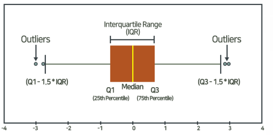

- 상자의 양 끝에서 1.5배 만큼 IQR 만큼 범위를 넓힘, 범위 안에는 정상적인 자료로 판단
- 1.5 는 tukey 계수라고 함.
- 이상값의 탐지
  - 표준화 점수 (Z-score)
  - 자료 x1, x2, x3 있고, 평균 x', 표준편차 S
  - 각각 자료에서 평균을 빼고, 이를 표준편차로 나눔 : (x1-x') / S
  - 이 값이 z1, z2, z3 라고 하며 이를 표준화 점수라고 함
  - 언제나 평균값은 0이고, 표준편차가 1이됨.
  - 표준화 값 z 의 절대값은 2,3 보다 큰 경우를 이상값으로 진단.
  - z 값이 크다는 것은 평균(가운데)으로 부터 많이 떨어져 있음을 알 수 있다.
- 이상값 처리 방법
  - 이상값 제외 (추정량 왜곡 발생)
  - 이상값 대체, winsorization (정상값 중 최대, 최소 등으로 대체)
  - 변수 변환 : 자료값 전체에 로그변환, 제곱근 변환등을 적용
  - 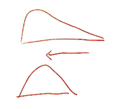
  - <u>**변수 구간화**</u> : 연속형 변수를 구간을 이용하여 범주화 하는 과정
  - 변수 구간화(binning)는 이상치를 완화, 결측치 처리 방법이 될 수 있다. 변수간 관계가 단순화 되어 분석 시 과적합을 방지할 수 있고, 결과 해석이 용이해짐. 다만 다소 정확도는 떨어짐(범주화에 따라 조절 가능)

- 데이터 전처리 과정 : 실제 분석에 들어가는 소요시간보다 훨씬 많은 시간 및 노력 필요. 데이터의 정보를 어떻게 잘 살리면서 분석에 용이한 형태로 만들 수 있을까

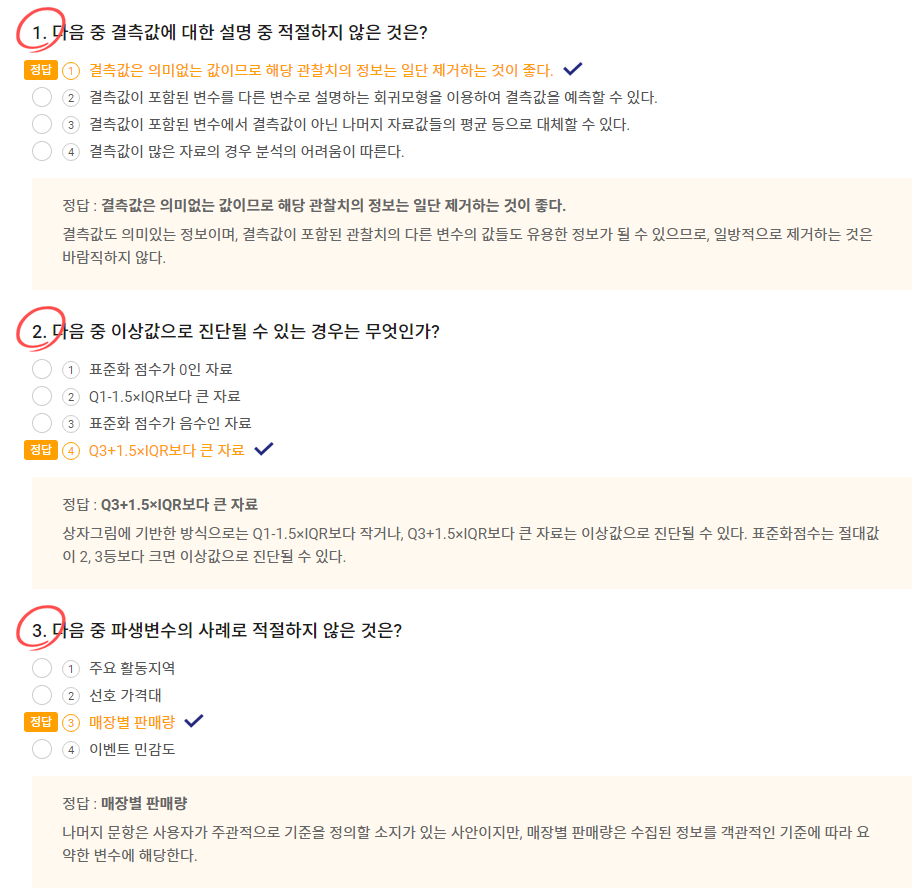

### 2) 데이터 변환, 데이터 결합

**로그변환, 제곱근변환, 박스콕스, 이너조인, 레프트 조인, 라이트 조인, 풀아우터 조인**

- 데이터 변환 : 자료 변환을 통해 자료의 해석을 쉽고 풍부하게 하기 위한 과정
  - 데이터 변환 : 로그변환, 지수변환, 제곱근변환
  - 데이터 변환의 목적 : 분포의 대칭화, 산포를 비슷하게하기 위해(여러 그룹의 평균 자료를 비교할 때), 변수간 관계를 단순하게 하기 위해(선형회귀분석을 통해, 직선으로 피팅하여 모델을 단순화)
- 변환유형 1
- 1,4,9 의 데이터가 있을 때,
  - 제곱근변환 : 왼쪽으로 값이 치우짐 (1,2,3)
  - 제곱변환 : 오른쪽으로 값이 치우짐 (1,16,81)
  - 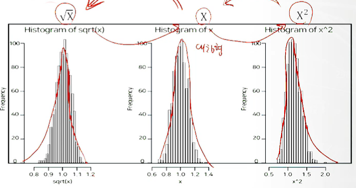
  - 로그변환 : 왼쪽으로 값이 치우침
  - 지수변환 : 오른쪽으로 값이 치우침
  - 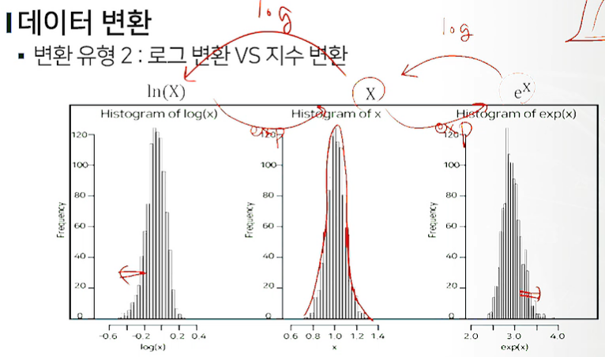
  - 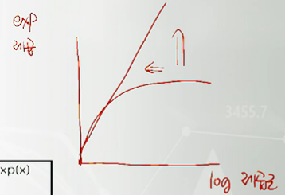
- 박스콕스 변환
  - 제곱근 유형의 변화를 일반화
  - 제곱유형의 변환을 일반화
  - 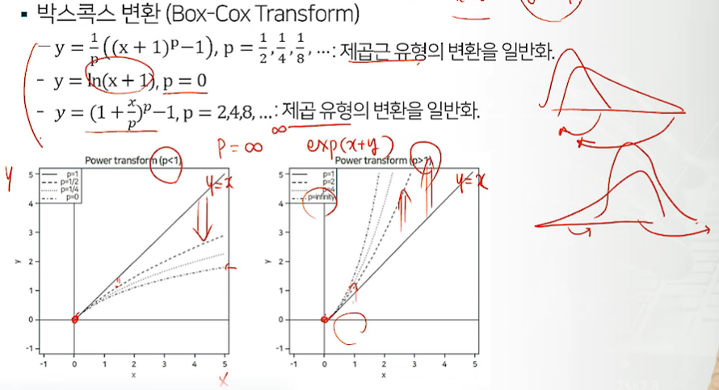
  - p를 어떻게 정할 것인가

- 데이터 결합
- 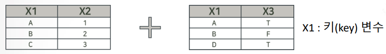
- 이너 조인 : 두 테이블에 키(key)가 공통으로 존재하는 레코드만 결합.(교집합)
  - (A,1,T) , (B,2,F)
- 풀아우터 조인 : 두 테이블 중 어느 한 쪽이라도 존재하는 키에 대한 레코드를 모두 결합(합집합)
  - (A,1,T) , (B,2,F), (C,3,NA), (D,NA,T)
- 레프트 조인(일반적) : 왼쪽 테이블에만 존재하는 키에 대한 레코드를 결합.(A,B,C)
  - (A,1,T) , (B,2,F), (C,3,NA)
- 라이트 조인(일반적) : 오른쪽 테이블에만 존재하는 키에 대한 레코드를 결합(A,B,D)
  - (A,1,T) , (B,2,F), (D,NA,T)

- 데이터의 변수 변환
  - 제곱, 지수변환, p가 1보다 큰 변환은 분포의 오른쪽을 잡아당겨줌
  - 제곱근, 로그변환, p가 1보다 작은 변환은 분포의 왼쪽을 잡아당겨줌
  - 오른쪽 꼬리가 긴 분포의 경우 로그변환, 제곱근 변환이 필요
  - 왼쪽 꼬리가 긴 분포의 경우 지수 변환, 제곱변환이 필요

- 데이터 통합 : 다양한 소스로부터 데이터를 통합

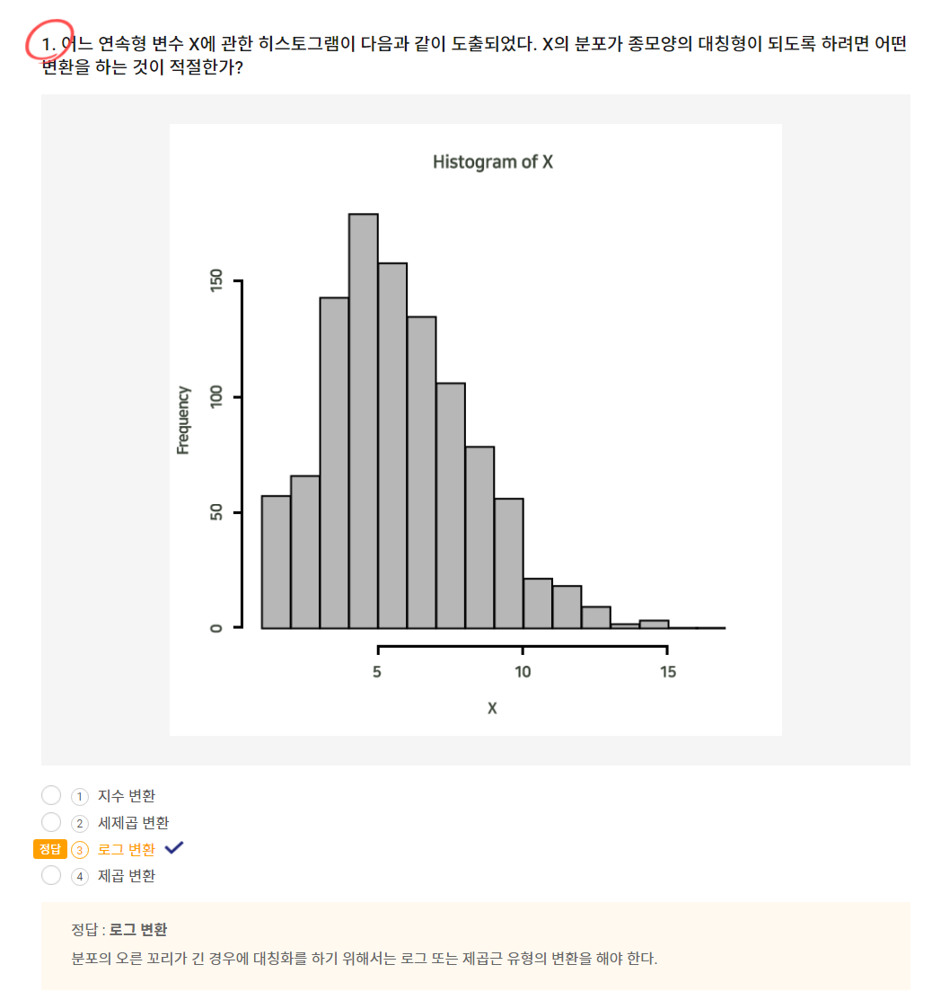

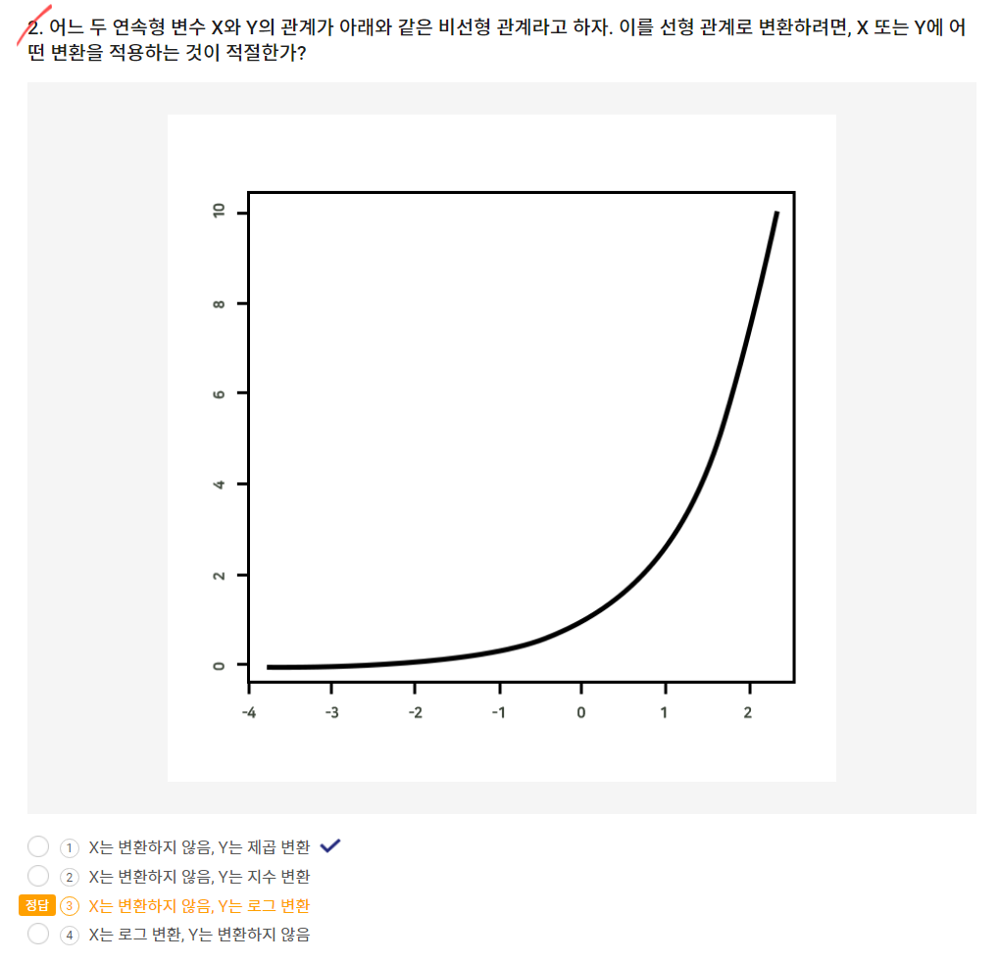

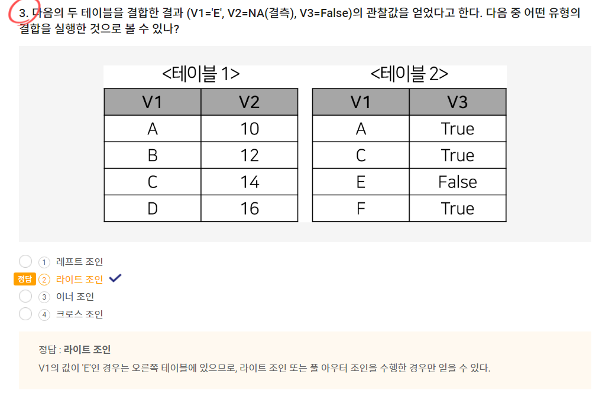

# 2. [ProDS] 통계 이론 및 데이터 시각화

## 확률의 개념과 특징

**확률개념, 확률정의, 확률규직, 여사건, 곱사건, 합사건, 조건부확률, 독립사건**

- 통계학 : 데이터에 담겨진 표면적인 정보를 정확히 요약, 내면에 담긴 의미를 추론 해석하기 위한 학문(데이터의 행간을 파악)
- 모수 : 미지의 정보(후보자의 지지율, 불량률을 온도나 습도로 설명, 다른 변수들과의 관계, 모형을 통해 정의되는 관계)

- 불확실하지만 의사결정에 중요한 모수, 과학적 예측 가능
- 통계적 추론 : 관심 대상을 파악하기 위해 일부의 정보만을 이용
- 확률 : 어떤 사건이 발생할 가능성을 0에서 1사이의 숫자로 표현한 것.
- 확률모형 : 시행을 반복할 때마다 나오는 결과가 우연에 의존하여 매번 달라지는 현상.

- 표본공간 : 확률 실험에서의 모든 관찰 가능한 결과의 집합, S로 표기
  - 동전 **S** = {앞면, 뒷면}, 주사위 S = {1,2,3,4,5,6}
- 사건 : 표본공간의 임의의 부분집합 , A,B 등으로 표기
  - 주사위의 짝수가 나오는 사건 **A** = {2,4,6}
  - 주사위 짝수가 나올 확률 **P[A]** = 3/6
- 고전적 접근(라플라스 정의)
  - n개의 실험결과로 구성된 표본공간에서 각 실험결과가 일어날 가능성이 같은 경우(유한한 경우), m(m<=n) 개의 실험 결과로 구성된 사건 A의 확률을 아래와 같이 정의함.
  - P(A) = m/n
- 상대적 비율에 의한 접근(Richard Von Mises)
  - n번의 반복된 실험 중 어떤 사건 A가 발생한 횟수를 m이라고 할 때, 사건 A의 상대빈도는 m/n 으로 구해짐.
  - 이 실험의 반복 횟수 n을 무한히 증가했을 때, 사건 A의 상대빈도수가 수렴하는 값을 사건 A의 확률로 정의하고자함.

- 확률의 공리

  

  - 상호배반 : 동시발생할 수 없는 상황, 따라서 합사건은 1

- 확률의 규칙(여사건, 곱사건, 합사건)

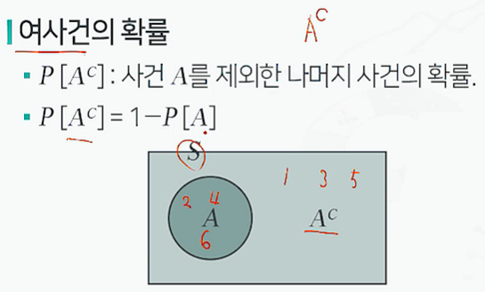

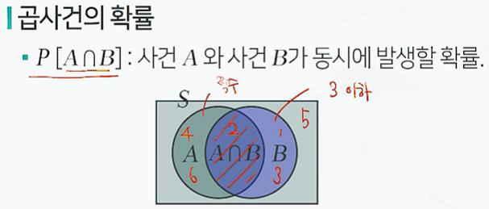

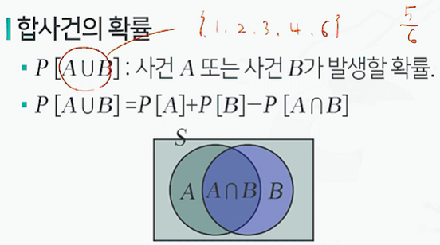

- 조건부 확률의 정의
  - A와 B가 표본공간 S상에 정의되어 있으며 P(B) > 0 라고 가정.
  - 이 때 사건 B가 일어났다는 가정 하의 사건 A가 일어날 조건부 확률은 다음과 같이 정의됨.
  - 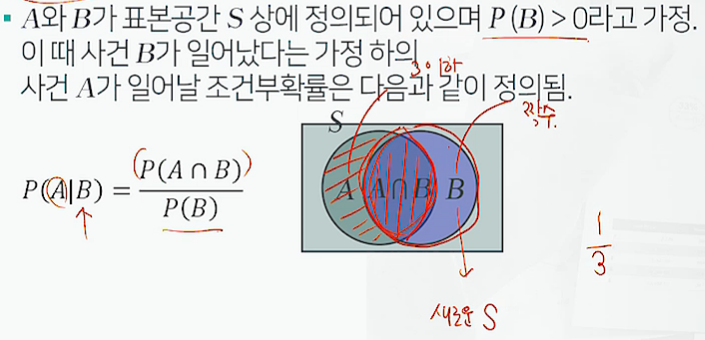

- 독립사건의 정의
  - 동전을 던지는 실험과 주사위를 동전을 던지는 실험 결과는 서로 영향을 주지 않음.

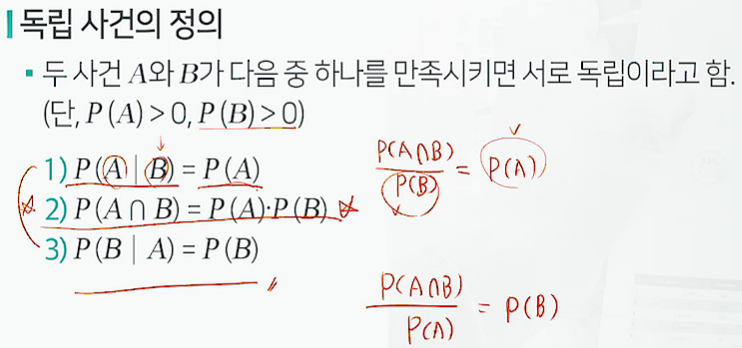

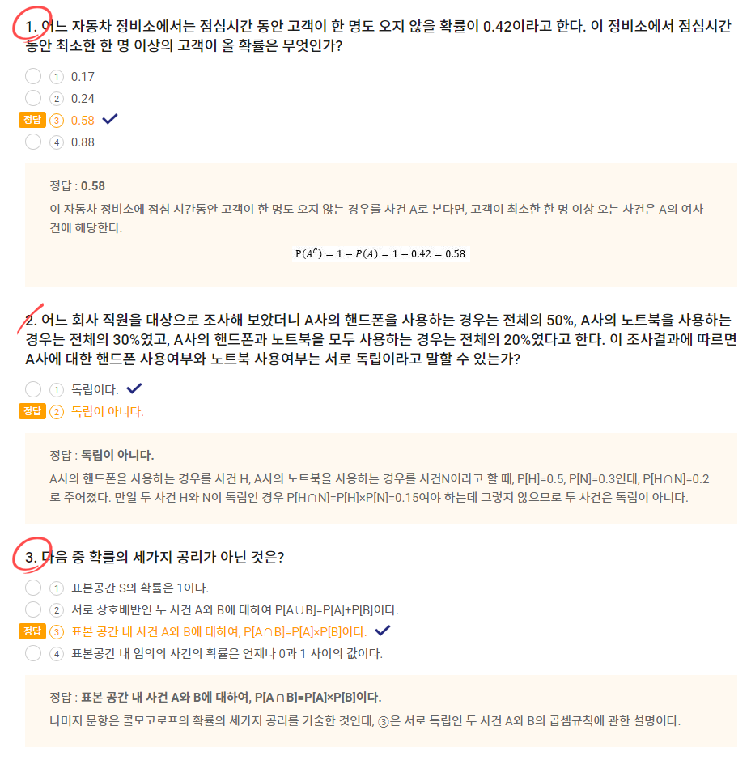