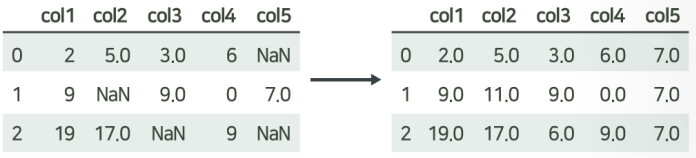

# 1. [ProDS] 머신러닝 이론 및 데이터 처리

2022-02-05

## 데이터 전처리
### 1) 데이터 생성, 데이터 정제

**요약변수, 파생변수, 이상치, 결측치, Binning(구간화)**

- 데이터 생성
  - 요약 변수 : 객관적이고 동일하게 계산 가능한 변수 (단어 빈도, 상품별 구매 금액 등)
  - 파생 변수 : 특정한 의미를 갖는 작위적 정의 (주관적), (영화 인기도, 선호도, 스타일 등)

- 데이터 정제
  - 기록 누락, 미응답, 수집오류 등의 이유로 결측이 발생
  - 결측값이 포함된 자료라도 나머지 변수의 값들은 의미있는 정보이므로, 정보의 손실을 최소화 하여 결측을 처리해야 함.
  - 

- 0,1,2, 는 관찰치 / col 1,2,3 변수

- 결측값을 처리하는 방법

  - 완전제거법은 정보의 손실로 분석 결과가 왜곡될 수 있음
  - 평균대체법이 가장 단순하면서도 많이 사용 됨. 해당 변수의 나머지 값들의 평균으로 대체. 단, 추정량의 표준오차가 과소추정됨(missing 값을 모르는 상태로 대체하게 되면 자료의 변동성을 놓칠 수 있음, 실제 값을 알 수 없기 때문)

  - **<u>핫덱 대체법</u>** : 동일한 데이터 내에서 결측 값이 발생한 관찰치와 유사한 특성을 가진 다른 관찰치의 정보를 이용하여 대체.
  - 그 밖의 결측값 처리법 : 모델링, 알고리즘 등을 이용하여 처리.

- 이상값의 이해

  - 이상값은 다른 데이터와 동떨어진 값을 말함. 의미 있는 값일 수도 있고, 단순히 입력 오류일 수도 있음.
  - 이상값을 분석에 포함할지 말지 결정해야 한다. 각각 장단점이 있음
  - 이상치는 결과값에 중요한 차이를 발생시킬 수 있다.
  - 이상값을 자동적으로 판단하는 방법 : 상자그림(박스플롯)

- 상자의 양 끝에서 1.5배 만큼 IQR 만큼 범위를 넓힘, 범위 안에는 정상적인 자료로 판단
- 1.5 는 tukey 계수라고 함.
- 이상값의 탐지
  - 표준화 점수 (Z-score)
  - 자료 x1, x2, x3 있고, 평균 x', 표준편차 S
  - 각각 자료에서 평균을 빼고, 이를 표준편차로 나눔 : (x1-x') / S
  - 이 값이 z1, z2, z3 라고 하며 이를 표준화 점수라고 함
  - 언제나 평균값은 0이고, 표준편차가 1이됨.
  - 표준화 값 z 의 절대값은 2,3 보다 큰 경우를 이상값으로 진단.
  - z 값이 크다는 것은 평균(가운데)으로 부터 많이 떨어져 있음을 알 수 있다.
- 이상값 처리 방법
  - 이상값 제외 (추정량 왜곡 발생)
  - 이상값 대체, winsorization (정상값 중 최대, 최소 등으로 대체)
  - 변수 변환 : 자료값 전체에 로그변환, 제곱근 변환등을 적용
  - 
  - <u>**변수 구간화**</u> : 연속형 변수를 구간을 이용하여 범주화 하는 과정
  - 변수 구간화(binning)는 이상치를 완화, 결측치 처리 방법이 될 수 있다. 변수간 관계가 단순화 되어 분석 시 과적합을 방지할 수 있고, 결과 해석이 용이해짐. 다만 다소 정확도는 떨어짐(범주화에 따라 조절 가능)

- 데이터 전처리 과정 : 실제 분석에 들어가는 소요시간보다 훨씬 많은 시간 및 노력 필요. 데이터의 정보를 어떻게 잘 살리면서 분석에 용이한 형태로 만들 수 있을까

### 2) 데이터 변환, 데이터 결합

**로그변환, 제곱근변환, 박스콕스, 이너조인, 레프트 조인, 라이트 조인, 풀아우터 조인**

- 데이터 변환 : 자료 변환을 통해 자료의 해석을 쉽고 풍부하게 하기 위한 과정
  - 데이터 변환 : 로그변환, 지수변환, 제곱근변환
  - 데이터 변환의 목적 : 분포의 대칭화, 산포를 비슷하게하기 위해(여러 그룹의 평균 자료를 비교할 때), 변수간 관계를 단순하게 하기 위해(선형회귀분석을 통해, 직선으로 피팅하여 모델을 단순화)
- 변환유형 1
- 1,4,9 의 데이터가 있을 때,
  - 제곱근변환 : 왼쪽으로 값이 치우짐 (1,2,3)
  - 제곱변환 : 오른쪽으로 값이 치우짐 (1,16,81)
  - 
  - 로그변환 : 왼쪽으로 값이 치우침
  - 지수변환 : 오른쪽으로 값이 치우침
  - 
  - 
- 박스콕스 변환
  - 제곱근 유형의 변화를 일반화
  - 제곱유형의 변환을 일반화
  - 
  - p를 어떻게 정할 것인가

- 데이터 결합
- 
- 이너 조인 : 두 테이블에 키(key)가 공통으로 존재하는 레코드만 결합.(교집합)
  - (A,1,T) , (B,2,F)
- 풀아우터 조인 : 두 테이블 중 어느 한 쪽이라도 존재하는 키에 대한 레코드를 모두 결합(합집합)
  - (A,1,T) , (B,2,F), (C,3,NA), (D,NA,T)
- 레프트 조인(일반적) : 왼쪽 테이블에만 존재하는 키에 대한 레코드를 결합.(A,B,C)
  - (A,1,T) , (B,2,F), (C,3,NA)
- 라이트 조인(일반적) : 오른쪽 테이블에만 존재하는 키에 대한 레코드를 결합(A,B,D)
  - (A,1,T) , (B,2,F), (D,NA,T)

- 데이터의 변수 변환
  - 제곱, 지수변환, p가 1보다 큰 변환은 분포의 오른쪽을 잡아당겨줌
  - 제곱근, 로그변환, p가 1보다 작은 변환은 분포의 왼쪽을 잡아당겨줌
  - 오른쪽 꼬리가 긴 분포의 경우 로그변환, 제곱근 변환이 필요
  - 왼쪽 꼬리가 긴 분포의 경우 지수 변환, 제곱변환이 필요

- 데이터 통합 : 다양한 소스로부터 데이터를 통합

## 3. 머신러닝의 기본 개념 및 방법론의 분류

**머신러닝, 지도학습, 회귀, 분류, 비지도학습,군집,차원축소, 추천시스템,강화학습**

### 머신러닝 기본개념

- 머신러닝
  - 컴퓨터 시스템에 명시적으로 프로그래밍 하지 않더라도 데이터를 스스로 학습하여 문제를 해결할수 있게하는 기술을 의미
  - 사람이 인지하기 어려운 복잡한 규칙과 패턴을 파악하여 의미있는 결과를 얻을 수 있음.

- 지도학습

  - 라벨이 있는 훈련용 데이터에서, 여러 특성변수를 이용하여 목표변수인 라벨( label)을 예측하도록 모델을 학습함.
  - 라벨의 데이터 타입에 따라 라벨이 연속형이면 회귀알고리즘, 라벨이 범주형이면 분류 알고리즘으로 구분

  - 지도학습은 x 와 y의 값이 주어졌을 때, 즉 레이블이 주어져 있는 훈련용 자료, x와y의 관계를 어떤 함수로 표현할수 있는가?

## 머신러닝 방법론의 분류

- 비지도학습

  - 라벨이 없는 훈련용 데이터에서 특정 변수들 간의 관계나 유사성을 기반으로 의미있는 패턴을 추출.

  - 자율학습 이라고도 함.

  - 군집화, 차원축소, 추천시스템 등에 활용됨.

    
    
    
    
    

## 4. 머신러닝 모델의 검증 및 평가

과대적합, 훈련자료, 검증자료, 평가자료, 교차검증, 편향, 분산

### 머신러닝 모델의 분석 절차

- 

- 모델 기반 지도학습 알고리즘의 일반적인 분석 절차
  - 주어진 데이터 전처리 탐색
  - 적절한 모델을 선택
  - 주어진 데이터로 모델을 훈련
  - 훈련된 모델을 적용하여 새로운 데이터에 대한 예측을 수행

- 과대 적합(overfitting)의 문제
  - 주어진 자료는 거의 완벽한 예측이 가능하지만, 미래의 새로운 자료에 대한 예측력이 떨어진느 문제.
  - 복잡한 알고리즘을 사용하여 데이터를 훈련하는 경우 과대적합 문제를 항상 염두에 두어야 함.

- 모델의 검증 및 평가 개요
  - 모델 평가의 필요성
    - 과대적합을 막고 일반화 오차를 줄이기 위해서는, 새로운 데이터에 얼마나 잘 일반화될지를 파악해야 함.
    - 모델 적합에 사용된 자료를 평가를 위해 재활용하지 않고, 평가만을 위한 데이터를 확보할 필요가 있음.

1) 훈련데이터 : 모델의 학습을 위해 사용되는 자료
2) 검증데이터
   1) 훈련자료로 적합되는 모델을 최적의 성능으로 튜닝하기 위해 사용되는 자료
   2) 훈련에 필요한 하이퍼파라미터를 조정하거나, 변수선택(Model selecting) 등에 이용.
3) 평가데이터 : 훈련 및 검증 자료로 적합된 최종 모형이 미래에 주어질 새로운 자료에 대하여 얼마나 좋은 성과를 갖는지를 평가하는데 사용되는 자료.(절대 사전에 확인해서는 안됨)

### 모델 검증 및 평가를 위해 데이터의 구분

#### K-fold 교차검증 (Cross-validation) 방식

- 자료의 수가 충분하지 않은 경우에는 훈련 데이터에서 너무 많은 양의 데이터를 검증 또는 평가 데이터에 뺏기지 않도록 교차 검정(cross-validation) 기법을 사용.
- 

- 머신러닝의 경우
  - 과대적합 : Test Error 가 Train Error 보다 너무 높은 경우
  - 과소적합 : 모양이 단순해서 fitting 이 안좋은 경우
  - 밸런스가 중요

- 편향-분산 트레이드 오프 : 모델의 복잡한 정도에 따라 훈련 데이터와 평가 데이터의 예측오차는 다음과 같은 패턴을 보이게 됨.
- 
- 분산은 자료가 바뀌면 모델이 얼마나 바뀌는가를 볼 수 있음.
- 일반화 오차 = 편향의 제곱 + 분산의 합
- 과대적합을 막기 위한 방법
  - 훈련 데이터를 많이 확보
  - 모델의 복잡도를 낮춤
    - 특성 변수의 수를 줄이거나 차원 축소.
    - 파라미터에 규제(regularization)를 적용.

## 5. 머신러닝 모델의 평가지표

RMSE, 결정계수(R^2), 정오분류표, 정확도, 오분류율, 정밀도, 재현율, ROC 곡선, AUC

- 지도학습은 데이터셋에 y 레벨이 존재
- 레이블이 범주형인 경우 분류모델
- 연속형 숫자형인 경우 회귀모델

### 지도학습 모델의 평가지표

- 여러가지 회귀 변수에 대한 값이 주어지면 y 값을 예측, 변수가 주어지면 y를 예측하는 함수
- 전체 데이터를 다 쓰는 것이 아닌 트레이닝 데이터, 평가 데이터
- RMSE
  - y1 - y2 는 결국 오차, "오차를 제곱해서 평균의 제곱근", 오차의 크기의 평균적인 값을 알고자함. 작을 수록 좋은 것임**(MSE는 (1+1+1+0)/4=0.75이며, RMSE는 MSE의 제곱근으로 0.866이 된다.)**
  - 결정계수값은 클수록 좋고, 1에 가까울 수록 좋음. (0일수록 안 좋은 분석)

- MAE
  - 절대값의 평균, 즉 MAE가 10 이면 , 오차가 평균적으로 10정도 발생한다고 볼 수 있음.
- MAPE
  - 실제 값 대비 오차가 차지하는 비중이 평균적으로 얼마인지 확인. -> 작을 수록 좋은 값

### 분류(Classification) 모델의 평가 지표

- 정오분류표(=교차분류표)

  

- y가 1일 확률, 즉 관심범주에 포함될 확률 -> 범주알고리즘

- 기본이 되는 교차분류표.

#### 분류(Classification) 모델의 평가지표

- 정확도 계산

- 실제로는 정확도만으로는 불안정한 경우가 있음.
  - Negative 와 Positive 의 비중이 현저하게 차이나는 경우, 밸런스가 깨진 경우 정확도는 좋은 지표가 되지 않음.  네거티브가 90%인데, 모든 자료를 네거티브로 예측해버리면, 정확도가 90%이지만 과연 좋은 예측인가?

- 정밀도와 재현율이 예측평가를 하는데 도움이 됨.
- 정밀도 : 

- <u>**Threshold**</u>(분류기준점)  : 예측확률 1인 범주로 예측하는 확률이 몇을 넘어가야 내가 1로 분류할까?

- 위 그래프를 개량

  

- 얼마나 많이 휘었는가를 곡선 아래 면적을 구할 수 있음(AUC)
- 기울기가 1인 직선의 경우 면적이 0.5 보다 높아야 좋은 것이며, TPR 이 가파르게 증가하는 좋은 모델.(곡선이 크게 휘어있으면 좋다.)

- 회귀 모델의 평가 지표 : 오차의 크기를 이용
- 분류 모델의 평가 지표

## 특성 공학 : 개요, 특성 선택 방법론

특성선택, 특성추출, Filter 방식, Wrapper 방식

#### 특성공학 : 머신러닝 알고리즘에 사용되는 입력데이터에 해당하는 특성변수들에 대한 처리

- 특성 선택 : 전체 특성변수 중 최적의 조합을 선택하는 문제

- 특성 추출 : 특성변수들을 적절하게 조합하여 새로운 특성변수를 만드는 문제

  

- Filter 방식
  - 특성변수를 중요한 순서대로 랭킹을 정하고, 순위가 높은 변수만 선택
  - 특성변수 x, 목표변수 y 와의 연관성을 측정한 뒤, 목표변수를 잘 설명할 수 있는 특성 변수만을 선택하는 방식.
  - p-value 가 작을수록 연관성이 있음.
- Wrapper 방식 
  - 전체 특성 데이터 중 일부 후보데이터를 가져와 모델에 피팅을 시킨 뒤, 결과를 평가 후 이를 반복한 뒤 그 중 가장 최적의 변수를 선택(모델을 훈련시켜 변수 선택)
  - 특성변수의 조합이 바뀔 떄마다 모델을 학습
  - 특성변수에 중복된 정보가 많은 경우 이를 효과적으로 제거.
- embedded 방식 : 어떤 변수를 선택할지 알고리즘이 스스로 선택.

## 특성 공학 : 추출법 개요

### 특성 공학

- 특성공간 방법론
  - 특성 선택 : 가지고 있는 특성 중 더 유용한 특성을 선택.
  - 특성 추출 : 가지고 있는 특성을 결합하여 더 유용한 특성을 생성.
