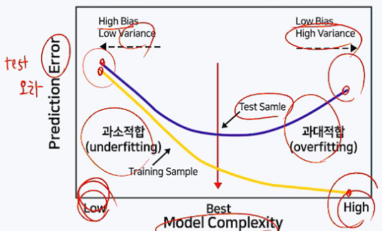
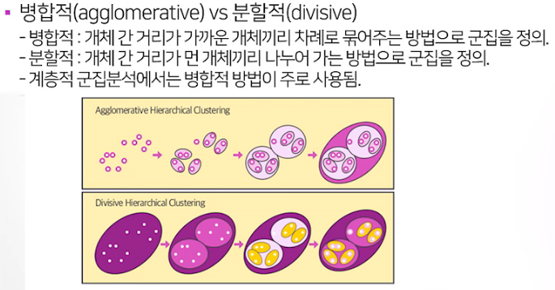
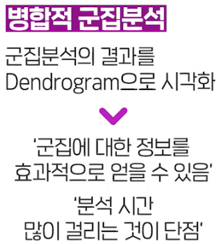
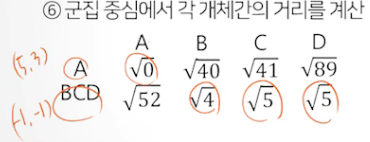
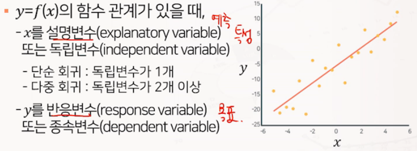
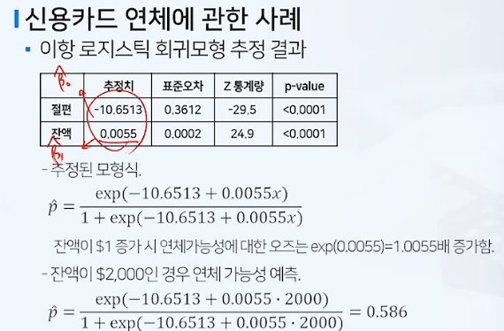
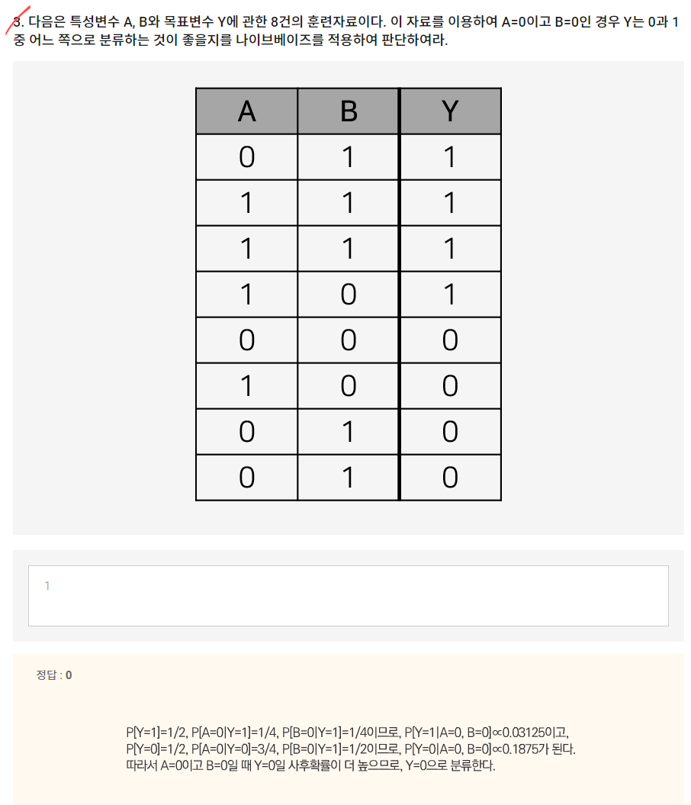

# 1. [ProDS] 머신러닝 이론 및 데이터 처리

2022-02-05

## 데이터 전처리
### 1) 데이터 생성, 데이터 정제

**요약변수, 파생변수, 이상치, 결측치, Binning(구간화)**

- 데이터 생성
  - 요약 변수 : 객관적이고 동일하게 계산 가능한 변수 (단어 빈도, 상품별 구매 금액 등)
  - 파생 변수 : 특정한 의미를 갖는 작위적 정의 (주관적), (영화 인기도, 선호도, 스타일 등)

- 데이터 정제
  - 기록 누락, 미응답, 수집오류 등의 이유로 결측이 발생
  - 결측값이 포함된 자료라도 나머지 변수의 값들은 의미있는 정보이므로, 정보의 손실을 최소화 하여 결측을 처리해야 함.
  - 

- 0,1,2, 는 관찰치 / col 1,2,3 변수

- 결측값을 처리하는 방법

  - 완전제거법은 정보의 손실로 분석 결과가 왜곡될 수 있음
  - 평균대체법이 가장 단순하면서도 많이 사용 됨. 해당 변수의 나머지 값들의 평균으로 대체. 단, 추정량의 표준오차가 과소추정됨(missing 값을 모르는 상태로 대체하게 되면 자료의 변동성을 놓칠 수 있음, 실제 값을 알 수 없기 때문)

  - **<u>핫덱 대체법</u>** : 동일한 데이터 내에서 결측 값이 발생한 관찰치와 유사한 특성을 가진 다른 관찰치의 정보를 이용하여 대체.
  - 그 밖의 결측값 처리법 : 모델링, 알고리즘 등을 이용하여 처리.

- 이상값의 이해

  - 이상값은 다른 데이터와 동떨어진 값을 말함. 의미 있는 값일 수도 있고, 단순히 입력 오류일 수도 있음.
  - 이상값을 분석에 포함할지 말지 결정해야 한다. 각각 장단점이 있음
  - 이상치는 결과값에 중요한 차이를 발생시킬 수 있다.
  - 이상값을 자동적으로 판단하는 방법 : 상자그림(박스플롯)

- 상자의 양 끝에서 1.5배 만큼 IQR 만큼 범위를 넓힘, 범위 안에는 정상적인 자료로 판단
- 1.5 는 tukey 계수라고 함.
- 이상값의 탐지
  - 표준화 점수 (Z-score)
  - 자료 x1, x2, x3 있고, 평균 x', 표준편차 S
  - 각각 자료에서 평균을 빼고, 이를 표준편차로 나눔 : (x1-x') / S
  - 이 값이 z1, z2, z3 라고 하며 이를 표준화 점수라고 함
  - 언제나 평균값은 0이고, 표준편차가 1이됨.
  - 표준화 값 z 의 절대값은 2,3 보다 큰 경우를 이상값으로 진단.
  - z 값이 크다는 것은 평균(가운데)으로 부터 많이 떨어져 있음을 알 수 있다.
- 이상값 처리 방법
  - 이상값 제외 (추정량 왜곡 발생)
  - 이상값 대체, winsorization (정상값 중 최대, 최소 등으로 대체)
  - 변수 변환 : 자료값 전체에 로그변환, 제곱근 변환등을 적용
  - 
  - <u>**변수 구간화**</u> : 연속형 변수를 구간을 이용하여 범주화 하는 과정
  - 변수 구간화(binning)는 이상치를 완화, 결측치 처리 방법이 될 수 있다. 변수간 관계가 단순화 되어 분석 시 과적합을 방지할 수 있고, 결과 해석이 용이해짐. 다만 다소 정확도는 떨어짐(범주화에 따라 조절 가능)

- 데이터 전처리 과정 : 실제 분석에 들어가는 소요시간보다 훨씬 많은 시간 및 노력 필요. 데이터의 정보를 어떻게 잘 살리면서 분석에 용이한 형태로 만들 수 있을까

### 2) 데이터 변환, 데이터 결합

**로그변환, 제곱근변환, 박스콕스, 이너조인, 레프트 조인, 라이트 조인, 풀아우터 조인**

- 데이터 변환 : 자료 변환을 통해 자료의 해석을 쉽고 풍부하게 하기 위한 과정
  - 데이터 변환 : 로그변환, 지수변환, 제곱근변환
  - 데이터 변환의 목적 : 분포의 대칭화, 산포를 비슷하게하기 위해(여러 그룹의 평균 자료를 비교할 때), 변수간 관계를 단순하게 하기 위해(선형회귀분석을 통해, 직선으로 피팅하여 모델을 단순화)
- 변환유형 1
- 1,4,9 의 데이터가 있을 때,
  - 제곱근변환 : 왼쪽으로 값이 치우짐 (1,2,3)
  - 제곱변환 : 오른쪽으로 값이 치우짐 (1,16,81)
  - 
  - 로그변환 : 왼쪽으로 값이 치우침
  - 지수변환 : 오른쪽으로 값이 치우침
  - 
  - 
- 박스콕스 변환
  - 제곱근 유형의 변화를 일반화
  - 제곱유형의 변환을 일반화
  - 
  - p를 어떻게 정할 것인가

- 데이터 결합
- 
- 이너 조인 : 두 테이블에 키(key)가 공통으로 존재하는 레코드만 결합.(교집합)
  - (A,1,T) , (B,2,F)
- 풀아우터 조인 : 두 테이블 중 어느 한 쪽이라도 존재하는 키에 대한 레코드를 모두 결합(합집합)
  - (A,1,T) , (B,2,F), (C,3,NA), (D,NA,T)
- 레프트 조인(일반적) : 왼쪽 테이블에만 존재하는 키에 대한 레코드를 결합.(A,B,C)
  - (A,1,T) , (B,2,F), (C,3,NA)
- 라이트 조인(일반적) : 오른쪽 테이블에만 존재하는 키에 대한 레코드를 결합(A,B,D)
  - (A,1,T) , (B,2,F), (D,NA,T)

- 데이터의 변수 변환
  - 제곱, 지수변환, p가 1보다 큰 변환은 분포의 오른쪽을 잡아당겨줌
  - 제곱근, 로그변환, p가 1보다 작은 변환은 분포의 왼쪽을 잡아당겨줌
  - 오른쪽 꼬리가 긴 분포의 경우 로그변환, 제곱근 변환이 필요
  - 왼쪽 꼬리가 긴 분포의 경우 지수 변환, 제곱변환이 필요

- 데이터 통합 : 다양한 소스로부터 데이터를 통합

## 3. 머신러닝의 기본 개념 및 방법론의 분류

**머신러닝, 지도학습, 회귀, 분류, 비지도학습,군집,차원축소, 추천시스템,강화학습**

### 머신러닝 기본개념

- 머신러닝
  - 컴퓨터 시스템에 명시적으로 프로그래밍 하지 않더라도 데이터를 스스로 학습하여 문제를 해결할수 있게하는 기술을 의미
  - 사람이 인지하기 어려운 복잡한 규칙과 패턴을 파악하여 의미있는 결과를 얻을 수 있음.

- 지도학습

  - 라벨이 있는 훈련용 데이터에서, 여러 특성변수를 이용하여 목표변수인 라벨( label)을 예측하도록 모델을 학습함.
  - 라벨의 데이터 타입에 따라 라벨이 연속형이면 회귀알고리즘, 라벨이 범주형이면 분류 알고리즘으로 구분

  - 지도학습은 x 와 y의 값이 주어졌을 때, 즉 레이블이 주어져 있는 훈련용 자료, x와y의 관계를 어떤 함수로 표현할수 있는가?

## 머신러닝 방법론의 분류

- 비지도학습

  - 라벨이 없는 훈련용 데이터에서 특정 변수들 간의 관계나 유사성을 기반으로 의미있는 패턴을 추출.

  - 자율학습 이라고도 함.

  - 군집화, 차원축소, 추천시스템 등에 활용됨.

    
    
    
    
    

## 4. 머신러닝 모델의 검증 및 평가

과대적합, 훈련자료, 검증자료, 평가자료, 교차검증, 편향, 분산

### 머신러닝 모델의 분석 절차

- 

- 모델 기반 지도학습 알고리즘의 일반적인 분석 절차
  - 주어진 데이터 전처리 탐색
  - 적절한 모델을 선택
  - 주어진 데이터로 모델을 훈련
  - 훈련된 모델을 적용하여 새로운 데이터에 대한 예측을 수행

- 과대 적합(overfitting)의 문제
  - 주어진 자료는 거의 완벽한 예측이 가능하지만, 미래의 새로운 자료에 대한 예측력이 떨어진느 문제.
  - 복잡한 알고리즘을 사용하여 데이터를 훈련하는 경우 과대적합 문제를 항상 염두에 두어야 함.

- 모델의 검증 및 평가 개요
  - 모델 평가의 필요성
    - 과대적합을 막고 일반화 오차를 줄이기 위해서는, 새로운 데이터에 얼마나 잘 일반화될지를 파악해야 함.
    - 모델 적합에 사용된 자료를 평가를 위해 재활용하지 않고, 평가만을 위한 데이터를 확보할 필요가 있음.

1) 훈련데이터 : 모델의 학습을 위해 사용되는 자료
2) 검증데이터
   1) 훈련자료로 적합되는 모델을 최적의 성능으로 튜닝하기 위해 사용되는 자료
   2) 훈련에 필요한 하이퍼파라미터를 조정하거나, 변수선택(Model selecting) 등에 이용.
3) 평가데이터 : 훈련 및 검증 자료로 적합된 최종 모형이 미래에 주어질 새로운 자료에 대하여 얼마나 좋은 성과를 갖는지를 평가하는데 사용되는 자료.(절대 사전에 확인해서는 안됨)

### 모델 검증 및 평가를 위해 데이터의 구분

#### K-fold 교차검증 (Cross-validation) 방식

- 자료의 수가 충분하지 않은 경우에는 훈련 데이터에서 너무 많은 양의 데이터를 검증 또는 평가 데이터에 뺏기지 않도록 교차 검정(cross-validation) 기법을 사용.
- 

- 머신러닝의 경우
  - 과대적합 : Test Error 가 Train Error 보다 너무 높은 경우
  - 과소적합 : 모양이 단순해서 fitting 이 안좋은 경우
  - 밸런스가 중요

- 편향-분산 트레이드 오프 : 모델의 복잡한 정도에 따라 훈련 데이터와 평가 데이터의 예측오차는 다음과 같은 패턴을 보이게 됨.
- 
- 분산은 자료가 바뀌면 모델이 얼마나 바뀌는가를 볼 수 있음.
- 일반화 오차 = 편향의 제곱 + 분산의 합
- 과대적합을 막기 위한 방법
  - 훈련 데이터를 많이 확보
  - 모델의 복잡도를 낮춤
    - 특성 변수의 수를 줄이거나 차원 축소.
    - 파라미터에 규제(regularization)를 적용.

## 5. 머신러닝 모델의 평가지표

RMSE, 결정계수(R^2), 정오분류표, 정확도, 오분류율, 정밀도, 재현율, ROC 곡선, AUC

- 지도학습은 데이터셋에 y 레벨이 존재
- 레이블이 범주형인 경우 분류모델
- 연속형 숫자형인 경우 회귀모델

### 지도학습 모델의 평가지표

- 여러가지 회귀 변수에 대한 값이 주어지면 y 값을 예측, 변수가 주어지면 y를 예측하는 함수
- 전체 데이터를 다 쓰는 것이 아닌 트레이닝 데이터, 평가 데이터
- RMSE
  - y1 - y2 는 결국 오차, "오차를 제곱해서 평균의 제곱근", 오차의 크기의 평균적인 값을 알고자함. 작을 수록 좋은 것임**(MSE는 (1+1+1+0)/4=0.75이며, RMSE는 MSE의 제곱근으로 0.866이 된다.)**
  - 결정계수값은 클수록 좋고, 1에 가까울 수록 좋음. (0일수록 안 좋은 분석)

- MAE
  - 절대값의 평균, 즉 MAE가 10 이면 , 오차가 평균적으로 10정도 발생한다고 볼 수 있음.
- MAPE
  - 실제 값 대비 오차가 차지하는 비중이 평균적으로 얼마인지 확인. -> 작을 수록 좋은 값

### 분류(Classification) 모델의 평가 지표

- 정오분류표(=교차분류표)

  

- y가 1일 확률, 즉 관심범주에 포함될 확률 -> 범주알고리즘

- 기본이 되는 교차분류표.

#### 분류(Classification) 모델의 평가지표

- 정확도 계산

- 실제로는 정확도만으로는 불안정한 경우가 있음.
  - Negative 와 Positive 의 비중이 현저하게 차이나는 경우, 밸런스가 깨진 경우 정확도는 좋은 지표가 되지 않음.  네거티브가 90%인데, 모든 자료를 네거티브로 예측해버리면, 정확도가 90%이지만 과연 좋은 예측인가?

- 정밀도와 재현율이 예측평가를 하는데 도움이 됨.
- 정밀도 : 

- <u>**Threshold**</u>(분류기준점)  : 예측확률 1인 범주로 예측하는 확률이 몇을 넘어가야 내가 1로 분류할까?

- 위 그래프를 개량

  

- 얼마나 많이 휘었는가를 곡선 아래 면적을 구할 수 있음(AUC)
- 기울기가 1인 직선의 경우 면적이 0.5 보다 높아야 좋은 것이며, TPR 이 가파르게 증가하는 좋은 모델.(곡선이 크게 휘어있으면 좋다.)

- 회귀 모델의 평가 지표 : 오차의 크기를 이용
- 분류 모델의 평가 지표

## 6. 특성 공학 : 개요, 특성 선택 방법론

특성선택, 특성추출, Filter 방식, Wrapper 방식

#### 특성공학 : 머신러닝 알고리즘에 사용되는 입력데이터에 해당하는 특성변수들에 대한 처리

- 특성 선택 : 전체 특성변수 중 최적의 조합을 선택하는 문제

- 특성 추출 : 특성변수들을 적절하게 조합하여 새로운 특성변수를 만드는 문제

  

- Filter 방식
  - 특성변수를 중요한 순서대로 랭킹을 정하고, 순위가 높은 변수만 선택
  - 특성변수 x, 목표변수 y 와의 연관성을 측정한 뒤, 목표변수를 잘 설명할 수 있는 특성 변수만을 선택하는 방식.
  - p-value 가 작을수록 연관성이 있음.
- Wrapper 방식 
  - 전체 특성 데이터 중 일부 후보데이터를 가져와 모델에 피팅을 시킨 뒤, 결과를 평가 후 이를 반복한 뒤 그 중 가장 최적의 변수를 선택(모델을 훈련시켜 변수 선택)
  - 특성변수의 조합이 바뀔 떄마다 모델을 학습
  - 특성변수에 중복된 정보가 많은 경우 이를 효과적으로 제거.
- embedded 방식 : 어떤 변수를 선택할지 알고리즘이 스스로 선택.

## 7. 특성 공학 : 추출법 개요

차원축소법, 주성분 분석(PCA), 특이값분해(SVD)

### 특성 공학

- 특성공간 방법론
  - 특성 선택 : 가지고 있는 특성 중 더 유용한 특성을 선택.
  - 특성 추출 : 가지고 있는 특성을 결합하여 더 유용한 특성을 생성.
    - 변수를 잘 결합하여 새로운 특성변수를 생성

- 주요특성 추출법

  - 주성분분석(PCA, Principal Component Analysis)

    

  - 주성분(y1,y2...)가 생성이 될때 중요 순서대로 먼저 나온다.

  - 머신러닝에서 차원축소를 많이 사용함.

  - PCA 를 통해 변수끼리 계산하여 새로운 변수 y 를 생성(ex 물고기 높이, 길이를 조합하여 y 라는 스코어 정의, 즉 새로운 좌표를 통해 물고기의 크기를 정할 수 있음. )

  - 새로운 변수 y1 의 축에 수직인 축을 찾으면 y2 이 생성

- 주성분 분석(PCA) 의 목적

  - 자료에서 변동이 큰 축을 탐색함
  - 변수들에 담긴 정보의 손실을 최소화하면서 차원을 축소함.
  - 서로 상관이 없거나 독립적인 새로운 변수인 주성분을 통해 데이터의 해석을 용이하게 함.

- 주성분 분석에 관한 기하학적 의미

  - 주성분 축은 원래 변수들의 좌표축이 직교 회전 변환된 것으로 해석할 수 있음.

    - 첫번째 주성분 축은 데이터의 변동이 가장 커지는 축임.

    - 두번째 주성분 축은 첫번째 주성분 축과 직교하며 첫번째 주성분 축 다음으로 데이터의 변동이 큰 축을 나타냄.

    - 각 관찰지 별 주성분 점수는 대응하는 원 자료 값들의 주성분 좌표축에서의 좌표 값에 해당함.

      

    - 자료들의 공분산 행렬이 대각행렬이 되도록 회전한 것으로 해석할 수 있음. 공분산이 0이 되는 형태로 변경하여, 대각행렬 형태가 됨을 의미.

      

- 특성값분해(SVD)

- 임의의 크기를 가지는 행렬을 어떤 세개의 행렬의 곱으로 표현하는데, 이때 각각의 열이 서로 직교하는 내적이 제로인 상태를 말하고, 가운데 행렬은 원소들이 채워져 있는 대각행렬( 가운데 외 나머지가 0)

## 8. 계층적 군집분석

병합적 방법, 단일연결법, 완전연결법, 평균연결법, 중심연결법, 와드연결법, 덴드프로그램

- 차원축소법 : 데이터의 특성변수를 압축하는 방법

- 군집분석 : case, 관찰치 등 사례들을 압축하는 방법

  - 어떤 개체나 대상들을 밀접한 유사성 또는 비유사성에 의하여 유사한 특성을 지닌 개체들을 몇 개의 군집으로 집단화 하는 비지도학습법.(유사하다 = 특성변수의 값이 비슷하다), Observation을 군집(Cluster)화하다.
  - 각 군집의 특성, 군집간의 차이 등에 대한 탐색대상으로, 집단에 대한 심화된 이해가 목적
  - 특이 군집의 발견, 결측값의 보정 등에도 사용될 수 있음.

- 군집의 조건

  - 동일 군집에 속한 개체끼리는 유사한 속성이 매우 많음
  - 다른 군집에 속하는 개체끼리는 유사한 속성이 매우 적음.

- 계층적 군집분석 개요

  

- 병합적 방법

  - 개체 간 거리 및 군집 간 거리의 정의
    - 개체 간 거리

  

  - 군집간 거리

    - 단일 연결법 최소
    - 

    - 완전연결법 최대
    - 

    - 평균 연결법 (거리들의 평균)
    - 
    - 중심간 연결법 (군집 센터들 간의 거리)
    - 
    - 와드 연결법
    - 

### 병합적 방법에서 단일연결법 사용 군집분석 예시

- 먼저 거리간 가장 작은 값을 찾는다 . -> 5와 3의 2값이 제일 작음.
- 2가 출발점이 된다. (이후 35 는 합쳐저 클러스터 형성)
- 

- 1과 3의 거리(=3), 1과 5의 거리(=11) 이므로, 단일연결법이므로 최소값이 3이 (35)와 1의 거리로 정해짐.
- 이 후 반복

- 

- 

## 9. 비계층적 군집분석

K평균 군집분석, 군집 오차제곱합(SSE), Elbow 차트

- 군집분석은 비지도학습의 일종임, 레이블 변수 y가 없는 상태로 k 개의 특성 변수들만을 이용해서, 특성변수 값이 유사한 애들끼리 관찰치를 묶는 것.
- 계층적 분석 : 덴드로그램을 그릴 수 있으나, 오래 걸림

### K-평균 군집분석 개요

- K-평균 군집분석
  - 사전에 결정된 군집 수 k에 기초하여, 전체 데이터를 상대적으로 유사한 k개의 군집으로 구분.
  - 계층적 방식에 비하여 계사니량이 적고, 대용량 데이터를 빠르게 처리함.
  - 사전에 적절한 군집 수 k에 대한 예상이 필요.
  - 초기에 군집 중심이 어디로 지정되는지에 따라 최종 결과가 영향을 많이 받음
  - 잡음이나 이상치의 영향을 많이 받음.
  - 

- 평균벡터
- 

### K- 평균 군집분석에서 적절한 군집수의 결정

- 오차 제곱합(SSE, sum of squared error)
  - 각 군집 내 개체들과 해당 군집 중심점과의 거리를 제곱한 값들의 합.
  - 오차제곱합이 작을수록 군집 내 유사성이 높아 잘 응집된 것임.
- 군집수 K에 따른 SSE의 변화를 Elbow 차트로 시각화한 뒤, SSE 가 급격히 감소하다가 완만해지기 시작하는 시점의 k를 적정 군집수로 판단함.

## 10. 단순회귀분석

단순선형회귀, 최소제곱법, 회귀계수의 유의성  t검정, 결정계수(R^2)

- 단순선형회귀 : 특성변수 x 하나만 가지고, 연속형 종속변수 y를 예측하는 모델.

  

- 회귀분석 : 독립변수와 종속변수 간의 함수적인 관련성을 규명하기 위하여 어떤 수학적 모형을 가정하고, 이 모형을 측정된 자료로부터 통계적으로 추정하는 분석방법.

- ex : 광고비를 통해 설명. 매출액의 영향을 주는 독립변수 (광고비, 가격, 품질) 등, 변수가 여러개일 때는 다중회귀라고 부른다. 종속변수는 1개인 경우만 다루는데 이는 일변량회귀를 말하며, 여러개는 다변량회귀라고 부른다.

- 엡실론(오차)은 실제 값과 차이가 있기 때문에 절편값 알파와는 다른 변수이다.
- y 는 결국 기대값을 의미. (ex : 광고비 x 에 대응되는 매출의 기대값 y)

- 검정선은 y의 기대값이 자나가는 선, 즉 우리 머리 속에만 존재하는 이상적인 선(모수)
- 빨간선은 표본을 산점도로 표현하고, 그 후 점들을 잘 요약한 선을 말한다.(=자료값들 근처를 지나가는 선 중 자료를 가장 잘 요약하는 선)

- 자료를 잘 요약하는 방법
  - 최소제곱법 : 표본 자료가 주어지고 그 근처를 지나는 선의 절편과 기울기를 가진 선과의 수직으로 그어진 선

- 잔차(e) : yi 와 yi기대에 해당하는 추정치를 나타내는 부분(=오차에 대응되는 부분), 관찰이 가능한 부분이다.

- 예제 : 자동차의 주행속도와 정지거리에 관한 50개의 표본 자료를 이용하여, 주행거리를 독립변수로, 정지거리를 종속변수로 두고 단순선형회귀모형을 적합하고자 함.

- 주어진 자료에 대해 먼저 평균 계산

## 11. 다중회귀분석(Multiple Linear Regression)

다중선형회귀모형, 범주형 독립변수, 더미변수

- 다중회귀분석 : 특성변수가 둘 이상을 의미. 여러개의 독립변수를 이용하면 종속변수의 변화를 설명할 수 있다.
- 모수 추정법

- 나머지 독립변수가 주어졌을 떄, "상수로 고정시킨뒤" 라는 문구를 반드시 넣어야 함. 해석의 차이를 불러올 수 있음.
- 

- 경력이 고정되어 있다면 학력이 증가할 때 임금은 얼마나 올라가는가.

- 해석은 최소제곱법을 사용.

- "다른 변수는 고정되어 있다고 가정"

### 중고차 가격 예시

## 12. 다중회귀분석(변수선택)

전진선택법, 후진제거법, 단계별 방법, 수정결정계수

- 가능한 적은 수의 설명변수로 좋은 예측력을 가지는 모형을 추정.
- 독립변수들끼리 중복된 정보가 많은 경우 - 회귀변수 추측에 부정적 영향을 끼침
- 변수들을 어떻게 하면 적은수의 좋은 변수들만 남길까
- 가장 적절한 최적의 독립변수 조합을 남기는 방법

- 효과적으로 변수들의 조합을 선별해 낼수 있는 방법을 알아보자

### 전진선택법

- 절편만 있는 모델에서 출발하여 중요한 변수를 하나씩 추가하는 방식.
- 한번 선택된 변수는 제거되지 않는 단점이 있음.

- 검정을 통해 변수를 선택해야함.

- 부분 F-검정, 유의수준 5%로 검정

### 후진제거법

- 모든 변수가 포함된 모델에서 가낭 중요하지 않은 변수부터 하나씩 제거
- 한번 제거된 변수는 선택되지 않는 단점이 있음.

### 단계별 방법(유용)

- 전진 선택과 후진 선택을 반복적으로 사용
- 절편만 포함된 모델에서 출발해 가장 중요한 변수부터 추가하고, 모델에 포함되어 있는 변수 중에서 중요하지 않은 변수를 제거함.
- 더 이상 새롭게 추가되는 변수가 없을 때까지 변수의 추가 또는 삭제를 반복함.

- 새로 추가한 변수가 기존 추가한 변수와 correlation(중복되는 변수)이 높아 기존 변수를 삭제.
- 모든 조합 희귀분석에 비해 적은 스텝으로 최적의 조합을 찾을 수 있음.

- R-Squared 는 높을 수록 좋긴 하나, 변수 선택에 있어서는 사용하지 않는 것이 좋다
- R-Squared (SST) = SSR + SSE, 즉 1 - (SSE/SST)
- SSE(수직거리제곱합)은 독립변수가 추가되면, 수직거리가 줄어들 소지가 생김
- R-Squared 는 증가하게됨 따라서 좋지 않음, 불필요한 변수가 추가되어도 변형이 되버리기 때문.
- 이를 보환하기 위해 수정된 결정계수가 등장.

- SS를 자신의 자유도로 한번씩 나눔. SST를 (n-1) 로 나누고, SSE를 자유도 (n-k-1) 로 나눔(이 때, k 가 바로 독립변수의 개수)
- 자유도 : 자유도 수는 "집단의 수 -1"로 계산하고, 집단 내 자유도 수는 "전체 사례수 - 집단 수"
- 따라서 적합도 지표 사용시, 수정된 "Adjusted R-Squared" 를 사용해야함

## 13. 다중회귀분석(잔차분석, 다중공선성)

잔차분석, 잔차산점도, QQ플롯, 다중곤선성, VIF 계수

- 다중회귀분석
  - 오차에 대한 분포 가정 : 정규, 등분산, 독립
  - 오차에 대한 가정이 있어야 검증가능

- 오차에 대한 가정이 적절한가?
- 잔차분석 : 오차에 대한 추정치 개념인 잔차를 이용하여 분석
- 다중공선성 : 독립변수들간 강한 상관관계가 부정적 영향을 미치는 현상.

- 잔차분석 방법
  - 각 가정 별로, 검정을 통한 방법과 그래프를 통한 시각적인 확인방법이 가능
  - 시각적 방법을 이용할 경우,
    - 오차의 정규성 위반 : 히스토그램, QQ플롯
    - 오차의 등분산성 : 잔차산점도
    - 오차의 독립성 : 잔차산점도

- 가중최소제곱회귀 : 변동성이 작은 변수는 가중치를 높여줌.

- y를 설명하기 위한 독립변수 x 들끼리의 서로 영향을 줌. 

## 14. 규제가 있는 선형회귀모델

릿지회귀, 라쏘회귀, 엘라스틱넷, 선형회귀모델의 규제, L1 규제, L2규제

- 파라미터가 너무 커지지 않도록 규제하는 추정법
- 중요하지 않은 변수, 중복된 변수의 영향력 규제

- 모델의 과적합 방지

- 수직거레 지곱합을 작게, 베타들의 값도 최소로.

- 릿지회귀와 라쏘회귀의 특징
  - 두 방식 모두 추정치는 일반선형회귀모형과는 달리 편의(평균적으로 오차가 발생)가 발생하지만, 분산은 더 작아지게 됨
    - 람다에 따라 일반화 오차가 더 작아질 수 있음
  - 라쏘 회귀의 경우 제약 범위가 각진 형태
    - 파라미터의 일부가 0이 되는 경향이 있음.(SPARSE MODEL)
  - 릿지 회귀의 경우 제약 범위가 원의 형태
    - 파라미터가 0이 되지 않고 전반적으로 줄어드는 경향이 있음.
  - 라쏘와 릿지는 오버피팅(과대적합)을 방지하는 역할

## 15. 분류 : 로지스틱 회귀

이항 로지스틱 회귀, 분류모형, 시그모이드, 로짓, 오즈비

- 로지스틱 회귀 모형은 이름은 회귀모형 이지만 <u>**실제로는 분류알고리즘**</u>이다.
- X들을 이용해서 Y를 설명, 레이블에 있는 훈련 데이터를 사용
- 지도학습 알고리즘이며, Y가 범주형인 경우에 적용

### 로지스틱 회귀모형

- 로지스틱 회귀분석은 선형 회귀분석과 달리 반응변수가 범주형 데이터인 경우에 사용되는 경우.
- 새로운 설명변수의 값이 주어질 때, 반응변수의 각 범주에 속할 확률이 얼마인지를 추정하고, 추정 확률을 분류기준값에 따라 분류하는 목적으로 사용됨.

- 예를 들어, 어떤 사람이 고객이 나이는 37살, 연봉 6만불, 특성변수 값이 주어 졌을 떄, 핸드폰을 구매할 것인지 아닌지를 예측하는 문제
- 반응변수(구매한다, 아니다)의 각 범주에 속할 확률 구매할 가능성을 구한다. 구매할 확률이 0.7이 나왔다면, 분류기준값 (Threshold, Cut-off)이 0.5라면 구매한다로 볼 수 있음.

### 이항 로지스틱 회귀모형

- 이항 로지스틱 회귀모형 : 이항(0/1) 형 값을 가지는 반응변수를 여러 설명변수를 이용하여 회귀식의 형태로 예측하는 모형.

- 확률  p 는 언제나 0과 1 사이에 있음. p/(1-p) : 상대적인 크기 

- threshold 가 0.5 라면, 이 사람은 연체할 가능성이 높은 사람이다.

## 16. 분류 : 나이브베이즈

조건부 확률, 베이즈 정리

- 나이브 베이즈 : 특성변수가 주어졌을 때, Y 범주의 확률 계산에 베이즈 정리를 이용(ex : 스팸 메일의 분류)

## 17. 분류 : KNN (K-nearest Neighbor Classifier)

유클리디안 거리, 맨해튼 거리, 민코우스키 거리

## 18. 의사결정나무 모델 : 분류나무 (Classification Tree)

CART, C4.5, C5.0, CHAID, 불순도, 지니 불순도, 엔트로피

## 19. 의사결정나무 모델 : 회귀나ㅏ무

분산감소량, 정지규칙, 가지치기

## 20. 추천 : 연관성 분석

연관규칙, 지지도, 신뢰도, 향상도, 연역적 알고리즘, 장바구니 분석

