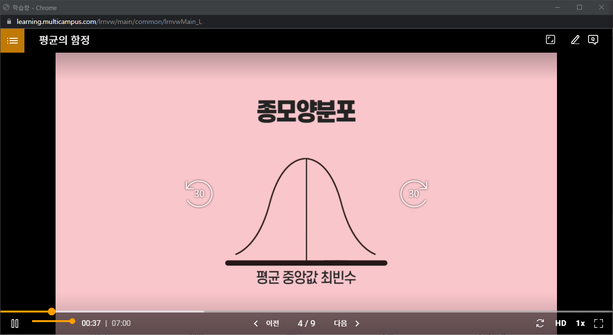
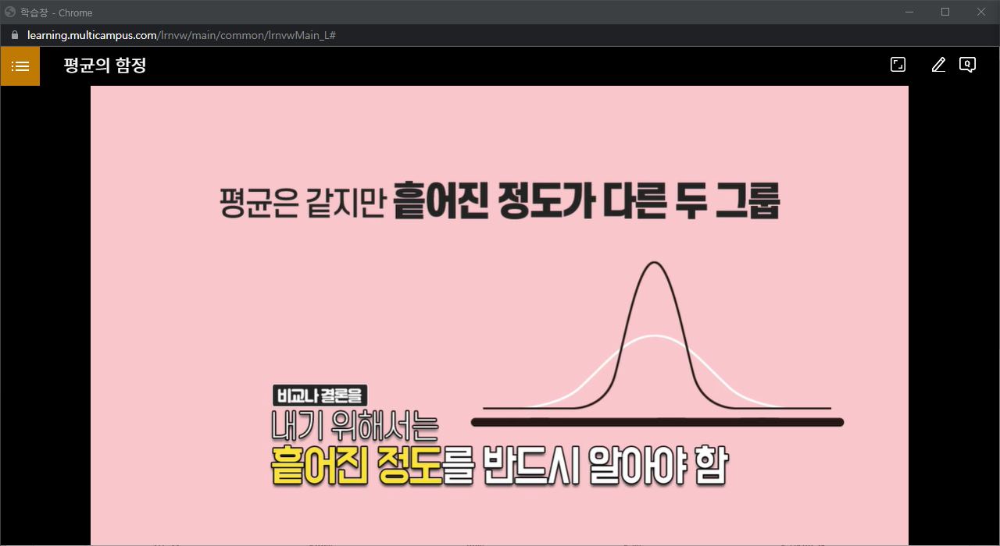

# 빅데이터가 별건가, 알고보면 쉬운 통계상식

### 1. 빅데이터 시대의 현재와 미래

- 데이터가 곧 자본이다(나에게 필요한 자료 분류 필요)

- 기업은 데이터를 어떤일이 왜 발생하였는지를 분석하는데 사용 -> 기계학습(머신러닝, 인공지능)

- 머신 러닝 : 명시적으로 프로그래밍을 하지 않고도 컴퓨터가 데이터 속에서 학습하는 능력

- 빅데이터를 이용한 경쟁우위 선점
- 데이터에 바탕을 둔 사실에 근거한 의사결정

- 데이터를 적극적으로 활용해야 장기적으로 오래 감

- 디지타이징 비즈니스 : 사업을 디지털화하여 혁신을 이뤄야함.
- 빅데이터 5대 핵심기술 : 소셜, 모바일, 사물 인터넷, 클라우드, 인공지능

- 우리는 신이 아닌 이상 모든 일에 근거(데이터)를 제시해야한다.

- 빅데이터 활용(제조,의료서비스,금융/보험, 유동, 여행 수성, 미디어/엔터. 전기/통신)

### 2. 분석, 빅데이터 시대 필수 역량

- 문제 인식과 관련 연구 조사
- 현대의 문맹 - 수맹 : 숫자에 두려움을 갖는 것.
- 현대인의 필요 역량 : 숫자와 통계를 기반으로 하는 분석능력이 반드시 필요함
- 관련 자료를 수집하고 분석해서 필요한 정보를 추출할 수 있는 능력 필요
- 이런 계량적인 정보를 얼마나 능숙하게 다룰 수 있는가

- 변수 : 사람, 상황, 행위 등의 속성을 나타낼 수 있는 대응물
- 자료(Data) : 변수들의 측정치를 모은것
- 나열된 자료에서 변수 사이의 규칙적인 패턴, 즉 변수 간 관련성을 파악하는 단계를 무엇이라 하는가

| ''분석''의 6단계   | 내용                                                         |
| ------------------ | ------------------------------------------------------------ |
| 문제인식           | 문제를 인식하고 그것을 해결하려는 것                         |
| 관련 연구 조사     | 문제와 직 간접적으로 관련된 지식을 문헌등을 통해 조사        |
| 모형화(변수선정)   | 기존 연구 결과를 그대로 적용할지, 아니면 다른 방법을 사용할지.  변수의 선정은 그 변수가 문제 해결에 직접적인 관련이 있는지를 확인 |
| 자료수집(변수측정) | 변수들의 측정치를 모은 것                                    |
| 자료 분석          | 나열된 자료에서 변수 사이의 규칙적인 패턴, 즉 변수 간 관련성을 파악 |
| 결론 도출          | 데이터를 통한 자료 분석 -> 올바른 결론 도출                  |

### 3. 평균의 함정

- 산술평균 : 모든 자료의 값을 다 더해서 전체수로 나눈것
- 예를들어 1 + 1 + 2  + 3 + 1 + 3 + 17 = 28,   28 / 7 = 4 
- 전체 숫자의 중심을 나타내는 대푯값의 역할을 못함

- 큰 값에 영향을 받지 않는 중심의 측정치를 중앙값과 최빈수를 중심으로 볼 수 있음.
- 중앙값 : 숫자들을 크기의 순서로 배열했을 때, 정가운데에 위치하는 값

- 최빈수를 사용한 평균은 1이 되며, 중심의 대푯값 역할을 함
- 그렇다면 어떤 평균을 사용해야 할까?
- 종모양 분포 -> 평균 중앙값 최빈수
- 
- 종모양의 분포를 하지 않는 경우에는 어 떤 종류의 평균인지 알기 전에는 의미 없음
- 예를 들어 '소득'의 경우 오른쪽으로 꼬리가 긴 분포를 가짐.(소수의 인원이 높은 소득을 가짐)
- 최빈수 혹은 산술평균 을 사용하여 같은 자료더라고 해석이 다를 수 있음.

- 값들이 어떤 범위 내 유사한 경우에는 산술평균 사용.
- 특정한 값을 선택하는 경우 중앙 값이나 최빈수 사용.
- 따라서 데이터가 어떤 척도로 측정되어 있는지를 알아야함. (질문이 무엇인가?)
- 명명척도로 측정한 경우 : 최빈수
- 서열척도인 경우 : 중앙값
- 이외의 경우 : 세가지 평균
- 데이터 분포를 반드시 고려해야 함
- 유도된 결론이 데이터에 잘못된 인상을 주지 않는지 고려해야 함.

### 흩어져 있는 정도

- 흔어져 있는 정도 : 각각의 숫자들이 얼마나 서로 다른가를 말함.
- 평균은 같지만 흩어진 정도가 다른 두 그룹의 경우 비교나 결론을 내기 위해서는 흩어진 정도를 반드시 알아야함.

- 범위 : 최솟값과 최댓값의 차이
- 표준편차 : 값이 클수록 산술평균을 중심으로 많이 흩어져 있음. (크다면 자료 주변에 널리 흩어져있음)
- 표준편차가 큰 경우, 평균은 중심의 대푯값으로서의 의미가 약함

### 가중 편균의 함정 : 심프슨의 역설

- 부분 분석이 전체 결과가 일치하지 않을 수 있음.
- 동일하지 않은 가중치를 적용하는 부분에 대한 분석결과와 전체에 대한 분석결과가 일치하지 않음.
