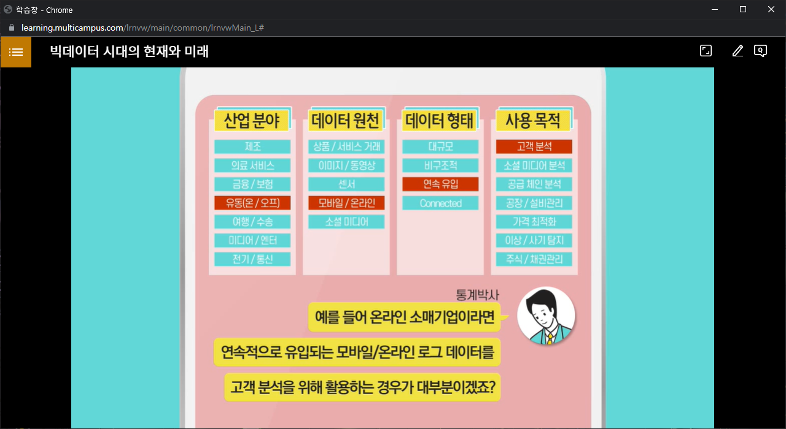

# 빅데이터가 별건가, 알고보면 쉬운 통계상식

### 1. 빅데이터 시대의 현재와 미래

- 데이터가 곧 자본이다(나에게 필요한 자료 분류 필요)

- 기업은 데이터를 어떤일이 왜 발생하였는지를 분석하는데 사용 -> 기계학습(머신러닝, 인공지능)

- 머신 러닝 : 명시적으로 프로그래밍을 하지 않고도 컴퓨터가 데이터 속에서 학습하는 능력

- 빅데이터를 이용한 경쟁우위 선점
- 데이터에 바탕을 둔 사실에 근거한 의사결정

- 데이터를 적극적으로 활용해야 장기적으로 오래 감

- 디지타이징 비즈니스 : 사업을 디지털화하여 혁신을 이뤄야함.
- 빅데이터 5대 핵심기술 : 소셜, 모바일, 사물 인터넷, 클라우드, 인공지능

- 우리는 신이 아닌 이상 모든 일에 근거(데이터)를 제시해야한다.

- 빅데이터 활용(제조,의료서비스,금융/보험, 유동, 여행 수성, 미디어/엔터. 전기/통신)

