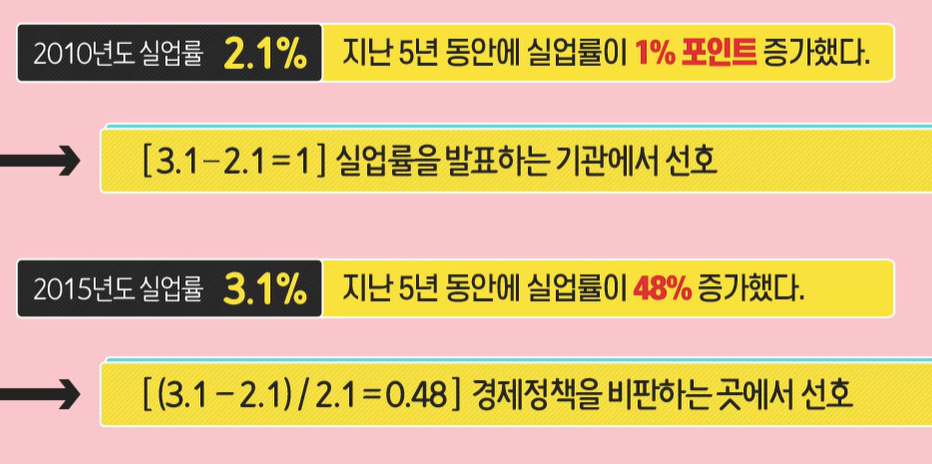

# 빅데이터가 별건가, 알고보면 쉬운 통계상식

### 1. 빅데이터 시대의 현재와 미래

- 데이터가 곧 자본이다(나에게 필요한 자료 분류 필요)

- 기업은 데이터를 어떤일이 왜 발생하였는지를 분석하는데 사용 -> 기계학습(머신러닝, 인공지능)

- 머신 러닝 : 명시적으로 프로그래밍을 하지 않고도 컴퓨터가 데이터 속에서 학습하는 능력

- 빅데이터를 이용한 경쟁우위 선점
- 데이터에 바탕을 둔 사실에 근거한 의사결정

- 데이터를 적극적으로 활용해야 장기적으로 오래 감

- 디지타이징 비즈니스 : 사업을 디지털화하여 혁신을 이뤄야함.
- 빅데이터 5대 핵심기술 : 소셜, 모바일, 사물 인터넷, 클라우드, 인공지능

- 우리는 신이 아닌 이상 모든 일에 근거(데이터)를 제시해야한다.

- 빅데이터 활용(제조,의료서비스,금융/보험, 유동, 여행 수성, 미디어/엔터. 전기/통신)

### 2. 분석, 빅데이터 시대 필수 역량

- 문제 인식과 관련 연구 조사
- 현대의 문맹 - 수맹 : 숫자에 두려움을 갖는 것.
- 현대인의 필요 역량 : 숫자와 통계를 기반으로 하는 분석능력이 반드시 필요함
- 관련 자료를 수집하고 분석해서 필요한 정보를 추출할 수 있는 능력 필요
- 이런 계량적인 정보를 얼마나 능숙하게 다룰 수 있는가

- 변수 : 사람, 상황, 행위 등의 속성을 나타낼 수 있는 대응물
- 자료(Data) : 변수들의 측정치를 모은것
- 나열된 자료에서 변수 사이의 규칙적인 패턴, 즉 변수 간 관련성을 파악하는 단계를 무엇이라 하는가

| ''분석''의 6단계   | 내용                                                         |
| ------------------ | ------------------------------------------------------------ |
| 문제인식           | 문제를 인식하고 그것을 해결하려는 것                         |
| 관련 연구 조사     | 문제와 직 간접적으로 관련된 지식을 문헌등을 통해 조사        |
| 모형화(변수선정)   | 기존 연구 결과를 그대로 적용할지, 아니면 다른 방법을 사용할지.  변수의 선정은 그 변수가 문제 해결에 직접적인 관련이 있는지를 확인 |
| 자료수집(변수측정) | 변수들의 측정치를 모은 것                                    |
| 자료 분석          | 나열된 자료에서 변수 사이의 규칙적인 패턴, 즉 변수 간 관련성을 파악 |
| 결론 도출          | 데이터를 통한 자료 분석 -> 올바른 결론 도출                  |

### 3. 평균의 함정

- 산술평균 : 모든 자료의 값을 다 더해서 전체수로 나눈것
- 예를들어 1 + 1 + 2  + 3 + 1 + 3 + 17 = 28,   28 / 7 = 4 
- 전체 숫자의 중심을 나타내는 대푯값의 역할을 못함

- 큰 값에 영향을 받지 않는 중심의 측정치를 중앙값과 최빈수를 중심으로 볼 수 있음.
- 중앙값 : 숫자들을 크기의 순서로 배열했을 때, 정가운데에 위치하는 값

- 최빈수를 사용한 평균은 1이 되며, 중심의 대푯값 역할을 함
- 그렇다면 어떤 평균을 사용해야 할까?
- 종모양 분포 -> 평균 중앙값 최빈수
- 
- 종모양의 분포를 하지 않는 경우에는 어 떤 종류의 평균인지 알기 전에는 의미 없음
- 예를 들어 '소득'의 경우 오른쪽으로 꼬리가 긴 분포를 가짐.(소수의 인원이 높은 소득을 가짐)
- 최빈수 혹은 산술평균 을 사용하여 같은 자료더라고 해석이 다를 수 있음.

- 값들이 어떤 범위 내 유사한 경우에는 산술평균 사용.
- 특정한 값을 선택하는 경우 중앙 값이나 최빈수 사용.
- 따라서 데이터가 어떤 척도로 측정되어 있는지를 알아야함. (질문이 무엇인가?)
- 명명척도로 측정한 경우 : 최빈수
- 서열척도인 경우 : 중앙값
- 이외의 경우 : 세가지 평균
- 데이터 분포를 반드시 고려해야 함
- 유도된 결론이 데이터에 잘못된 인상을 주지 않는지 고려해야 함.

### 흩어져 있는 정도

- 흔어져 있는 정도 : 각각의 숫자들이 얼마나 서로 다른가를 말함.
- 평균은 같지만 흩어진 정도가 다른 두 그룹의 경우 비교나 결론을 내기 위해서는 흩어진 정도를 반드시 알아야함.

- 범위 : 최솟값과 최댓값의 차이
- 표준편차 : 값이 클수록 산술평균을 중심으로 많이 흩어져 있음. (크다면 자료 주변에 널리 흩어져있음)
- 표준편차가 큰 경우, 평균은 중심의 대푯값으로서의 의미가 약함

### 가중 편균의 함정 : 심프슨의 역설

- 부분 분석이 전체 결과가 일치하지 않을 수 있음.
- 동일하지 않은 가중치를 적용하는 부분에 대한 분석결과와 전체에 대한 분석결과가 일치하지 않음.

## 4. 퍼센트를 조심하라

- 적은 자료를 토대로 계산한 퍼센트는 오판의 가능성이 존재

- 퍼센트라 함은 '무엇'이 기준이고 '기준'은 분모가 되기 때문에 항상 명확해야 함.
- 퍼센트는 원래의 숫자를 비교하는 정보로서만 인식해야함.
- 무엇에 대한 퍼센트인지, 기준은 어떻게 잡았는지 늘 염두해야 함.
- 기준 차이가 많은 경우 단순 크기 비교는 무의미.
- %P(퍼센트 포인트) 는 퍼센트 비교시 기준이 같을 때, 두 퍼센트의 차이(혹은 변화)

## 5. 시각화의 오용과 남용

- 문제분석 -> 자료수집 -> 자료창출 -> 자료분류 -> 자료저장 -> 자료활용
- 데이터 분석결과를 어떻게 효과적으로 전달할 것인가?

- 데이터를 쉽게 시각화하여 전달하는 것이 중요 (그래프나 플롯)

- 선그래프

  - x축, y축 눈금을 조절하면 시각적으로 전달하는 느낌이 달라짐.(의도에 맞게 변화)

  - 눈금의 크기를 일관성 있게 유지해야함

- 그림도표
  - 그리는 과정에서 일어날 수 있는 과장이나 축소를 주의해야함.
  - 그래프가 전체 그림을 보여주고 있는가? 축을 변형하거나, 그래프를 자르거나, 데이터를 왜곡하지 않았는가?

## 6. 확률에도 종류가 있다

- 아마나, 혹시나, 행운 등의 단어에도 확률에 대한 개념이 들어가 있음.
- 확률은 불확실한 것을ㅇ 재는 것으로 0에서 1까지의 값을 갖는데 그 값이 커질수록 일어날 가능성이 높아짐.
- 선험적, 경험적,  주관적, 3가지 확률이 있음
- 선험적 확률 : 미리 경험하기 전에 알 수 있는 확률(ex : 동전 던지기)
  - 일어날 확률과 미리 알 수 있는 확률이 다르면 문제 및 차이가 나는 원인을 해석하여 문제 해결
- 경험적 확률 : 오랜 기간에 걸쳐서 동일한 상황이나 조건하에서 어떤 사건이 일어나는 상대적인 비율로 확률해석 -> 조사한 자료가 많을수록 경험적 확률의 정확성이 올라감.
  - 벤포드 법칙(첫 자리 법칙) : 데이터의 조작탐지와 횡령, 탈세자 탐지등에 사용(첫자리수의 1이 확률적으로 높음)

- 주관적 확률 : 개인이 기대하는 확률, 한 개인이 어떤 사건이 일어날 것이라고 믿는 정도가 곧 그 사건의 확률

## 7. 확률을 이용한 판단 오류

- 야구 경기는 확률의 경기 -> 많을 데이터를 모을 수 있기 때문. 표본이 많음.

- 대부분의 사람들은 확률에 대한 이해가 낮음. (직관과 다르기 때문)
- 정확한 의사결정을 위해서는 확률을 정확히 이해해야함.
- 각 특성이 독립적이지 않으므로, 일치할 확률은 더 높아짐
- ex1 ) 미국의 콜린즈 사건을 예를 보면
- 어떤 남성이 범인의 특성과 일치할 확률(x) < 다른 커플이 범인의 특성과 일치할 확률 (o)
- 범인의 특성과 일치한다는 조건하에서 범인의 특성과 일치하는 다른 커플이 있을 확률은 달라짐.
- 사건과 직접 관계된 올바른 변수선정과 계산을 근거로 콜린즈 외 범인의 특성과 일치하는 다른 남성이 있을 확률이 상당히 높음.

- ex2 ) 도박사의 오류
- 로또의 경우 840회 축적된 데이터는 아주 소량의 자료이므로 빅데이터가 아님.
- 평균의 법칙(대수의법칙) : 시도(혹은 실험)를 반복하면 반복할 수록 원래의 이론적인 확률에 접근

- ex3 ) 유용성의 오류

- 유용성의 오류 : 쉽게 기억나는 사건들이 일어날 확률을 높게 평가하는 것.

- 우연의 일치 : 파이(원주율 3.141592의 근사치)

- 숫자 속 숨어있는 진실과 가치를 파악하는 것이 중요.

## 8. 여론조사 올바로 이해하기

- 표본조사와 대표성
  - 전체가 아닌 일부표본을 조사하는 방법은 오래된 방식은 아님.
  - 표본의 대표성 : 모집단과 표본에 대해 알아야함
  - 모집단 : 연구의 대상이 되는 집단. 즉, 조사 연구자가 추론하고자 하는 모든 자료들의 집합
  - 표본조사 : 표본을 뽑아서 조사한 뒤 이를 근거로, 모집단의 특성을 추정(적절한 경우 전수조사보다 효율적)
  - 좋은 표본을 뽑아야 함.
  - 무작위 추출 : 모집단에 속한 대상들이 표본에 뽑힐 확률이 모두 동일한 것.
  - 무작위 추출은 표본을 뽑는 사람의 판단이나 편리함이 고려되지 않음(대표성 유지를 위한 필수조건)

- 편의표본 : 주로 가까이에 있는 대상을 표본으로 추출(사람의 주관적 판단이 개입)
  - 이는 무작위 추출이 어려운 경우
  - 연구의 예비적인 결과를 미리 알기 위해 사용
  - 성급한 일반화를 주의(무작위 추출과 다르므로 주의해야함.)

- 표본을 얼마나 뽑아야 하는지도 매우 중요함.
  - 모집단을 얼마나 뽑아야 하는가
  - 조사가 어느정도의 정확도를 요구하는가?
- 질문과 응답항목
  - 여론조사의 성패는 질문의 질과 직결됨.
  - 질문의 의도에 따라서도 결과가 달라짐.
  - 응답률을 높이기 위해 조사자의 의도가 개입되어서는 안됨.
- 조사결과의 해석
  - 누가 어떤 목적으로 조사했는가?
  - 조사에 후원한 후원 동기는 무엇인가?
  - 표본이 적절한가?

## 9. 상관관계는 인과관계가 아니다

- 담뱃값과 흡연율 사이에 상관관계가 있지만, 담뱃값이 오르면 흡연율이 낮아지는지에 대한 인과적 결론은 나지 않음(다른 요인에 의해서도 영향을 받기 때문)
- 인과관계의 조건
  - 상관관계 : 어떤 변수가 증가할 때, 다른 변수가 함께 증가하는지 혹은 감소하는지를 관찰하여 파악해야함. 어떤 것들 간의 관계가 밀접하다는 것을 나타냄
  - 1. 원인은 결과보다 시간적으로 앞서야함
  - 2. 원인과 결과는 관련이 있어야함
  - 3. 결과는 원인이 되는 변수만으로 설명이 되어야 하고 다른 변수에 의한 설명은 제거되어야 한다.
    4.  상관 관계는 어떤 것들 간의 관계만 나타내며, 어떤 것이 원인이고 결과인지에 대한 증거를 제공하지 않음.
- 우연한 상관관계
  - 두 개의 변수는 서로 인과관계가 없는 경우가 많다?
    - 허위 관련성 : 두 변수가 전혀 관계가 없는 경우보다 우연히 상관관계를 나타내는 경우가 흔함.
  - 우연적 상관관계를 마치 인과적 관계가 있는 것처럼 잘 못 판단하는 경우가 많음.
  - 원인과 결과를 모두 만족한다고 하더라도 인과관계가 있다고 단정지을 수 없음. (전후 인과의 오류)
- 인과관계의 방향
  - 상관관계가 있다고 할때, 흔히 생각하는 것과 반대방향으로 인과관계가 작용할 수도 있음
  - 감독을 바꾸는 것이 팀이 지는 것의 원인이 될 수는 없음.(원인과 결과가 반대임)
  - 원인과 결과가 생각과는 반대방향으로 작용하지만, 쉽게 드러나지 않는 경우가 많으므로 주의
  - 승용차가 한대 있는 가정에서 한대 더 구입한 경우, 차량 당 주행거리는 줄어들까, 늘어날까?
    - 미국의 통계를 보면 차보유대수가 증가하면 차량당 평균주행거리가 증가함.
- 원인은 딴 곳에
  - 상식과는 동떨어진 원인이 있을 수 있음
  - 교회수 증가는 범죄 발생 증가? (아니다. 인구의 증가가 원인이다)
  - 흡연자들이 비흡연자들에 비해서 폐암에 걸릴 확률이 높다.(이는 사실이지만 너무 단순화 하여 일반화 할 수 없음. 폐암 발생의 유일한 원인이 흡연으로 단정 지어서는 안됨.)

## 10. 비교 어떻게 해야 할까?

- 복수의 대한을 제시하되, 상대가 선택하도록 함.
- 비교의 함정
  - 비교 : 둘 이상의 사물을 견주어 서로 간의 유사점, 차이점, 일반 법칙 따위를 고찰하는 것
  - 내가 가진것이 아닌, 다른 사람이 가진 것을 세는 것이다.
  - 비교는 비교대상을 계량화 하기 어려울 경우 더 자주 나타냄.(숫자로 나타내기 어려운 경우 주관적으로 판단하기 때문)
  - 비교를 할 때는 비교되는 특성이 같아야함.
  - 우리나라의 실업률과 미국의 실업률을 비교하는 것은 옳지 않음(실업률의 정의가 다름)
  - 비교되는 특성 이외의 것들은 서로 비슷해야함.

- 같은 것끼리, 다른 조건은 비슷하게
  - 기준이 틀린 자료의 비교는 의미가 없음.
  - 명문대 합격자 숫자를 기준으로 명문고를 판단하는 것은 다른 조건을 고려하지 않은 잘못된 판단임.
  - 정확한 비교가 뒷받침된 통계가 필요함.
- 원래 크기가 다르다면?
  - 원래 대상들의 크기에 차이가 있음을 고려하지 않으면 잘못된 결론에 도달.
- 이혼율 : OECD 국가 중에서 9위는 굉장히 높다?
  - 문화를 고려하면, 프랑스의 경우 결혼전 동거, 법적으로 인정하므로 우리나라와의 단순비교를 하는 것은 옳지 않음. 여러 요소를 살펴봐야함
