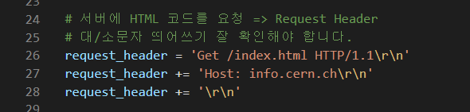
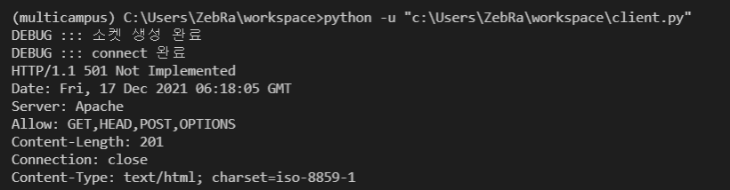

## 파이썬 인터프리터의 설치
- [파이썬 공식 홈페이지](http://www.python.org)
  - 파이썬은 기본적으로 한 버전만 설치하는 것이 원칙입니다. 
  - 여러개의 버전을 동시에 여러개 설치해서 사용할 수 없다는 의미
    - 억지로 억지로 여러개를 설치할 수 있지만, 그렇게 사용하지는 않습니다.

  - **설치시 주의사항은 `Add to python to PATH` 항목 체크**
  - 파이썬 쉘을 종료할 때는 EOF를 사용하면 됩니다. 
    - 윈도우즈: ctrl + z
    - 맥OS: ctrl + d


## 가상환경
- 여러개의 파이썬을 설치해서 격리(독립)된 환경을 구축
- 파이썬에서는 가상환경을 지원하는 여러가지 프로그램이 있습니다. 
  - Anaconda, VirtualEnv, ... 
  - 수업시간에는 `Anaconda`를 사용하도록 합니다. 
- 아나콘다 설치
  - [Anaconda](https://www.anaconda.com/products/individual)
  - 설치는 기본적으로 긍정적으로 하시면 됩니다. 
    - `next`, `Agree`, `install`, ... 
  - 주의사항은 설치 도중에 `Advanced Installation Options` 에서
    - **`Add Anaconda3 to the system PATH environment variable` 항목을 꼭 체크를 해주세요**

  - CLI 기반의 명령어를 통해서 가상환경을 생성, 삭제, 확인, ...
    - CLI(Command Line Interface)
    - GUI(Graphic User Interface)
  - 명령어 기반이 익숙해지면 다루기는 더 편하지만, 처음 사용하시는 분들을 위해 `Anaconda Nevigator`를 통해서 가상환경을 다루도록 합니다. 


## IDE(Integrated Development Environment)
- 통합개발환경
  - 지난수업시간까지 사용했던 IDE `주피터`라는 IDE를 사용
  - 로컬환경에서 사용가능한 또다른 개발환경
  - `Visual Studio Code`
    - `Visual Studo`라는 개발도구도 있습니다. 
    - 이름이 같고, 비슷하게 생겼어요!
    - 전혀다른 개발도구 입니다. 
    - 만든 회사는 둘다 MS에서 개포하는 개발도구
- VScode(Visual Studio Code)
  - 파이썬이 아니어도 다른 개발에도 사용가능합니다
  - [다운로드](https://code.visualstudio.com/download)
  - 컴파일러(인터프리터) + 에디터 + 디버거 + 유틸 ... 
  - VScode는 인터프리터를 따로 설치(가상환경)


# 웹프로그래밍 개발 환경
- HTML, CSS, JavaScript(프론트-엔드)

- JavaScript
  - [node.js](https://nodejs.org/ko/download/): 자바스크립트를 실행하기 위한 인터프리터
  - VScode 에서는 `code runner` 패키지를 설치해주시면 됩니다. 

- HTML & CSS
  - 테스트를 위해서 아래의 방법으로 코드를 자동으로 생성해줍니다. 
    - 확장자가 `.html`인 파일을 하나 생성해줍니다. 
    - 해당 파일에서 아래와 같이 자동으로 코드를 생성해줍니다. 
      - ![tab]
      - html:5[tab]
  - `open in browser` 확장 패키지를 설치 해줍니다. 
    - 파일 탭에서 마우스 우클릭 => `open in default browser` 선택
  - `Live Server` 확장 패키지를 설치 해줍니다. 
    - 에디터에서 마우스 우클릭 => `open with live server` 선택


### 풀스택 = 프론트 엔드 + 백엔드

- 프론트
  - HTML, CSS, Javascript


## 풀스택 개발 과정

# 웹(WWW)이란? 
- World Wide Web
- CERN
  - 아주 유명한 물리연구소 입니다. 
  - `힉스입자`가 발견된 곳이에요
  - 이 연구소에 웹의 시초가 개발이 됩니다. (by. 팀버너스리)
    - 문서의 공유를 쉽게 하기 위해서 만든거에요(연구소 내에서)
    - 만들고 보니 너무 괜찮은거에요 => 외부에 공개(세계 최초의 웹 페이지)
    - [세계최초의 웹페이지](http://info.cern.ch)


### 소스코드를 브라우징에서 랜더링하여(해석) 출력물을 내 놓음.

# 웹의 원래 목적은? 
- 문서를 쉽게 공유하기 위한 목적으로 제일 처음 만들어졌습니다. 
- 최초의 웹을 `Web 1.0` 이라고 표현하기도 합니다. 
  - 웹의 발전사에 따라서 `Web 2.0, 3.0, ... `등으로 표현을 합니다. 
  - 웹 1.0은 문서를 표현하는 **정적**인 웹 사이트
  - 웹 2.0은 `자바스크립트`의 출현으로 정적인 페이지에서 동적인 페이지가 나오기 시작했던 시대를 얘기합니다. 
  - 웹 3.0을 `CGI(Common Gateway Interface)`이 기술이 나오기 시작한 시대
    - 이때의 CGI 기술이 발전해서 지금의 `백엔드`가 됩니다.

  - 3.0과 4.0 사이에 10년 이라는 시간이 존재
    - 이 시간동안 웹 표준이 거의 변화가 없던 시절
  - 웹 4.0은 HTML5 표준이 나온 시대
    - `자바스크립트`가 표준 언어로 지정
      - Vue, node, React, Angular, JQuery, ...
      - 프론트엔드 수업은 자바스크립트로 된 라이브러리를 배우는 수업
    - 문서만 표현할 있었던 HTML이 비디오를 포함한 이미지, 음악, 등도 같이 표현
- 문서를 표현하던 웹 페이지가 현재는 어플리케이션을 대신하고 있습니다. 


# 웹의 동작 방식

1. HTTP(Hyper-Text Transfer Protocol)
  - HTML로 이루어진 `텍스트`를 네트워클 통해서 송/수신 하는 방법
    - HTML로 이루어진 소스파일은 서버에 존재를 하고 
    - 브라우저는 서버로부터 HTML 소스파일을 전송받아서 화면에 표현

2. HTML(Hyper-Text Markup Language)
  - 하이퍼-텍스트로 이루어진 소스코드
    - 왜? 이름이 하이퍼-텍스트 인지는 모르겠어요
    - 누군가는 하이퍼를 `지랄같다`라고 해석을 하기도 합니다.
    - 즉, 하이퍼라는 단어가 큰 의미를 가지지는 않습니다. 
  - 마크업은?
    - `<, >`로 이루어진 텍스트를 마크업 언어라고 합니다. 

- 프론트 엔드 Vs. 백엔드
  - 어디서 실행되느냐 입니다. 
  - 프론트엔드
    - 웹브라우저에서 실행되는 것을 의미합니다.(HTML, CSS, JavaScript)
    - 그래서, 소스코드를 모두 다운로드 해서 브라우저가 실행
    - 소스코드가 모두 공개됩니다. 
  - 백엔드
    - 서버에서 실행되는 것을 의미합니다. 
    - 그래서 코드가 공개되어 있지 않습니다. 
    - 우리가 브라우저에서 확인할 수 있는 것은 서버에서 실행하고 난 후에 반환된 값을 보고 있는 겁니다. 
    - 자바의 스프링, 파이썬의 장고, 루비의 레일즈, ... 


## HTTP
- 네트워크 전송 규약
  - 문자 프로토콜
  - 하이퍼 텍스트를 주고 받기 위한 네트워크 표준


### 소켓 프로그래밍
- 네트워크를 통한 입/출력(통신)을 하기 위한 프로그래밍을 `소켓 프로그래밍` 이라고 합니다. 
  - `소켓`을 이용한 통신을 한다고 해서 붙여진 이름
- 수업시간에는 `TCP socket`을 이용한 간단한 HTTP 통신을 실습

```
import socket

# 네트워크 통신을 하기 위한 소켓 객체를 생성
# IPv4를 이용한 TCP 통신용 소켓
# 이렇게 생성된 소켓 객체를 통해서 서버와 통신(입/출력)을 할 수 있습니다. 
sock = socket.socket( socket.AF_INET, socket.SOCK_STREAM )
print('DEBUG:::소켓 생성 완료')

# 파일 입/출력 할 때 open을 통해서 입/출력 하기 위한 파일 객체를 얻어온 것 처럼
# 통신(입/출력)하기 위한 서버 객체를 생성
# 소켓 프로그래밍 에서는 connect()를 통해서 통신 하기위한 서버의 객체를 얻어올 수 있습니다. 
# 생성된 객체를 통해서 입/출력(통신)

# 읽거나 쓰기 위한 파일의 경로와 유사
# 통신하기 위한 네트워크 상의 경로 정도로 이해
serverAddress = socket.gethostbyname('info.cern.ch')
serverPort = 80

# 오픈하기 위한 서버의 경로는 튜플로 전달
sock.connect( (serverAddress, serverPort) )
print('DEBUG:::connect 완료')

# 서버에 HTML 코드를 요청 => Request Header
# 대/소문자 띄어쓰기 잘 확인해야 합니다. 
request_header = 'GET /index.html HTTP/1.1\r\n'
request_header += 'Host: info.cern.ch\r\n'
request_header += '\r\n'

# 요청대로 처리가 되어서 HTML 코드가 잘 다운로드 되는지 확인해봅니다. 
sock.send( request_header.encode() )
response = sock.recv(1024)
print( response.decode() )

# 생성된 소켓을 닫아줍니다.
sock.close()
```


.





### Request Header

```
GET /index.html HTTP/1.1\r\n
Host: info.cern.ch\n\n
\r\n
```

1. 요청 헤더

```
GET /index.html HTTP/1.1\r\n
-----------------------------
star-line(request-line)CRLF

Host: info.cern.ch\r\n
-----------------------------
헤더 필드: *

\r\n
----
헤더의 끝을 의미
```

- HTTP 헤더에서 `CRLF`는 구분자 입니다. 
  - 라인과 라인, 필드와 필드를 구분해주는 구분자의 역할
- 헤더필드는 서버와의 통신에 필요한 여러가지 정보를 표현
  - 예제에서는 `Host`변수 하나만 사용을 했는데 
  - 더 많은 변수를 사용할 수 있습니다. 


#### request-line

```
    GET     SP    /index.html     SP    HTTP/1.1     \r\n
  -------  ----  --------------       -------------  -------
  method  space        url            protocol ver     sep
```

- 3개의 필드로 구성
  - 각 필드의 구분자는 `SP(공백)` 입니다. 

- method
  - [위키 참조](https://ko.wikipedia.org/wiki/HTTP)
  - [나무위키 참조](https://namu.wiki/w/HTTP)
- URL/URI
  - Uniform Resource Locator
    - 네트워크상에서 접근하려는 리소스(파일)의 경로 정도로 이해
  - Uniform Resource Identifier
    - 동일한 경로 표현이기는 한데 정확한 파일의 정보는 노출이 되지 않음
    - 일반적으로 식별번호를 이용하면, 백엔드에서 그에 맞는 정보를 반환


```
# 메소드 테스트

import socket

serverAddress = socket.gethostbyname('info.cern.ch')
serverPort = 80

sock = socket.socket( socket.AF_INET, socket.SOCK_STREAM )
sock.connect( (serverAddress, serverPort) )

method = 'GET' # GET 대신에 HEAD, OPTIONS로 바꿔보고 응답을 확인해봅시다 
request_header = f'{method} /index.html HTTP/1.1\r\n'
request_header += 'Host: info.cern.ch\r\n'
request_header += '\r\n'

sock.send( request_header.encode() )
response = sock.recv(1024)
print( response.decode() )

sock.close()


HTTP/1.1 200 OK
Date: Fri, 17 Dec 2021 08:00:30 GMT
Server: Apache
Last-Modified: Wed, 05 Feb 2014 16:00:31 GMT
ETag: "286-4f1aadb3105c0"
Accept-Ranges: bytes
Content-Length: 646
Connection: close
Content-Type: text/html

<html><head></head><body><header>
<title>http://info.cern.ch</title>
</header>

<h1>http://info.cern.ch - home of the first website</h1>
<p>From here you can:</p>
<ul>
<li><a href="http://info.cern.ch/hypertext/WWW/TheProject.html">Browse the first website</a></li>
<li><a href="http://line-mode.cern.ch/www/hypertext/WWW/TheProject.html">Browse the first website using the line-mode browser simulator</a></li>
<li><a href="http://home.web.cern.ch/topics/birth-web">Learn about the birth of the web</a></li>
<li><a href="http://home.web.cern.ch/about">Learn about CERN, the physics laboratory where the web was born</a></li>
</ul>
</body></html>

```

````
### Response Header

```
HTTP/1.1 200 OK
Date: Fri, 17 Dec 2021 08:06:35 GMT
Server: Apache
Last-Modified: Wed, 05 Feb 2014 16:00:31 GMT
ETag: "286-4f1aadb3105c0"
Accept-Ranges: bytes
Content-Length: 646
Connection: close
Content-Type: text/html
```
````

````
#### 응답 헤더 구성

```
HTTP/1.1 200 OK\r\n
----------------
start-line(response-line)CRLF

Date: Fri, 17 Dec 2021 08:06:35 GMT\r\n
Server: Apache\r\n
Last-Modified: Wed, 05 Feb 2014 16:00:31 GMT\r\n
ETag: "286-4f1aadb3105c0"\r\n
Accept-Ranges: bytes\r\n
Content-Length: 646\r\n
Connection: close\r\n
Content-Type: text/html\r\n
-----------------------------------------------
header-field: *

\r\n
----
헤더의 끝
```
````


#### response-line
- 클라이언트의 요청에 대한 처리 결과


```
      HTTP/1.1     SP    200     SP    OK\r\n
    ------------       -------       -----------
    protocol ver     status code    status string
```

- request-line과 마찬가지로 3개의 필드로 구성
  - 각 필드의 구분자는 `SP(공백)`입니다. 

- 상태코드
  - [위키 참조](https://ko.wikipedia.org/wiki/HTTP_%EC%83%81%ED%83%9C_%EC%BD%94%EB%93%9C)
  - [나무위키 참조](https://namu.wiki/w/HTTP/%EC%9D%91%EB%8B%B5%20%EC%BD%94%EB%93%9C)

  - 1XX: 거의 볼 일이 없기는 합니다.
  - 2XX: 서버가 요청을 수락했음을 의미
    - 200 OK: 클라이언트 요청을 수락했고 처리가 잘 되었음을 의미
  - 3XX: 요청에는 문제가 없지만, 요청에 대한 optional한 처리
    - 304 Not Modified: 요청한 리소스가 변경되지 않았음을 의미
    - 301, 302는 리디렉션(Redirection)과 관련
      - 영구이동, 임시이동
      - 지금 요청한 리소스의 위치가 바뀐 경우
      - 301과 302는 리소스의 새로운 위치를 알려준다. 
  - 4XX: 클라이언트 요청 오류(요청에 문제가 있는 경우)
    - 400 Bad Request: 오탈자, 없는 리소스
    - 401 Unauthorized, 403 Forbidden
      - 둘 다 권한과 관련된 오류
      - 401은 인증키가 없는 경우에 
      - 403은 해당 리소스에 대한 접근 권한이 없는 경우
    - 404 Not Found: 리소스를 찾을 수 없는 경우
  - 5XX: 서버 에러(요청을 처리하다가 서버에서 오류가 발생한 경우)
    - 500 Internel Server Error
      - 예를 들면 파이썬 코드에서 문제가 발생하는 경우
