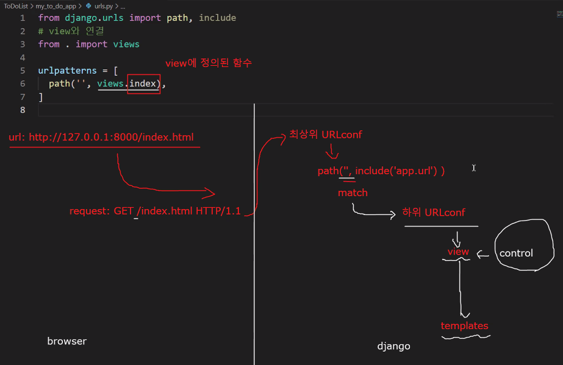
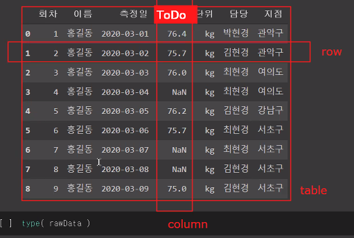
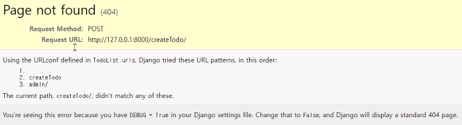
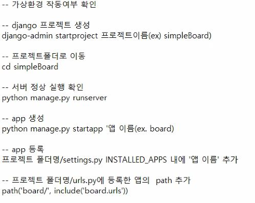
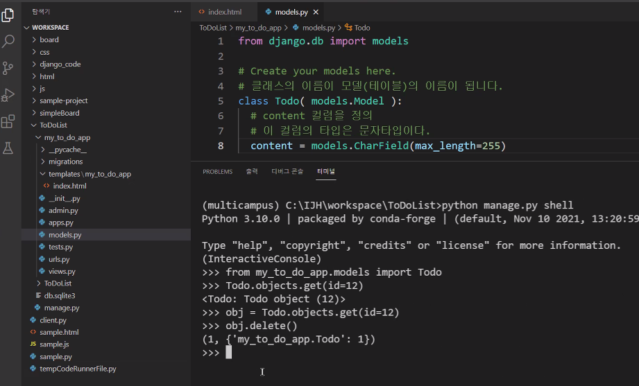

# 장고 설치
- 교재(p. 87). 2.3.3. Django 설치하기

- VScode에서는
  - 파이썬 파일을 선택한 이후에 인터프리터를 설치한 가상환경을 선택해주시면 됩니다. 
  - 터미널 실행했을 때, 다음과 같이 보여지면 됩니다. 

  ```
      Microsoft Windows [Version 10.0.18362.959]
      (c) 2019 Microsoft Corporation. All rights reserved.
  
      C:\IJH\workspace>C:/ProgramData/Anaconda3/Scripts/activate
  
      (base) C:\IJH\workspace>conda activate multicampus
  
      (multicampus) C:\IJH\workspace>
      -------------
      가상환경이 선택된 이후에 명령어를 실행을 해야만 합니다. 
  ```

## 터미널에서 가상환경 선택

- 가상환경 목록 확인

```
Microsoft Windows [Version 10.0.18362.959]
(c) 2019 Microsoft Corporation. All rights reserved.

C:\IJH\workspace>conda env list
                 --------------
                 가상환경 목록 확인하기 위한 명령어
# conda environments:
#
base                  *                        C:\ProgramData\Anaconda3
----                -----                   -----------------------------
가상환경 이름    현재 선택된 가상환경          가상환경이 설치된 위치(경로)
multicampus              C:\ProgramData\Anaconda3\envs\multicampus   

```

- 가상환경 선택

```
C:\IJH\workspace>conda activate multicampus

(multicampus) C:\IJH\workspace>conda env list
-------------
현재 선택된 가상환경
# conda environments:
#
base                     C:\ProgramData\Anaconda3
multicampus           *  C:\ProgramData\Anaconda3\envs\multicampus   
                    ------
                 현재 선택된 가상환경

```

- `주의`
  - 설치는 명령어 기반이기 때문에 명령어를 실행할 때의 가상환경이 중요합니다. 
  - 엉뚱한 다른 가상환경에 설치될 수 있습니다. 

## 파이썬 모듈(패키지) 설치
- 어떤걸 사용해도 문제는 없습니다. 
  1. pip
  2. conda 


### pip를 이용한 패키지 관리

- 설치된 모듈(패키지) 확인

```
prompt> pip list
```

- pip를 이용한 설치

```
prompt> pip install [설치할 모듈(패키지)이름]
```

- pip를 이용한 모듈(패키지) 업그레이드

```
prompt> pip install --upgrade [업그레이드할 모듈(패키지)이름]
```


### conda를 이용한 패키지 관리

- 설치된 모듈(패키지) 확인

```
prompt> conda list
```

- 설치

```
prompt> conda install [설치할 모듈(패키지)이름]
```


## 장고 설치

- pip 업그레이드
  - pip는 파이썬의 패키지 관리자 입니다. 
  - 그래서, 항상 최신버전으로 유지해주시는게 좋습니다. 
  - 명령어가 `update`가 아닌, `upgrade`라는거에 주의 해주세요
  - 권한 문제가 발생할 수 있지만, 설치가 안되는건 아니기 때문에, 무시해주겠습니다. 

```
prompt> pip install --upgrade pip
```

- 장고 설치

```
prompt> pip install django
```

- 설치 확인
  - 목록에서 `django` 이름이 보이면 됩니다. 

```
prompt> pip list
...
django
...
```


## 장고 예제 따라해보기

## 프로젝트 생성
- 하나의 웹 사이트를 만들려면 하나의 프로젝트를 생성
- 교제(p. 90)
  - 교재에서 첫번째 프로젝트의 이름은 `ToDoList` 입니다. 

- 프로젝트를 생성하는 방법

```
prompt> django-amdin startproject 프로젝트이름
```


### 프로젝트에서 생성되는 것들

```
프로젝트/
  - manage.py
  - 프로젝트/
    - __init__.py
    - setting.py
    - urls.py
    - wsgi.py
    - asgi.py
```

- manage.py
  - 전체적인 프로젝트를 관리할 수 있는 유틸
  - 프로젝트 초기화, 마이그레이션, 앱 생성, ... 
- 프로젝트/setting.py
  - 현재 프로젝트의 환경설정 파일
- 프로젝트/urls.py
  - 현재 프로젝트의 URL에 대한 설정
- 프로젝트/wsgi, asgi.py 
  - 작성된 웹 사이트를 서버를 통해서 배포하는 경우에 사용
  - 수업시간에는 로컬 환경에서만 동작을 확인


## 가상서버 실행

```
prompt> cd 프로젝트폴더
prompt> python manage.py runserver
```


## 앱 생성하기
- 앱(app/application) 
- 하나의 프로젝트는 여러개의 앱으로 구성
- 기능 또는 서비스에 따라서 여러개의 앱을 구성
  - 현재 진행하는 프로젝트는 하나의 앱으로 구성이 되어 있습니다. 
  - `ToDoList` 프로젝트는 `할 일 목록` 기능만 있는 겁니다. 

- 앱 생성하는 방법
  - 교재에서 사용하는 앱의 이름은 `my_to_do_app` 입니다. 

```
prompt> python manage.py startapp 앱이름
```


## MVC 구조
- `웹 프레임워크`란? 
  - 웹 서비스를 하기 위해 필요한 구조를 제어하기 편하게 미리 만들어 놓은 구조 정도로 이해
  - 프레임워크에서 제공하는 구성에 맞춰서 작성만 하면 서비스가 가능
- MVC
  - Model, View, Controll 의 약자로 
  - 기능별로 프레임워크 구조가 나눠져 있다고 보면 됩니다. 
  - 각각의 역할을 이해하고, 그에 맞춰서 기능을 구현

  - Model
    - DB와 관련된 기능
    - 장고에서는 `models.py`가 해당 역할을 수행
  - View
    - 화면에 보여지는 기능
    - 장고에서는 `Templates`를 이용해서 view 역할을 수행
  - Control 
    - View와 Model 사이의 제어 역할
    - 장고에서는 `views.py`가 해당 역할을 수행
- 장고는 다른 의미로 `MVT` 구조라고 하기도 합니다. 


## 템플릿 작성하기
- 교재(p. 134) 1.4 HTML 템플릿 사용하기
- `view`를 담당하는 기능
  - 사용자에게 보여지는 기능
  - 결국, HTML된 소스코드를 브라우저에 보여질 수 있게 하는 기능

- `templates` 폴더는 `앱폴더`에 직접 폴더를 만들어주면 됩니다. 
  - 장고는 `templates` 폴더에서 찾게 될 겁니다. 
  - `templates` 폴더에 앱이름과 동일하게 폴더를 하나 더 생성

- 실제 폴더의 구조는 다음과 같이 됩니다. 

```
프로젝트폴더/
  - manage.py
  - 프로젝트폴더/
  - 앱폴더/  
    - templates/
      - 앱폴더/
        - index.html
```

- 해당 앱에서 화면에 보여지는 내용이 있다면 `template`폴더를 찾게 되고
  - `templates` 폴더 내에서 앱이름과 동일한 이름의 폴더를 찾아서 
  - 그 내부에 있는 HTML 파일을 사용하게 됩니다. 


## 앱등록
- 장고에서는 앱을 사용하려면 설정에서 해당 앱을 등록 해줘야 합니다. 
  - `setting.py`에서 설정 합니다. 
  - 추가를 해주지 않으면, 장고는 어떤 앱이 설치 되었는지 알 수 없습니다. 

- `프로젝트폴더/프로젝트폴더/settings.py`
  - `INSTALLED_APPS`를 찾아서 아래와 같이 추가된 앱을 리스트에 등록 해줍니다. 
  
```
INSTALLED_APPS = [
    'django.contrib.admin',
    'django.contrib.auth',
    'django.contrib.contenttypes',
    'django.contrib.sessions',
    'django.contrib.messages',
    'django.contrib.staticfiles',
]

# 설치된 앱을 다음과 같이 등록 해줍니다. 
INSTALLED_APPS += [ 
    'my_to_do_app',
]
```


## URL 설정
- 교재(p. 127) 1.3 URL 설정하기
- 뷰(templates)를 호출하려면 연결을 해줘야 합니다.
  - `urls.py`이 URL을 연결해주는 역할을 합니다.
  - 우리가 만든 `index.html`과 `url`을 연결

- 최상위 `URLconf`에서 요청하는 URL과 앱을 먼저 연결하도록 합니다. 
  - `프로젝트폴더/프로젝트폴더/urls.py`

  - 최상위 `URLconf`에서 담당하는 역할 `네트워크에서의 서버의 경로` 다음에 위치하는 `서버에서 폴더/파일의 경로`에 대한 `라우팅` 역할 입니다. 

  ```
    http://127.0.0.1:8000/                admin/index.html
    ----------------------               ------------------
  네트워크에서 서버의 경로             서버에서 해당 폴더/파일의 경로
  ```

  - `path`는 URL과 앱을 연결해주는 라우팅 함수 입니다. 
    - 필수인자 2개
    - `path( route, view )
    - route는 URL 패턴을 가진 문자열이 됩니다.
      - 문자열에 해당하는 앱 또는 뷰와 연결할 수 있습니다. 
    - view는 route에서 일치하는 패턴을 찾으면, view함수를 호출
      - include()와 같은 경우 하위 `URLconf`에 대한 설정을 호출
      - 이 `include`함수는 패턴이 추가될 때 마다 만들어줘야 합니다 


### 하위 URLconf
- 최상위 `URLconf`로부터 연결이 설정 되었다면 해당 앱에서는 따로 `urls.py`를 만들어 주면 됩니다. (앱폴더에)

  - `프로젝트폴더/앱폴더/urls.py`를 만들어 줍니다. 

- `urls.py`는 다음과 같이 작성해줍니다. 

```
from django.urls import path, include
# view와 연결
from . import views

urlpatterns = [
  # 해당 url 패턴을 views.py의 index 함수와 연결
  path('', views.index),
]
```


## 뷰 작성하기
- 장고에서 뷰는 `제어` 역할을 합니다. 
  - `URL`과 `템플릿`
  - `템플릿`과 `모델` 등 의 연결 역할을 해줍니다. 
  - 가장 많이 사용하게 되는 모델일 것 같아요 

- index함수의 정의

```
def index( request ):
  return render( request, 'my_to_do_app/index.html')
```


## 디비 설정
- 교재(P.143 ~ )
- 웹브라우저로부터 `할 일`을 전달 받아서 `DB`에 저장
  - SQL Query를 사용하지 않고도 사용할 수 있습니다.(ORM)

- 교재의 예제는 `sqlite3`를 사용하고 있습니다. 
  - 장고의 기본 `DBMS(DataBase Management System)`는 `sqlite3`이기 때문에 추가적인 설치나 설정을 하지 않아도 됩니다. 


## 모델 만들기
- MVC 구조에서 `M(Model)`에 해당하는 내용 입니다. 
- 장고에서 모델은 `models.py`로 작성할 수 있습니다. 
  - 모델은 자료를 저장할 `테이블` 이라고 보면 됩니다. 
  - `테이블`은 판다스의 `DataFrame`과 동일한 개념 입니다. 
  - 할 일을 저장할 `테이블`을 `models.py`를 통해서 만들어 보겠습니다. 


### 모델의 형태
- 모델의 형태는 테이블의 형태가 됩니다. 
  - ToDo에 대한 데이터를 다루기 때문에, ToDo를 저장할 테이블만 있으면 됩니다. 
  - 결국, 컬럼이 하나이고 이름이 `ToDo`인 데이터프레임과 동일한 모양입니다. 

- 장고에서는 데이터베이스의 각 필드는 `Field` 클래스의 객체가 됩니다. 
  - CharField
    - 교재의 예제는 문자를 저장하기 위해서 `charField`를 사용하고 있습니다. 
    - 필수 파라미터로 `max_length`를 지정해줘야 합니다. 
  - [더 많은 장고의 필드 타입들](https://docs.djangoproject.com/en/4.0/ref/models/fields/#model-field-types)

- 모델을 정의하는 방법
  - `models.py`에 다음과 같이 클래스를 추가 해 줍니다. 

```
from django.db import models

# Create your models here.
# 클래스의 이름이 모델(테이블)의 이름이 됩니다. 
class Todo( models.Model ):
  # content 컬럼을 정의
  # 이 컬럼의 타입은 문자타입이다.
  content = models.CharField(max_length=255)
```


### 모델을 적용
- 이렇게 만들어진 모델을 실제 DB에 반영

- 적용하는 방법
  - 모델을 변경시킨 내용과 변경사항을 장고에게 알려줍니다.

```
prompt> python manage.py makemigrations 앱이름
```

  - 변경사항을 실제 DB에 반영해줍니다. 

```
prompt> python manage.py migrate
```


## createTodo 기능 추가
- 전달받은 할일을 디비에 저장

  1. URL과 Veiw를 연결
  2. view에서는 해당 기능을 구현


### urls.py
- `createTodo` 요청과 views를 연결
- /프로젝트폴더/앱폴더/urls.py
  - 아래와 같이 추가 해줍니다. 

```
urlpatterns = [
  path('', views.index),

  # createTodo에 대한 URL 요청과 view를 연결해줍니다. 
  path('createTodo/', views.createTodo),
]
```


### views.py - 1
- `URLconf`에서 설정된 내용대로 함수를 정의 해줍니다. 
  - 연결이 잘 되었는지 확인하기 위해서 아래와 같이 추가

- /프로젝트폴더/앱폴더/views.py

```
from django.http import HttpResponse

def createTodo( request ):
  # URL과 view가 잘 연결되었는지 확인하기 위해서 아래와 같은 코드를 이용
  return HttpResponse('create Todo를 할 거야!')
```


### views.py - 2
- 입력한 값이 서버로 잘 전달되는지 확인
  - views.py의 `createTodo`함수를 아래와 같이 수정해서 확인

```
def createTodo( request ):
  # 사용자가 입력한 할 일을 잘 받아 오는지 확인
  # 입력값 전달은 POST 방식으로, 'todoContent'변수를 통해서 전달이 될겁니다. 
  user_input_str = request.POST['todoContent']
  return HttpResponse(f'사용자가 입력한 값: {user_input_str}')
```


### urls.py
- 입력을 처리하고, 다시 첫 페이지로 돌아가기 위해서 아래와 같이 수정
  - index에 대해서 `name` 파라미터를 추가

- /프로젝트폴더/앱폴더/urls.py
```
urlpatterns = [
  path('', views.index, name='index'),

  # createTodo에 대한 URL 요청과 view를 연결해줍니다. 
  path('createTodo/', views.createTodo),
]
```


### views.py
- 전달받은 값을 디비에 저장하기 위한 코드를 추가
- 프로젝트폴더/앱폴더/views.py

```
from django.shortcuts import render
from django.http import HttpResponse, HttpResponseRedirect

# 미리 만들어진 model을 가져오도록 합니다. 
from .models import *

# index 페이지로 돌아가기 위한 reverse를 임포트 합니다. 
from django.urls import reverse

# Create your views here.
def index( request ):
  # DB의 내용을 브라우저에 전달하기 위한 코드를 추가
  todos = Todo.objects.all()
  content = {'todos':todos}
  return render( request, 'my_to_do_app/index.html', content)

def createTodo( request ):

  user_input_str = request.POST['todoContent']
  # models.py에서 정의된 클래스를 이용해서 전달받은 값을 DB에 저장 합니다.
  new_todo = Todo( content = user_input_str )
  new_todo.save()

  return HttpResponseRedirect(reverse('index'))
```


### index.html
- 책의 예제는 지금 단계에서는 동작하지 않기 때문에 수정된 `index.html`을 공유 해드리겠습니다. 
  - 그냥 덮어쓰시면 됩니다. 

```
<html lang="ko">
<head>
    <meta charset="UTF-8">

    <!-- Boot strap -->
    <!-- 합쳐지고 최소화된 최신 CSS -->
    <link rel="stylesheet" href="https://maxcdn.bootstrapcdn.com/bootstrap/3.3.2/css/bootstrap.min.css">
    <!-- 부가적인 테마 -->
    <link rel="stylesheet" href="https://maxcdn.bootstrapcdn.com/bootstrap/3.3.2/css/bootstrap-theme.min.css">
    <!-- 합쳐지고 최소화된 최신 자바스크립트 -->
    <script src="https://maxcdn.bootstrapcdn.com/bootstrap/3.3.2/js/bootstrap.min.js"></script>

    <style>
        .content{
            height: 75%;
        }
        .messageDiv{
            margin-top: 20px;
            margin-bottom: 50px;
        }
        /*
        .toDoDiv{

        }
        */
        .custom-btn{
            font-size: 10px;
        }
        .panel-footer{
            height:10%;
            color:gray;
        }
    </style>

    <title>To-Do</title>
</head>
<body>
    <div class="container">
        <div class="header">
            <div class="page-header">
                <h1>To-do List <small>with Django</small></h1>
            </div>
        </div>
        <div class="content">
            <div class="messageDiv">
                <form action="./createTodo/" method="POST">
                    <div class="input-group">
                        <input id="todoContent" name="todoContent" type="text" class="form-control" placeholder="메모할 내용을 적어주세요">
                        <span class="input-group-btn">
                            <button class="btn btn-default" type="submit">메모하기!</button>
                        </span>
                    </div>
                </form>
            </div>

            <div class="toDoDiv">
                <ul class="list-group">
                    
                    <form action="./doneTodo/" method="GET">
                        <div class="input-group" name='todo1'>
                            <li class="list-group-item">{{ todo.content }}</li>
                            <input type="hidden" id="todoNum" name="todoNum" value="{{ todo.id }}"></input>
                            <span class="input-group-addon">
                                <button type="submit" class="custom-btn btn btn-danger">완료</button>
                            </span>
                        </div>
                    </form>
                    
                </ul>
            </div>
        </div>
        <div class="panel-footer">
            실전예제로 배우는 Django. Project1-TodoList
        </div>
    </div>
</body>
</html>
```







- 현재는 todo(column) 하나 밖에 없음.



- 404 not found -> 존재하지 않는 페이지 -> urls.pyu 파일을 확인할 필요가 있음.


Microsoft Windows [Version 10.0.19042.1415]
(c) Microsoft Corporation. All rights reserved.

C:\Users\ZebRa\workspace\testBoard>conda activate multicampus

(multicampus) C:\Users\ZebRa\workspace\testBoard>python manage.py dbshell
SQLite version 3.36.0 2021-06-18 18:36:39
Enter ".help" for usage hints.
sqlite> .tables
sqlite> .tables;
Error: unknown command or invalid arguments:  "tables;". Enter ".help" for help
sqlite> .table
sqlite> ^Z     

Traceback (most recent call last):
  File "C:\Users\ZebRa\.conda\envs\multicampus\lib\site-packages\django\core\management\commands\dbshell.py", line 26, in handle
    connection.client.runshell(options['parameters'])
  File "C:\Users\ZebRa\.conda\envs\multicampus\lib\site-packages\django\db\backends\base\client.py", line 25, in runshell
    subprocess.run(args, env=env, check=True)
  File "C:\Users\ZebRa\.conda\envs\multicampus\lib\subprocess.py", line 524, in run
    raise CalledProcessError(retcode, process.args,
subprocess.CalledProcessError: Command '['sqlite3', WindowsPath('C:/Users/ZebRa/workspace/testBoard/db.sqlite3')]' returned non-zero exit status 1.

During handling of the above exception, another exception occurred:

Traceback (most recent call last):
  File "C:\Users\ZebRa\workspace\testBoard\manage.py", line 22, in <module>
    main()
  File "C:\Users\ZebRa\workspace\testBoard\manage.py", line 18, in main
    execute_from_command_line(sys.argv)
  File "C:\Users\ZebRa\.conda\envs\multicampus\lib\site-packages\django\core\management\__init__.py", line 425, in execute_from_command_line
    utility.execute()
  File "C:\Users\ZebRa\.conda\envs\multicampus\lib\site-packages\django\core\management\__init__.py", line 419, in execute
    self.fetch_command(subcommand).run_from_argv(self.argv)
  File "C:\Users\ZebRa\.conda\envs\multicampus\lib\site-packages\django\core\management\base.py", line 373, in run_from_argv
    self.execute(*args, **cmd_options)
  File "C:\Users\ZebRa\.conda\envs\multicampus\lib\site-packages\django\core\management\base.py", line 417, in execute
    output = self.handle(*args, **options)
  File "C:\Users\ZebRa\.conda\envs\multicampus\lib\site-packages\django\core\management\commands\dbshell.py", line 39, in handle
    ' '.join(e.cmd),
TypeError: sequence item 1: expected str instance, WindowsPath found

(multicampus) C:\Users\ZebRa\workspace\testBoard>dir
 C 드라이브의 볼륨에는 이름이 없습니다.
 볼륨 일련 번호: 6EB9-1C4B

 C:\Users\ZebRa\workspace\testBoard 디렉터리

2021-12-28 화  오전 09:39    <DIR>          .
2021-12-28 화  오전 09:39    <DIR>          ..
2021-12-28 화  오전 09:37    <DIR>          board
2021-12-28 화  오전 09:37                 0 db.sqlite3
2021-12-28 화  오전 09:29               687 manage.py
2021-12-28 화  오전 09:40    <DIR>          static
2021-12-28 화  오전 09:30    <DIR>          testBoard
               2개 파일                 687 바이트
               5개 디렉터리  73,689,649,152 바이트 남음

(multicampus) C:\Users\ZebRa\workspace\testBoard>python manage.py makemigrations  
Migrations for 'board':
  board\migrations\0001_initial.py
    - Create model board

(multicampus) C:\Users\ZebRa\workspace\testBoard>python manage.py migrate       
Operations to perform:
  Apply all migrations: admin, auth, board, contenttypes, sessions
Running migrations:
  Applying contenttypes.0001_initial... OK
  Applying auth.0001_initial... OK
  Applying admin.0001_initial... OK
  Applying admin.0002_logentry_remove_auto_add... OK
  Applying admin.0003_logentry_add_action_flag_choices... OK
  Applying contenttypes.0002_remove_content_type_name... OK
  Applying auth.0002_alter_permission_name_max_length... OK
  Applying auth.0003_alter_user_email_max_length... OK
  Applying auth.0004_alter_user_username_opts... OK
  Applying auth.0005_alter_user_last_login_null... OK
  Applying auth.0006_require_contenttypes_0002... OK
  Applying auth.0007_alter_validators_add_error_messages... OK
  Applying auth.0008_alter_user_username_max_length... OK
  Applying auth.0009_alter_user_last_name_max_length... OK
  Applying auth.0010_alter_group_name_max_length... OK
  Applying auth.0011_update_proxy_permissions... OK
  Applying auth.0012_alter_user_first_name_max_length... OK
  Applying board.0001_initial... OK
  Applying sessions.0001_initial... OK

(multicampus) C:\Users\ZebRa\workspace\testBoard>python manage.py dbshell        
SQLite version 3.36.0 2021-06-18 18:36:39
Enter ".help" for usage hints.
sqlite> .tables
auth_group                  board_board
auth_group_permissions      django_admin_log
auth_permission             django_content_type
auth_user                   django_migrations
auth_user_groups            django_session
auth_user_user_permissions
sqlite> select * from board_board;
sqlite> ^Z


(multicampus) C:\Users\ZebRa\workspace\testBoard>python manage.py shell  
Python 3.10.0 | packaged by conda-forge | (default, Nov 10 2021, 13:20:59) [MSC v.1916 64 bit (AMD64)] on win32
Type "help", "copyright", "credits" or "license" for more information.
(InteractiveConsole)
>>> import datetime
>>> from board.models import board
>>> b = Board( createDate=datetime.date.today(), writer='글 작성자', subject='글 제목', content='글 내용')
>>> Traceback (most recent call last):
>>> File "<console>", line 1, in <module>
>>> NameError: name 'Board' is not defined
>>> b = board( createDate=datetime.date.today(), writer='글 작성자', subject='글 제목', content='글 내용') 
>>> b.save()
>>> board.objects.all()
>>> <QuerySet [<board: board object (1)>]>
>>> for a in board:
>>> ...     print(a.subject())
>>> ... 
>>> Traceback (most recent call last):
>>> File "<console>", line 1, in <module>
>>> TypeError: 'ModelBase' object is not iterable
>>> for a in board:    ())
>>> ...     print(a.subject)  
>>> ... 
>>> Traceback (most recent call last):
>>> File "<console>", line 1, in <module>
>>> TypeError: 'ModelBase' object is not iterable
>>> ^Z

now exiting InteractiveConsole...

(multicampus) C:\Users\ZebRa\workspace\testBoard>python manage.py dbshell
SQLite version 3.36.0 2021-06-18 18:36:39
Enter ".help" for usage hints.
sqlite> select * from board_board;
1|2021-12-28|글 작성자|글 제목|글 내용
sqlite> ^Z


(multicampus) C:\Users\ZebRa\workspace\testBoard>python manage.py shell          
Python 3.10.0 | packaged by conda-forge | (default, Nov 10 2021, 13:20:59) [MSC v.1916 64 bit (AMD64)] on win32
Type "help", "copyright", "credits" or "license" for more information.
(InteractiveConsole)
>>> import datetime
>>> from board.models import board
>>> for b in board.objects.all():
>>> ...     print(b.subject)
>>> ... 
>>> 글 제목
>>> ^Z                  

now exiting InteractiveConsole...




```django
conda activate multicampus

python manage.py runserver

from . import views
from .models import board
from django.urls import reverse


from django.http.response import HttpResponseRedirect
from django.shortcuts import render
from django.http import HttpResponse

def create(request):
    # return HttpResponse('게시글을 생성합니다')
    new = board(
        createDate = request.POST['createDate'],
        writer = request.POST['user'],
        subject = request.POST['subject'],
        content = request.POST['content'],
    )
    new.save()
    
    return HttpResponseRedirect(reverse('list'))


urlpatterns = [ 
    path('', views.index, name='list')  # name [list] 속성을 부여, redirect 시 list로 돌아옴


# dbshell 로 보드에 입력된 db 확인 가능
python manage.py dbshell
	select * from board_board
	 ;
	 
	 
	 
```




form 태그의 동작 방식
form 태그 내의 버튼 태그나 혹은 input태그 의 타입 중 submit인 타입의 버튼이 클릭되면(이벤트 발생)
form태그의 attribute인 action에 지정된 경로의 url로 이동요청이 시작됨.

method에도 요청 방식을 기입함.

form 태그 내 input 의 name 어트리뷰트가 백엔드 (파이썬, 장고)에서 변수이름으로 사용됨.
delList2 = value값이 할당
-> delList2 = board.id값


