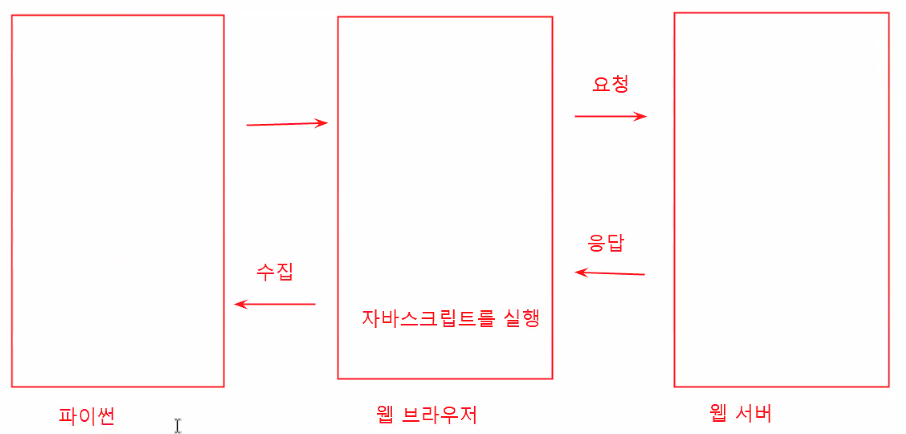

# 크롤링(Crawling)
- 크롤링 Vs. 스크래핑
  - 두 용어에서 큰 차이를 두지 않고, 대표적으로 크롤링 이라는 이름으로 주로 사용
  - 구분은 가능합니다.

1. 웹 사이트에서 내용을 가져오는 방법
  - 웹 사이트에 존재하는 거의 대부분의 내용들을 가져올 수 있습니다. 
  - 텍스트, 영상, 음성, 그림, ... 
  - **주의!**
    - 마음대로 가져다가 사용해도 되는건 아닙니다.
    - 특히 **저작권**과 관련해서 문제가 발생할 수 있습니다.
    - 다운로드만 해도 불법인 경우가 있고
    - 배포가 되었을 경우에 불법인 경우가 있습니다.
      - 배포할 의도가 없었어도 배포가 되면 불법이에요
      - P2P같은 경우가 그런 경우가 많이 있습니다.
      - 변명의 여지가 없어요
    - 과도한 트랙픽을 유발할 수 있기 때문에, 관리자는 싫어합니다.
      - 일반적으로 웹 서버 관리자들은 크롤링을 허용하지 않습니다.
      - 모니터링을 통해서 차단을 합니다.

2. 오픈 API를 통해서 가져오는 방법
  - 가장 추천하는 방법 입니다.
  - 수집을 허용하기 때문에 API가 제공


## 소켓프로그래밍을 이용한 HTTP 통신
- 크롤링이란? HTTP를 이용해서 원하는 자원(파일, 그림, 영상, 텍스트, ... )을 가져오는 방법
  - 일반적으로는 웹 페이지(html)를 주로 요청
  - 그림 파일(jpg, png, ...)일 수도 있는거고
  - 여러가지 형태의 파일들을 HTTP 통신을 이용해서 가져올 수 있다. 


```
import socket

serverAddress = socket.gethostbyname('info.cern.ch')
serverPort = 80

sock = socket.socket( socket.AF_INET, socket.SOCK_STREAM )
sock.connect( (serverAddress, serverPort) )

method = 'GET' # GET 대신에 HEAD, OPTIONS로 바꿔보고 응답을 확인해봅시다 
request_header = f'{method} /index.html HTTP/1.1\r\n'
request_header += 'Host: info.cern.ch\r\n'
request_header += '\r\n'

sock.send( request_header.encode() )
response = sock.recv(1024)
print( response.decode() )

sock.close()


HTTP/1.1 200 OK
Date: Mon, 03 Jan 2022 01:45:04 GMT
Server: Apache
Last-Modified: Wed, 05 Feb 2014 16:00:31 GMT
ETag: "286-4f1aadb3105c0"
Accept-Ranges: bytes
Content-Length: 646
Connection: close
Content-Type: text/html

<html><head></head><body><header>
<title>http://info.cern.ch</title>
</header>

<h1>http://info.cern.ch - home of the first website</h1>
<p>From here you can:</p>
<ul>
<li><a href="http://info.cern.ch/hypertext/WWW/TheProject.html">Browse the first website</a></li>
<li><a href="http://line-mode.cern.ch/www/hypertext/WWW/TheProject.html">Browse the first website using the line-mode browser simulator</a></li>
<li><a href="http://home.web.cern.ch/topics/birth-web">Learn about the birth of the web</a></li>
<li><a href="http://home.web.cern.ch/about">Learn about CERN, the physics laboratory where the web was born</a></li>
</ul>
</body></html>

```


## 라이브러리를 이용한 HTTP 통신
- 소켓 프로그래밍을 직접 하지 않고도 편하게 HTTP 통신을 구현할 수 있습니다. 
  - urllib
  - requests


### urllib을 통한 HTTP 통신
- 파이썬 기본 패키지
- 따로 설치가 필요없이 바로 사용이 가능


```
import urllib.request

url = 'http://info.cern.ch'

request = urllib.request.Request(url)
response = urllib.request.urlopen( request )
print( response.read().decode() )

<html><head></head><body><header>
<title>http://info.cern.ch</title>
</header>

<h1>http://info.cern.ch - home of the first website</h1>
<p>From here you can:</p>
<ul>
<li><a href="http://info.cern.ch/hypertext/WWW/TheProject.html">Browse the first website</a></li>
<li><a href="http://line-mode.cern.ch/www/hypertext/WWW/TheProject.html">Browse the first website using the line-mode browser simulator</a></li>
<li><a href="http://home.web.cern.ch/topics/birth-web">Learn about the birth of the web</a></li>
<li><a href="http://home.web.cern.ch/about">Learn about CERN, the physics laboratory where the web was born</a></li>
</ul>
</body></html>

```


### urllib을 통한 파일 저장
- urllib은 리퀘스트 객체를 생성할 때, 헤더값을 직접 정의
  - fake_agent를 이용해서 `user-agent` 헤더의 값을 크롬 크라우저의 값과 동일하게 설정
  ```
  prompt> pip install fake_useragent
  ```


```
### urllib을 통한 파일 저장
- urllib은 리퀘스트 객체를 생성할 때, 헤더값을 직접 정의
  - fake_agent를 이용해서 `user-agent` 헤더의 값을 크롬 크라우저의 값과 동일하게 설정
```
  prompt> pip install fake_useragent
  ```
  
  
  import urllib.request
from fake_useragent import UserAgent

# 파이썬이 아닌 웹 브라우저를 통해서 요청하는 것 처럼 보이기 위해
# 헤더값을 직접 설정해줍니다.
agent = UserAgent()
header = {'User-Agent': agent.chrome}

url = 'https://image.zdnet.co.kr/2022/01/01/e601fd8d72cc33ca75cd9d41d3315684.jpg'
request = urllib.request.Request( url, headers=header )
response = urllib.request.urlopen( request )
print(response.read())
  ```


### urllib.request.urlretrieve를 통한 파일 저장

```
import urllib.request
from fake_useragent import UserAgent

# UserAgent 객체 생성
agent = UserAgent()

# urllib은 urlretrieve함수를 이용해서 한 번에 파일로 저장
url = 'https://image.zdnet.co.kr/2022/01/01/e601fd8d72cc33ca75cd9d41d3315684.jpg'

# 파일을 저장할 경로
path = 'web/data/download.jpg'

# opener 객체를 생성해서 헤더를 먼저 수정해줍니다
opener = urllib.request.build_opener()
opener.addheaders = [('User-Agent', agent.chrome)]
urllib.request.install_opener(opener)

# 이제는 urlretrieve를 이용해서 다운로드 한 파일을 바로 생성할 수 있습니다
urllib.request.urlretrieve( url, path )
```


파일에 대한 접근이 자유롭다면 별다른 설정없이 바로 다운로드 해볼 수 있습니다. 

```
import urllib.request

# urllib은 urlretrieve함수를 이용해서 한 번에 파일로 저장
url = 'https://unsplash.com/photos/g9P21WrK_7g/download?ixid=MnwxMjA3fDB8MXxhbGx8NHx8fHx8fDJ8fDE2NDExODI0MTk&force=true'
path = 'web/data/download2.jpg'
urllib.request.urlretrieve( url, path )
```


### requests을 통한 HTTP 통신
- 설치가 필요한 패키지 이지만, 콜랩에서는 미리 설치가 되어 있기 때문에 바로 사용이 가능합니다. 
  - 로컬에서 사용하는 경우에는 따로 설치를 해주면 됩니다. 

  ```
  prompt> pip install requests
  ```


```
import requests

url = 'http://info.cern.ch'

response = requests.get(url)
print( response.text )


<html><head></head><body><header>
<title>http://info.cern.ch</title>
</header>

<h1>http://info.cern.ch - home of the first website</h1>
<p>From here you can:</p>
<ul>
<li><a href="http://info.cern.ch/hypertext/WWW/TheProject.html">Browse the first website</a></li>
<li><a href="http://line-mode.cern.ch/www/hypertext/WWW/TheProject.html">Browse the first website using the line-mode browser simulator</a></li>
<li><a href="http://home.web.cern.ch/topics/birth-web">Learn about the birth of the web</a></li>
<li><a href="http://home.web.cern.ch/about">Learn about CERN, the physics laboratory where the web was born</a></li>
</ul>
</body></html>

```


- 일반적으로 빅데이터를 수집
  - 발생되는 네트워크 트래픽을 저장
  - 크롤러와 같은 경우 주기적으로 데이터를 수집하는 경우
    - 과도한 트래픽이 발생할 수 있음
    - 웹의 구조가 바뀌는 경우


# 스크래핑(Scraping)
- 웹 페이지에서 내가 원하는 내용만 가져오는 기능
  - 크롤링된 웹 페이지에서 내가 원하는 내용을 찾는 것(파싱)
  - 수업 시간에는 네이버 영화 페이지의 사용자 리뷰만 가져와보도록 합니다. 


## 네이버 영화 리뷰 페이지 크롤링
- 크롤링된 HTML내에 내가 원하는 `사용자 리뷰`가 있을겁니다. 
- 이 HTML로부터 내가 원하는 요소를 찾는겁니다(파싱)

```
import requests

url = 'https://movie.naver.com/movie/point/af/list.naver'
response = requests.get(url)
html = response.text
```


## BeatifulSoup
- CSS 셀렉터를 이용해서 원하는 요소를 검색할 수 있습니다. 
- 설치

```
prompt> pip install bs4
```


\# BeautifulSoup 패키지를 임포트

import bs4


```
# 수집된 HTML은 일반 텍스트 이기 때문에
# bs4 객체로 변환
review = bs4.BeautifulSoup(html)
type(review)

bs4.BeautifulSoup

```


## BS4를 이용한 파싱
- find, find_all, select_one, select


```
# 태그명 검색
# 일치하는 태그가 여러개인 경우에는 제일 처음 일치하는 태그의 요소를 반환
element = review.find('a')
print( type(element) )
print(element)

<class 'bs4.element.Tag'>
<a name="gnb_top"></a>
```


```
# 일치하는 모든 요소에 대해서 리스트 형태로 반환
elements = review.find_all('a')
print(type(elements))
print(elements)

```


```
# 일치하는 모든 요소에 대해서 리스트 형태로 반환
elements = review.find_all('a')
print(type(elements))
print(elements)
```


```
# 단일 속성인 경우 
td_element = review.find('td', class_='title')
td_element

<td class="title">
<a class="movie color_b" href="?st=mcode&amp;sword=159893&amp;target=after">킹스맨: 퍼스트 에이전트</a>
<div class="list_netizen_score">
<span class="st_off"><span class="st_on" style="width:100%">별점 - 총 10점 중</span></span><em>10</em>
</div>
<br/>
<a class="report" href="#" onclick="report('seon****', 'jqsgC//3Kfsfvc10igCveXiR97eG4CGwD8jvwue8YUU=', '', '17889896', 'point_after');" style="color:#8F8F8F" title="새 창">신고</a>
</td>
```


```
# 여러개의 속성을 이용해서 검색하고자 하는 경우
# 딕셔너리 형태로 검색하고자 하는 속성을 추가해주면 됩니다. 

attrs = {
  'class':'title'
}
td_element = review.find('td', attrs=attrs)
td_element

<td class="title">
<a class="movie color_b" href="?st=mcode&amp;sword=159893&amp;target=after">킹스맨: 퍼스트 에이전트</a>
<div class="list_netizen_score">
<span class="st_off"><span class="st_on" style="width:100%">별점 - 총 10점 중</span></span><em>10</em>
</div>
<br/>
<a class="report" href="#" onclick="report('seon****', 'jqsgC//3Kfsfvc10igCveXiR97eG4CGwD8jvwue8YUU=', '', '17889896', 'point_after');" style="color:#8F8F8F" title="새 창">신고</a>
</td>
```


```
attrs = {
  'class':'title'
}
td_elements = review.find_all('td', attrs=attrs)
td_elements
```

```
for string in td_elements[1].strings:
  print(string)
```


```
td_elements[1].text

\n스파이더맨: 노 웨이 홈\n\n별점 - 총 10점 중5\n\n보는 내내 영화속 일반 시민의 입장에서 생각하게 되었다 최악의 영웅놀이 잼민이다 \n\t\t\t\n\t\t\t\n\t\t\t\n\t\t\t\t\n\t\t\t\t\n\t\t\t\t\n\t\t\t\t신고\n
```

```
td_elements[1].text.split('\n')[5]
보는 내내 영화속 일반 시민의 입장에서 생각하게 되었다 최악의 영웅놀이 잼민이다 
```

```
for child in td_elements[1].children:
  print('하위 요소들:', child)
  
  
  
```


```
완성된 코드

import requests
import bs4

url = 'https://movie.naver.com/movie/point/af/list.naver'
response = requests.get(url)
html = response.text
review = bs4.BeautifulSoup(html)

# 리뷰만 확인
search = {
  'class':'title'
}
td_elements = review.find_all('td', attrs=search)

for element in td_elements:
  print( element.text.split('\n')[5] )
```


- 옥션 후기 리스트 검색시, 중간에 파이썬으로 제어 가능한 웹 브라우저를 하나 넣어서 이를 통해 웹 서버로 요청. 웹서버에서 자바스크립트 응답을 받으면 웹 브라우저는 자바스크립트를 실행.




```
# 두 번째 실습은 쇼핑몰 후기 가져오기 (파이썬과 웹 서버 사이의 웹 브라우저 필요, bs4 필요가 없음)

from selenium import webdriver
from selenium.webdriver.common.by import By
from selenium.webdriver.common.keys import Keys # 대소문자에 주의
from selenium.webdriver.chrome.service import Service

options = webdriver.ChromeOptions()
options.add_experimental_option('excludeSwitches', ['enable-logging'])

# webdriver
# 크롬을 기준으로 현재 사용하고 있는 버전에 맞춰서 webdriver를 다운로드
service = Service(executable_path='c:\\Users\\ZebRa\\workspace\\chromedriver.exe')
browser = webdriver.Chrome(service = service, options=options)

#url = 'http://itempage3.auction.co.kr/DetailView.aspx?itemno=C436169354'
url = 'https://www.naver.com'
browser.get(url)

# 검색어 입력 후 엔터 입력
# element = browser.find_element(By.CSS_SELECTOR, 'input#query')
# element.send_keys('검색어')
# element.send_keys('\n')

# 검색어 입력 후 마우스 클릭
# 클릭 가능한 요소라면 클릭이 가능
input = browser.find_element(By.CSS_SELECTOR, 'input#query')
button = browser.find_element(By.CSS_SELECTOR, 'button#search_btn')
input.send_keys('검색어')
button.click()

# 두 번째 검색어 실시
input2 = browser.find_element(By.CSS_SELECTOR, 'input#nx_query')
# 첫 번째 검색어는 지워야 함
input2.clear()
input2.send_keys('두번째 검색어')
input2.send_keys('\n')


```


```
# 두 번째 실습은 쇼핑몰 후기 가져오기 (파이썬과 웹 서버 사이의 웹 브라우저 필요, bs4 필요가 없음)

from selenium import webdriver
from selenium.webdriver.common.by import By
from selenium.webdriver.common.keys import Keys # 대소문자에 주의
from selenium.webdriver.chrome.service import Service

service = Service(executable_path='c:\\Users\\ZebRa\\workspace\\chromedriver.exe')
options = webdriver.ChromeOptions()
options.add_experimental_option('excludeSwitches', ['enable-logging'])
browser = webdriver.Chrome(service = service, options=options)

url = 'http://itempage3.auction.co.kr/DetailView.aspx?itemno=C436169354'
browser.get(url)

# '구매후기' 버튼클릭

review_button = browser.find_element(By.CSS_SELECTOR, 'li#tap_moving_2 a')
review_button.click()

elements = browser.find_elements(By.CSS_SELECTOR, 'ul.list__review p.text')
for element in elements:
    print(element.text)
```


```
# 두 번째 실습은 쇼핑몰 후기 가져오기 (파이썬과 웹 서버 사이의 웹 브라우저 필요, bs4 필요가 없음)

from selenium import webdriver
from selenium.webdriver.common.by import By
from selenium.webdriver.common.keys import Keys # 대소문자에 주의
from selenium.webdriver.chrome.service import Service
import time

service = Service(executable_path='c:\\Users\\ZebRa\\workspace\\chromedriver.exe')
options = webdriver.ChromeOptions()
options.add_experimental_option('excludeSwitches', ['enable-logging'])
browser = webdriver.Chrome(service = service, options=options)

url = 'https://lc.multicampus.com/k-digital/#/login'
browser.get(url)

time.sleep(2)    # 페이지가 로딩되는 시간
inputs = browser.find_elements(By.CSS_SELECTOR, 'div.input-row-line input')
loginbutton = browser.find_element(By.CSS_SELECTOR, 'div.btn-row button.login-btn')

inputs[0].send_keys('ID')
inputs[1].send_keys('PW')

loginbutton.send_keys('\n')


time.sleep(2)
# 무한 스크롤(지정하고 모든 내용을 전부 스크래핑)
last_height = browser.execute_script('return document.body.scrollHeight')
while True :
    # 스크롤을 아래로 내리고
    browser.execute_script('window.scrollTo(0, document.body.scrollHeight);')
    
    # 내용이 로딩되는 동안 잠시 기다려주고
    time.sleep(2)
    
    # 새로 높이를 재고
    new_height = browser.execute_script('return document.body.scrollHeight')
    
    # 높이가 이전과 같을 경우 더 이상 내려갈 수 없음
    if new_height == last_height : break
    
    # 기존의 높이를 새로운 높이로 변경
    last_height = new_height
    
# 로드된 내용들을 수집
articles = browser.find_elements(By.CSS_SELECTOR, 'div.feedlist span article')
for article in articles:
    for content in article.find_elements(By.CSS_SELECTOR, 'div.all span.feedContentBlk span'):
        print(content.text)
```

