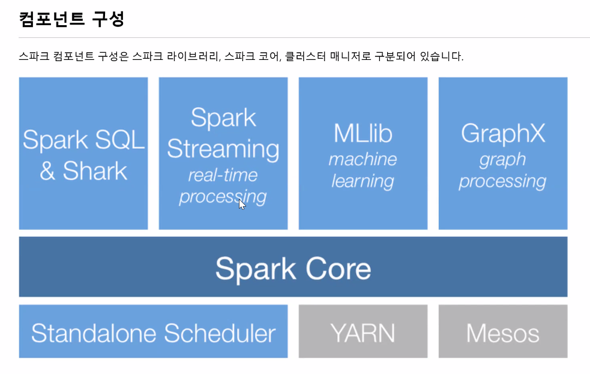

## 데이터 엔지니어 수업

(김성환 강사님 / 010-8877-2863, shwank@nate.com)

- 2022-01-26 / 데이터 엔지니어 

- 인프런

- 정보처리기사

- 이러닝 ProDS 강의( 2/7까지 접수 2/28 에 시험 )
  
  Copilot(깃허브에서 만든 AI 코딩프로그램)‘툴’이라는 명칭도 사용하지만 ‘솔루션’이라는 단어를 더 많이 사용함.알고리즘도 중요하지만, ‘도메인지식(업무지식)’이 더 중요하다
  
  수료증은 꼭 받자
  세가지 조건 중 두가지가 마음에 안들면 퇴사(1년감 참아야함)

- 연봉,회사의 비전,동료

- 취업 전 면담 -> 좋은 회사인지?

- 취업이 안된다면 강사님께 연락.

  —--------------------------------------------------------------------------------------------
  저는 짧게 하도록 하겠습니다. 안녕하세요. 데이터 엔지니어링 10회차 수강중인 이현호입니다. 대학교에서는 환경공학과를 전공했고, 제약회사 미생물팀에서 4년정도 근무하였습니다. 현재는 퇴사하여 데이터 엔지니어링 수업을 듣고있습니다.현재 IT 지식이 부족하고 수업 중인 데이터 엔지니어 관련 지식이 역시 많이 부족한 상태입니다. 이번 수업을 통해 전문적인 지식을 잘 습득하고, 수업을 같이 듣는 동료분들과 인맥도 쌓고 싶습니다. 포트폴리오는 준비하고 싶지만 감이 잘 안잡히고 있습니다. 감사합니다.항암제인데 고형제, 주사제의 원료 및 완제품 미생물실험(세균,진균,대장균,살모넬라균,녹농균,황색포도상구균), 성적서 작성, 일탈관리, 환경모니터링(낙하균,표면균,부유균, 부유입자)
  생활의 팁국가공인시험의 경우 : 객관식 문제의 경우 4지선다가 25%의 확률도 유지되어야함.정보처리기사 실기 : IT 쪽 신문을 잘 읽어볼 것.(NFT, 메타버스 공부!)

  —--------------------------------------------------------------------------------------------

  1:1 미팅 질문

- 현재 배우고 데이터 엔지니어링 수업을 배우면서 데이터의 정제, 가공 위주로 배우고 있는데, 자료를 받아오는 백엔드 구축은 따로 배우지 않는지…

- 두 번째 프로젝트가 얼마 남지 않았는데 스파크, 하둡을 배울 시간이 있을까요?

- 이러닝 과제가 있어서, 과제도 좋지만 수업시간에 실습과정을 조금 반복해서 배울 수 있는지

- 포트폴리오 및 면접 준비

  

  —--------------------------------------------------------------------------------------------

  과제 - SQLite3기한 : 다음 주 목요일까지
  설 기간 동안 Wikidocs 에서 A10 까지 공부 후B01 처럼원하는 주제를 정한 뒤,

  (예제를 따라해도 됨)SQLite 로 불러온 뒤 정제하여, 커리할 것.
  —--------------------------------------------------------------------------------------------

  2022-02-03	**(SQL)**Host 의 반대 용어 = Client

  **Null : 아직 결정되지 않은 값(알 수 없다)**

  SQL(Structured Query Language) : 구조적 질의 언어(시퀄), 데이터 베이스를 구축하고 활용하기 위해 사용하는 언어(DB 를 조작하는 언어)테이블 : 하나 또는 여러 컬럼들이 모여 하나의 레코드를 구성 함.인덱스 : 쿼리문을 이용하여 정보를 검색할 때 빠른 수행을 위해 인덱스를 구성하여 사용.데이터는 로우 보다 컬럼이 더 중요하다. 로우는 컴퓨터가 할 일. 사람은 어느 컬럼을 쓸 것인지가 중요하다.뷰(View) 는 실제로는 존재하지 않는 가상의 테이블. 실제 테이블을 사용자 입장에서 논리적인 테이블을 만들어 쉽게 접근 할 수 있게 함. 사용 목적은 편리성과 보안성.Stored Procedure : 쿼리문을 저장해 두었다가 손쉽게 재사용 할 수 있는 저장 프로시져, 저장 프로시져가 생성이 되면, 소스 프로시져가 최초 한번 컴파일된 후, 처음 수행될 때만 한번 만들어지고 이후에는 이러한 과정이 생략되고 컴파일된 형태를 그대로 재사용하기 때문에 일반적인 쿼리수행에 비해 빠른 성능을 제공트리거 : 테이블 값이 변경(인서트, 업데이트, 딜리트)될 때 자동적으로 수행되는 저장 프로시져, 방아쇠를 당긴다는 의미로, 미리 정의된 프로시져 안에서 자동으로 수행되는 프로시져

  **Primary Key** : 컬럼에서 가장 대표되는 것을 프라이머리 키라고 한다.

  ID 가 중복되지 않기 때문에 숫자가 중요, 그리고 null 값이 있어서는 안된다.

  RDBMS : Relevant Data Basement System

  Where 절 조건식 : 우선순위 ( ) -> 논리연산자 제외한 연산자 -> NOT -> AND -> OR -> NULLAND, OR, NAND, NOR 일 때, 0 과 1반도체는 낸드플래시로 구성되어 있음.

  SQL 문장의 종류DDL : Data Definition Language(데이터 정의어, DB구조 정의)DML : Data Manipulation Language (데이터 조작어, 삽입, 변경, 삭졔)DRL : SELECT (데이터 질의어, 검색)

  TCL : Commit Rollback (롤백 : 되돌리다)

  DCL : 데이터 제어어, 사용권한 부여, 제거

  ### ACID

  원자성(Atomicity) : 트랜잭션과 관련된 작업들이 부분적으로 실해오디다가 중단되지 않는 것을 보장하는 능력

  일관성(Consistency) : 트랜잭션이 실행을 성공적으로 완료하면 언제나 일관성 있는 데이터베이스 상태로 유지하는 것을 의미

  고립성(Isolation) : 트랜잭션을 수행 시 다른 트랜잭션의 연산 작업이 끼어들지 못하도록 보장하는 것을 의미

  지속성(Durability) : 성공적으로 수행된 트랜잭션은 영원히 반영되어야 함을 의미.

  INSERT INTO 학생 Valuese (‘이름’, 1, 20143424, ‘컴퓨터공학’); <- 암기할것Commit;WWW

  -----------------------------------------------------------------------------------------------------------------------------------------------------

  2022-02-04

### SQL

- Data On Air -> DB 기술자료 -> D 가이드 -> 초보자에서부터 실무자까지 실습

- DA 가이드 70번 (물리가이드 모델) --> DA 가이드는 중급이 본다

- SQL 부터 시작할 것!

- SQL - DML 튜닝에서 중요 키워드 : Redo, Undo, 인덱스

- DML(데이터 머신 러닝) 의 가장 큰 단점 : **총 인덱스 개수에 따라 성능이 크게 달라진다.**

- 따라서 대량의 데이터를 넣을 때(인서트)에는 DML 작업을 하기 위해서 Primary KEY 를 disable 을 한 후 진행한다.

- Batch processing (=job) : 한번에 모아서 처리해야 할 일

- Online processing (=job) : 실시간으로 처리해주는 작업, 시간을 다투는 작업, 온라인 예매 등이 포함된다.

- 일반적으로 배치 프로세싱의 양이 많다.

- 파티션 -> 데이터의 양이 너무 많으니 데이터를 쪼갠다. 용량 혹은 성능 때문에 나눈다.

- 고급 SQL 활용은 일단 스킵.

- 조인의 기본원리 는 볼 것

- **옵티마이저**(빠른 Search가 목적) - SQL을 가장 빠르고 효율적으로 수행할 최적(최저비용)의 처리경로를 생성해 주는 DBMS 내부의 핵심엔진이다. 사용자가 구조화된 질의언어(SQL)로 결과 집합을 요구하면, 이를 생성하는데 필요한 처리 경로는 DBMS에 내장된 옵티마이저가 자동으로 생성해준다. 옵티마이저가 생성한 SQL 처리경로를 실행계획이라고 부른다.

- 옵티마이저 SQL 최적화 과정을 요약하면 다음과 같다.

  - 사용자가 던진 쿼리수행을 위해, 후보군이 될만한 실행계획을 찾는다.

  - 데이터 딕셔너리(Data Dictionary)에 미리 수집해 놓은 오브젝트 통계 및 시스템 통계정보를 이용해 각 실행계획의 예상비용을 산정한다.

  - 각 실행계획을 비교해서 최저비용을 갖는 하나를 선택한다.

- **Full table scan **VS **Index scan** 어느 것이 효율적인가를 판단해주는 것이 옵티마이저

- 데이터 엔지니어가 옵티마이저를 돌려 

- Lock : 데이터를 동시에 사용할 때 A와 B가 서로의 데이터를 침범하지 않게 하는 것.(ex : 영화관 좌석)

- 윈도우 함수는 천천히 읽어 볼것

- 서브쿼리 : SQL 문장 안에 또 다른 문장이 들어 있음


### 데이터 실무

#### 데이터 수집 개요

- 정성적 :  데이터 자체가 하나의 텍스트를 이루고 있기 때문에 함축된 정보를 가지고 있음(ex : 환율이 내리고 있어 올해 목표한 수출 목표의 조기 달성이 가능해 보임)
- 정량적 : 여러 속성(이름, 나이, 성별, 주소 등)이 모여 하나의 객체를 형성하고, 각 속성은 속성 하나 혹은 여러 개의 속성을 결합해 측정이나 설명이 가능하도록 구성되어 있음.


- 수집데이터의 형태에 따른 분류

  - 비정형 데이터가 상대적으로 많음.

  - 수집데이터의 위치에 따른 분류

- 빅데이터는 내부데이터가 적어도 외부데이터와 결합시켜 인사이트를 도출하는 것. 가진 데이터가 적어도 외부 데이터와 결합하면 빅데이터 결합으로 새로운 것을 창출할 수 있음. 이것을 빅데이터라고 함.


### 데이터 수집 절차

- 존재 형태별 데이터 유형

| 형태 | 데이터 유형                | 수집 방법                                       |
| ---- | -------------------------- | ----------------------------------------------- |
| RDB  | 정형 데이터, 비정형 데이터 | DBtoDB, ETL, RDB 벤더제공 드라이버, 오라클 ODBC |
| 파일 | 반정형 데이터              | 크롤링, Open API, FTP, HTTP                     |

- 크롤링 등 정보 저작권을 주의할 것.


- 기업체에서 주로 많이 사용하는 패키지

  - RODBC : DBMS 에 연결을 위한 Package

  - sqldf : database 의 문법을 사용 가능

  - ggplot2 : 구글에서 제공하는 Map 관련

  - googleVis : 여러 시각화 함수 제공

  - animation : 동적 시각화 제공


## R 에 관한 실습, Must Learning with R (개정판) - 위키닥스

https://www.dropbox.com/sh/vtqlvrgdts2yfez/AAD_cd49dBcvgBNdz-C-A6TFa?dl=0

- https://www.r-project.org/

- R 설치 후

- demo()

- 패키지 설치 : install.packages("ggplot2")  

- ggplot2 실행 : library(ggplot2)

- 위키닥스 **A2.c()의 활용 부분**은 자주 사용하므로 꼭 볼것.

- Ch6. R중급문법 1단계,  A3. apply 함수와 dplyr 패키지 는 한번 봐야함.

- Ch3, 5, 6, 7 까지 할 것.  ===> dplyr 함수를 이용하여 데이터를 가공해서 가져올 것.

- > install.packages("dplyr")
  >
  > > library(dplyr)


### Ch3. R 기본문법 2단계

#### A1. 연습데이터 설명

- satisfaction_level : 직무 만족도
- last_evaluation : 마지막 평가점수
- number_project : 진행 프로젝트 수
- average_monthly_hours : 월평균 근무시간
- time_spend_company : 근속년수
- work_accident : 사건사고 여부(0: 없음, 1: 있음, 명목형)
- left : 이직 여부(0: 잔류, 1: 이직, 명목형)
- promotion_last_5years: 최근 5년간 승진여부(0: 승진 x, 1: 승진, 명목형)
- sales : 부서
- salary : 임금 수준


#### A2. 데이터 불러오기 및 Strings 확인

1. HR_comma_sep 파일을 불러오기
2. head(HR,n=3) 을 통해 데이터 윗부분을 출력


3. str() 을 통해 데이터의 모양, 문자열 파악

   


4. summary(HR) : 데이터 요약해서 보기


5. Left(이직여부) 의 변수가 명목형 변수이므로 Factor 형식이어야 하지만 확인해보면 Int 타입으로 인식되고 있으므로, 이를 원래 데이터 특성에 맞게 Strings 변환을 진행


#### A3. 조건에 맞는 데이터 가공하기

1. ifelse() 조건 함수를 통해 satisfaction_level 이 0.5보다 크면 High, 크지 않으면 Low를 부여


2. ifelse() 를 통해 satisfaction_level 이 0.8보다 크다면 High, 0.5~0.8 이면 Mid, 나머지는 Low 부여


3. subset() 함수는 조건에 맞는 데이터를 추출하는 명령어.


- high, low, medium 으로 분류가 되어야 되는데 왜 요약이 이렇게 되는건지?


4. salary 가 high 이면서, sales 가 IT 인 직원들만 추출하여 HR_High_IT 생성(교집합)


5. salary 가 high 이거나, sales가 IT 인 직원들을 추출하여 HR_High_IT2 생성(합집합)


#### A4. 조건에 맞는 집계 데이터 만들기

1. 

#### A5. ggplot2 기본 시각화

- ggplot2 실행 이후 회색 바탕 만들기 이후 배경 만들기
- aes 를 통해 x 축에 salary 부여


> - 막대그래프에 색칠 하기
>
> ggplot(HR,aes(x=salary)) +  
>
> +     geom_bar(fill = 'royalblue') 
>
> ggplot(HR,aes(x=salary)) +  
> +     geom_bar(aes(fill=salary)) 


- 막대 도표 (bar plot)

- x 축은 salary 설정, y축은 자동으로 집계된 값이 표현

- 색설정

- > ggplot(HR,aes(x=salary)) +  
  > +     geom_bar(fill = 'royalblue')
  > ggplot(HR,aes(x=salary)) +  
  > +     geom_bar(aes(fill=left))


- 히스토그램

- 

- > ggplot(HR,aes(x=satisfaction_level))+
  > +     geom_histogram()
  > `stat_bin()` using `bins = 30`. Pick better value with `binwidth`.
  > ggplot(HR,aes(x=satisfaction_level))+
  > +     geom_histogram(binwidth = 0.01,col='red',fill='royalblue') 


- 밀도 그래프

- > ggplot(HR,aes(x=satisfaction_level))+
  > +     geom_density()
  > ggplot(HR,aes(x=satisfaction_level))+
  > +     geom_density(col='red',fill='royalblue')


- 박스플롯

> ggplot(HR,aes(x=left,y=satisfaction_level)) +
> +     geom_boxplot(aes(fill = left)) +
> +     xlab("이직여부") + ylab("만족도") + ggtitle("Boxplot") +
> +     labs(fill = "이직 여부")


- 산점도

- > ggplot(HR,aes(x=average_montly_hours,y=satisfaction_level))+
  > +     geom_point(aes(col = left)) + 
  > +     labs(col = '이직 여부') + xlab("평균 근무시간") + ylab("만족도")


#### A6. 연습문제

1. HR 데이터의 행의 수, 열의 수를 구하시오.

   1. > 행의 수
      >
      > nrow(HR)
      > [1] 14999
      >
      > 열의 수
      >
      > ncol(HR)
      >
      > [1] 12

2. salary변수의 strings에 대해 답하시오.

   1. > str(HR)
      > 'data.frame':	14999 obs. of  12 variables:
      >  $ satisfaction_level        : num  0.38 0.8 0.11 0.72 0.37 0.41 0.1 0.92 0.89 0.42 ...
      >  $ last_evaluation           : num  0.53 0.86 0.88 0.87 0.52 0.5 0.77 0.85 1 0.53 ...
      >  $ number_project            : int  2 5 7 5 2 2 6 5 5 2 ...
      >  $ average_montly_hours      : int  157 262 272 223 159 153 247 259 224 142 ...
      >  $ time_spend_company        : int  3 6 4 5 3 3 4 5 5 3 ...
      >  $ Work_accident             : Factor w/ 2 levels "0","1": 1 1 1 1 1 1 1 1 1 1 ...
      >  $ left                      : Factor w/ 2 levels "0","1": 2 2 2 2 2 2 2 2 2 2 ...
      >  $ promotion_last_5years     : Factor w/ 2 levels "0","1": 1 1 1 1 1 1 1 1 1 1 ...
      >  $ sales                     : chr  "sales" "sales" "sales" "sales" ...
      >  $ salary                    : Factor w/ 3 levels "low","medium",..: 1 2 2 1 1 1 1 1 1 1 ...
      >  $ satisfaction_level_group_1: Factor w/ 2 levels "High","Low": 2 1 2 1 2 2 2 1 1 2 ...
      >  $ satisfaction_level_group_2: Factor w/ 3 levels "High","Low","Mid": 2 3 2 3 2 2 2 1 1 2 ...

3. salary변수에 대하여 low는 1, medium은 2, high는 3의 값을 가져 서열정보를 가지게 하는 salary_New 변수를 만드시오. ( 열삭제 : **<u>HR <- subset(HR, select=-salary_New)</u>** )

   1. > HR <- HR %>% mutate("salary_New" = ifelse(salary == "medium", 2, ifelse(salary == "high", 3, 1))
      >
      > > 팩터변환
      > >
      > > HR$salary_New=as.factor(HR$salary_New)
      > > summary(HR$salary_New)
      > > 1    2    3 
      > > 7316 6446 1237 

4. Salary_New 값이 2이면서 left는 1인 직원들만 뽑아 Medium_Left라는 새로운 데이터프레임을 만드시오.

   1. > Medium_Left = subset(HR,salary_New == 2 & left == 1)
      >
      > > print(xtabs(~ Medium_Left$salary_New + Medium_Left$left))
      > >                  Medium_Left$left
      > > Medium_Left$salary_New    0    1
      > >                 1    0    0
      > >                 2    0 1317
      > >                 3    0    0

5. Medium_Left 데이터에 대해 sales변수 별로 time_spend_company의 평균을 구하여, Time_spend_Mean이

- 문제 이상


### Ch5. R 기본문법 4단계

#### A1. 데이터 불러오기 및 데이터 설명

**변수 설명**

- Rank
- Title : 영화 제목
- Genre : 영화 장르
- Description : 영화 설명
- Director : 감독명
- Actors : 배우
- Year : 영화 상영 년도
- Runtime..Minutes : 상영시간
- Rating : Rating 점수
- Votes : 관객 수
- Revenue..Millions : 수익
- Metascore : 메타 스코어


#### A2. 결측치(Missing Value)

결측치(Missing Value)는 말 그대로 데이터에 값이 없는 것을 뜻합니다. 줄여서 ’NA’라고 표현하기도 하고, 다른 언어에서는 Null 이란 표현을 많이 씁니다. 결측치는 데이터를 분석하는데에 있어서 매우 방해가 되는 존재입니다. 결측치는 다음과 같은 문제를 야기합니다.

먼저 결측치를 다 제거해버리는 경우, 결측치의 비율에 따라서 막대한 데이터 손실을 불러일으킬 수 있습니다. 다음으로는 결측치를 잘못 대체할 경우, 데이터에서 편향(bias)이 생길 수가 있습니다. 또한 결측치를 처리하는 데에 있어 분석가의 견해가 가장 많이 반영되기 때문에 대체가 잘못될 경우 분석결과가 매우 틀어질 수도 있습니다.

결론은 결측치를 자세히 처리하기 위해서는 시간이 많이 투자되어야 합니다. **무엇보다, 데이터에 기반한 결측치 처리가 진행되어야 분석을 정확하게 진행할 수 있습니다.**


#### A3. R을 통한 결측치 처리

- Metascore 변수 내에서 결측치 논리문 판단 (TRUE, FALSE) 

> is.na(IMDB$Metascore)[1:20]
>  [1] FALSE FALSE FALSE FALSE FALSE FALSE FALSE FALSE FALSE FALSE FALSE FALSE
> [13] FALSE FALSE FALSE FALSE FALSE FALSE FALSE FALSE


- Metascore 변수 내에 결측치 갯수 

> sum(is.na(IMDB$Metascore)) 
> [1] 64


- IMDB 내 모든 변수별 결측치 갯수

> colSums(is.na(IMDB))
>          Rank              Title              Genre        Description 
>             0                  0                  0                  0 
>      Director             Actors               Year  Runtime..Minutes. 
>             0                  0                  0                  0 
>        Rating              Votes Revenue..Millions.          Metascore 
>             0                  0                128                 64 


- 결측치 제거 

  - 전부 삭제하는 경우, 가장 극단적인 방법. (결측치가 하나라도 포함된 obs(행)은 삭제)

  - > IMDB2 = na.omit(IMDB) 
    > colSums(is.na(IMDB2))
    >          Rank              Title              Genre        Description 
    >             0                  0                  0                  0 
    >      Director             Actors               Year  Runtime..Minutes. 
    >             0                  0                  0                  0 
    >        Rating              Votes Revenue..Millions.          Metascore 
    >             0                  0                  0                  0 

  - 특정 변수에 결측치가 존재하는 행만 삭제하는 경우

    ```
    # 12번째 열에 결측치가 있는 경우에만 삭제
    > IMDB3 = IMDB[complete.cases(IMDB[ ,12]),]
    > colSums(is.na(IMDB3))
                  Rank              Title              Genre        Description 
                     0                  0                  0                  0 
              Director             Actors               Year  Runtime..Minutes. 
                     0                  0                  0                  0 
                Rating              Votes Revenue..Millions.          Metascore 
                     0                  0                 98                  0 
    ```

  - 결측치를 특정값으로 대체할 경우

     

    - is.na가 True인 값(결측치)들에 대해 58.99 지정

    ``` 
    # Rawdata를 새로운 변수에 복사 
    IMDB$Metascore2 = IMDB$Metascore 
    
    # 결측치 대체
    IMDB$Metascore2[is.na(IMDB$Metascore2)]=58.99 
    
    
    ```

    - 결측치 생략하고 계산할 경우

    ```
    # NA 생성
    > mean(IMDB$Revenue..Millions.)
    [1] NA
    
    # NA 생략하고 계산
    > mean(IMDB$Revenue..Millions.,na.rm = TRUE)
    [1] 82.95638
    ```

    

#### A4. 결측치 처리시 주의할 점

데이터를 다룰 때, 기본적으로 raw 데이터는 절대 건드리는 것이 아닙니다.보통의 경우, 데이터를 새로 복사를 해두고 진행을 하는 것이 나중을 위해 매우 좋은 습관이 됩니다. 때로는 나머지 정보를 잃지 않기 위하여 최대한 합리적으로 결측치를 대체해야 할 필요가 있습니다. 가장 기본적인 방법은 다음과 같습니다.

- 연속형 변수 : 평균으로 대체
- 이산형 변수 : 최빈값으로 대체


#### A5. 결측치 처리를 위한 데이터의 분포 탐색

- 결측치를 처리하기 위한 데이터의 분포 탐색

```
library(ggplot2)

ggplot(IMDB,aes(x=Revenue..Millions.)) +
geom_histogram(fill='royalblue', alpha = 0.4) +
ylab('') +
xlab("Revenue_Millions") +
theme_classic()

```


```
ggplot(IMDB,aes(x = "",y=Revenue..Millions.)) +
geom_boxplot(fill='red', alpha = 0.4,outlier.color = 'red') +
xlab('') +
ylab("Revenue_Millions") +
theme_classic()
```


> summary(IMDB$Revenue..Millions.)
> Min. 1st Qu.  Median    Mean 3rd Qu.    Max.    NA's 
> 0.00   13.27   47.98   82.96  113.72  936.63     128 

- Revenu_Millions를 볼 때 데이터가 한쪽으로 매우 치우쳐져 있습니다. 이런 분포는 항상 평균과 중위수의 차이를 확인해봐야합니다. (평균: 82.96, 중위수: 47.98) 따리서, 이런 분포의 데이터의 결측치는 평균으로 대체하면 매우 위험합니다. 평균은 극단값(Outlier, 이상치)에 영향을 받기 때문입니다. 극단값은 패턴을 벗어난 특수한 상황이지, 결코 일반적인 상황을 대변해주지 않습니다.


#### A6. 이상치(Outlier) 뽑아내기

- 이상치( Outlier) 뽑아내기

  > ggplot(IMDB,aes(x=as.factor(Year),y=Revenue..Millions.))+
  > +   geom_boxplot(aes(fill=as.factor(Year)),outlier.colour = 'red',alpha=I(0.4))+
  > +   xlab("년도") + ylab("수익") + guides(fill = FALSE) +
  > +   theme_bw() +
  > +   theme(axis.text.x = element_text(angle = 90))


- 박스플롯을 그린 이유는 이상치 탐색을 가장 하기 좋은 플롯이 박스플롯이기 때문입니다. 박스플롯의 구성을 살펴보시면 다음과 같습니다.

  상자 안에 그려져 있는 직선은 중위수(Median)을 나타냅니다. 상자의 밑변은 1분위수를 나타애며, 윗변은 3분위수를 나타냅니다. 상자 테두리 외부에 직선이 있는 것을 볼 수 있습니다. 이 직선은 울타리라고 부릅니다.

  

- Outlier 의 처리방법

  - 제거를 하는 방법이 쓰이기는 하지만, 개인적으로 좋아하는 방식은 아닙니다. 어찌됐든 데이터를 버리는거니깐요. 데이터 변형을 통해 Outlier문제를 줄여줍니다. 통계추정에세는 정규분포를 맞추어 주는 것이 매우 중요합니다. 보통 Outlier로 인해 한 쪽으로 치우친 분포는 log 변환을 통해 정규성을 맞추어주고는 합니다. 

  ```
  > Q1 = quantile(IMDB$Revenue..Millions.,probs = c(0.25),na.rm = TRUE) 
  > Q3 = quantile(IMDB$Revenue..Millions.,probs = c(0.75),na.rm = TRUE)
  > LC = Q1 - 1.5 * (Q3 - Q1)
  > UC = Q3 + 1.5 * (Q3 - Q1)
  > IMDB2 = subset(IMDB,
  +      Revenue..Millions. >  LC & Revenue..Millions. < UC)


#### A7. 문자열 데이터 다루기 1편

- 문자열을 다룰 때 기본적으로 숙지하고 있어야 하는 명령어는 다음과 같습니다.
  - 문자열 대체 : gsub()
  - 문자열 분리 : strsplit()
  - 문자열 합치기 : paste()
  - 문자열 추출 : substr()
  - 텍스트마이닝 함수: Corpus() & tm_map(), & tdm()

- 문자열 추출

```
> substr(IMDB$Actors[1],1,5)
[1] "Chris"
```

```
# 첫번째 obs의 Actors변수에서 _ A 붙이기
> paste(IMDB$Actors[1],"_",'A')
[1] "Chris Pratt, Vin Diesel, Bradley Cooper, Zoe Saldana _ A"

# 띄어쓰기 없이 붙이기
> paste(IMDB$Actors[1],"_",'A',sep="")
[1] "Chris Pratt, Vin Diesel, Bradley Cooper, Zoe Saldana_A"

# |로 붙이기
> paste(IMDB$Actors[1],"_","Example",sep="|")
[1] "Chris Pratt, Vin Diesel, Bradley Cooper, Zoe Saldana|_|Example"

```

- paste()는 기본적으로 붙이는 문자열 사이에 " “(한칸 빈칸)이 기본 설정입니다. 이를 수정하기 위해서는 sep =”"옵션을 주어야 합니다.

```
strsplit(as.character(IMDB$Actors[1]), split= ",") 
[[1]]
[1] "Chris Pratt"     " Vin Diesel"     " Bradley Cooper" " Zoe Saldana"   
```

- 문자열 대체(**<u>gsub 명령어</u>**는 매우 많이 사용)

```
IMDB$Genre2=gsub(","," ",IMDB$Genre) # , 를 띄어쓰기로 대체 
```


#### A8. 문자열 데이터 다루기 2편 (R 텍스트 마이닝)

- 영어의 경우, 대문자와 소문자가 다른 글자로 인식되기 때문에 바꿔주는 작업이 필요합니다.

- 1단계 : 코퍼스 생성

  ```
  library(tm) # tm 패키지 설치 필요
  
  CORPUS = Corpus(VectorSource(IMDB$Genre2)) # 코퍼스 생성
  CORPUS_TM = tm_map(CORPUS,removePunctuation) # 특수문자 제거
  CORPUS_TM = tm_map(CORPUS_TM, removeNumbers) # 숫자 제거 
  CORPUS_TM = tm_map(CORPUS_TM, tolower) # 알파벳 모두 소문자로 바꾸기
  ```

- Corpus는 말뭉치라는 의미로, 텍스트 마이닝을 하기 전에 문자열 데이터를 정리하는 과정이라고 생각하시면 될 것 같습니다.
- 2단계 : 문서행렬 생성

```
> TDM=DocumentTermMatrix(CORPUS_TM) # 문서행렬 생성
> inspect(TDM)
<<DocumentTermMatrix (documents: 1000, terms: 20)>>
Non-/sparse entries: 2555/17445
Sparsity           : 87%
Maximal term length: 9
Weighting          : term frequency (tf)
Sample             :
    Terms
Docs action adventure comedy crime drama horror mystery romance scifi thriller
  1       1         1      0     0     0      0       0       0     1        0
  10      0         1      0     0     1      0       0       1     0        0
  11      0         1      0     0     0      0       0       0     0        0
  12      0         0      0     0     1      0       0       0     0        0
  2       0         1      0     0     0      0       1       0     1        0
  4       0         0      1     0     0      0       0       0     0        0
  5       1         1      0     0     0      0       0       0     0        0
  6       1         1      0     0     0      0       0       0     0        0
  7       0         0      1     0     1      0       0       0     0        0
  9       1         1      0     0     0      0       0       0     0        0
```

```
> TDM = as.data.frame(as.matrix(TDM)) # 문서행렬을 데이터프레임 형태로 만들어주기.
> head(TDM) 
  action adventure scifi mystery horror thriller animation comedy family fantasy
1      1         1     1       0      0        0         0      0      0       0
2      0         1     1       1      0        0         0      0      0       0
3      0         0     0       0      1        1         0      0      0       0
4      0         0     0       0      0        0         1      1      1       0
5      1         1     0       0      0        0         0      0      0       1
6      1         1     0       0      0        0         0      0      0       1
  drama music biography romance history crime western war musical sport
1     0     0         0       0       0     0       0   0       0     0
2     0     0         0       0       0     0       0   0       0     0
3     0     0         0       0       0     0       0   0       0     0
4     0     0         0       0       0     0       0   0       0     0
5     0     0         0       0       0     0       0   0       0     0
6     0     0         0       0       0     0       0   0       0     0

```

- 3단계 : 기존데이터와 결합하기

```
IMDB_GENRE = cbind(IMDB,TDM)
```

기존에 있는 데이터와, 장르 변수들로 구성된 데이터를 합쳐야 합니다. 합쳐야 할 두 데이터가 같은 행을 가지고 순서도 같다면, cbind(Column bind) 명령어를 쓰면 됩니다. 만약, 반대로 합쳐야 할 두 데이터가 같은 열을 가지고, 순서도 같은데, 행을 합쳐야 한다면 rbind(row bind) 명령어를 쓰면 됩니다.


**데이터 결합하기 명령어**

- cbind : 행이 동일하고, 순서도 같을 때 옆으로(변수) 합치기
- rbind : 열이 동일하고, 순서도 같을 때 아래로(obs) 합치기
- merge : 열과 행이 다른 두 데이터 셋을 하나의 기준을 잡고 합치고자 할 때 사용

Genre 변수를 통해 간단하게 다룰어봤다면, 이번에는 Description 변수를 통해 복습도 할겸 다루어보도록 하겠습니다. Description 변수는 Genre 변수와 비교했을 때, 다음의 차이점이 존재합니다.

1. 단어의 중복 등장
2. 조사, 동사, 명사 등 등장

```
> library(tm)
> CORPUS=Corpus(VectorSource(IMDB$Description))
> CORPUS_TM = tm_map(CORPUS,stripWhitespace)
경고메시지(들): 
tm_map.SimpleCorpus(CORPUS, stripWhitespace)에서:
  transformation drops documents
> CORPUS_TM = tm_map(CORPUS_TM,removePunctuation)
경고메시지(들): 
tm_map.SimpleCorpus(CORPUS_TM, removePunctuation)에서:
  transformation drops documents
> CORPUS_TM = tm_map(CORPUS_TM, removeNumbers)
경고메시지(들): 
tm_map.SimpleCorpus(CORPUS_TM, removeNumbers)에서:
  transformation drops documents
> CORPUS_TM = tm_map(CORPUS_TM, tolower)
경고메시지(들): 
tm_map.SimpleCorpus(CORPUS_TM, tolower)에서: transformation drops documents
> 
> DTM = DocumentTermMatrix(CORPUS_TM)
> inspect(DTM)


<<DocumentTermMatrix (documents: 1000, terms: 5960)>>
Non-/sparse entries: 20465/5939535
Sparsity           : 100%
Maximal term length: 23
Weighting          : term frequency (tf)
Sample             :
     Terms
Docs  and for from her his that the their who with
  155   2   1    1   0   0    0   4     0   0    2
  232   1   0    0   0   1    0   2     0   1    2
  323   1   2    0   0   0    0   3     0   0    0
  324   1   0    0   0   0    1   5     0   0    1
  704   0   0    1   1   0    0   2     0   1    1
  764   4   0    1   0   0    0   1     2   0    0
  774   0   0    3   2   2    2   3     0   1    1
  836   2   0    0   0   0    0   5     1   0    0
  863   2   0    1   0   3    0   0     1   1    1
  960   2   0    0   0   1    0   5     0   0    0

```


```
> convert_count = function(x) {
+ y <- ifelse(x > 0,1,0)
+ y = as.numeric(y)
+ y
+ }
> convert_count = function(x) {
+ y <- ifelse(x > 0,x,0)
+ y = as.numeric(y)
+ y
+ }
> DESCRIPT_IMDB=apply(DTM,MARGIN=2,convert_count)
> DESCRIPT_IMDB=as.data.frame(DESCRIPT_IMDB)

```


```
# Temr Document Matrix 생성

TDM = TermDocumentMatrix(CORPUS_TM)

# 워드클라우드 생성
m =  as.matrix(TDM) 
v = sort(rowSums(m),decreasing=TRUE) # 빈도수를 기준으로 내림차순 정렬
d = data.frame(word = names(v),freq=v) 

```


```
# 먼저 라이브러리 설치 필요
> library("wordcloud")
> library("RColorBrewer")
> library("SnowballC")
> 
> wordcloud(words = d$word, freq = d$freq, min.freq = 5,  
+ max.words=200, random.order=FALSE,
+ colors=brewer.pal(8, "Dark2"))
> 
```


```
# 단어 빈도 그래프 그리기
ggplot(d[1:10,]) +
  geom_bar(aes(x = reorder(word,freq), y = freq), stat = 'identity') +
  coord_flip()+ xlab("word") + ylab("freq") +
  theme_bw()
```


#### A9. 연습문제

1. IMDB 데이터 셋의 Revenue Millions 변수에 존재하는 결측치를 모두 0으로 전환시켜 Revenue_NonNA라는 변수를 만드시오.

   ```
   # Revenue..Millions 결측치 개수 확인
   > sum(is.na(IMDB$Revenue..Millions))
   [1] 128
   
   # Revenue..Millions 결측치를 0으로 변환
   > IMDB$Revenue_NonNA = IMDB$Revenue..Millions
   > IMDB$Revenue_NonNA[is.na(IMDB$Revenue_NonNA)]=0
   > str(IMDB)
   'data.frame':   1000 obs. of  15 variables:
    $ Rank              : int  1 2 3 4 5 6 7 8 9 10 ...
    $ Title             : chr  "Guardians of the Galaxy" "Prometheus" "Split" "Sing" ...
    $ Genre             : chr  "Action,Adventure,Sci-Fi" "Adventure,Mystery,Sci-Fi" "Horror,Thriller" "Animation,Comedy,Family" ...
    $ Description       : chr  "A group of intergalactic criminals are forced to work together to stop a fanatical warrior from taking control "| __truncated__ "Following clues to the origin of mankind, a team finds a structure on a distant moon, but they soon realize the"| __truncated__ "Three girls are kidnapped by a man with a diagnosed 23 distinct personalities. They must try to escape before t"| __truncated__ "In a city of humanoid animals, a hustling theater impresario's attempt to save his theater with a singing compe"| __truncated__ ...
    $ Director          : chr  "James Gunn" "Ridley Scott" "M. Night Shyamalan" "Christophe Lourdelet" ...
    $ Actors            : chr  "Chris Pratt, Vin Diesel, Bradley Cooper, Zoe Saldana" "Noomi Rapace, Logan Marshall-Green, Michael Fassbender, Charlize Theron" "James McAvoy, Anya Taylor-Joy, Haley Lu Richardson, Jessica Sula" "Matthew McConaughey,Reese Witherspoon, Seth MacFarlane, Scarlett Johansson" ...
    $ Year              : int  2014 2012 2016 2016 2016 2016 2016 2016 2016 2016 ...
    $ Runtime..Minutes. : int  121 124 117 108 123 103 128 89 141 116 ...
    $ Rating            : num  8.1 7 7.3 7.2 6.2 6.1 8.3 6.4 7.1 7 ...
    $ Votes             : int  757074 485820 157606 60545 393727 56036 258682 2490 7188 192177 ...
    $ Revenue..Millions.: num  333 126 138 270 325 ...
    $ Metascore         : int  76 65 62 59 40 42 93 71 78 41 ...
    $ Metascore2        : num  76 65 62 59 40 42 93 71 78 41 ...
    $ Genre2            : chr  "Action Adventure Sci-Fi" "Adventure Mystery Sci-Fi" "Horror Thriller" "Animation Comedy Family" ...
    $ Revenue_NonNA     : num  333 126 138 270 325 ...
   
   
   ```

   

   

2. Revenue Millions의 이상치범위를 계산해보세요

```
> summary(IMDB$Revenue_NonNA)
   Min. 1st Qu.  Median    Mean 3rd Qu.    Max. 
  0.000   3.353  37.145  72.338  99.177 936.630 
```

```
ggplot(IMDB,aes(x=as.factor(Year),y=Revenue_NonNA))+
  geom_boxplot(aes(fill=as.factor(Year)),outlier.colour = 'red',alpha=I(0.4))+
  xlab("수익") + ylab("값") + guides(fill = FALSE) +
  theme_bw() +
  theme(axis.text.x = element_text(angle = 90))
```


### Ch6. R 중급문법 1단계

#### A3. apply 함수와 dplyr 패키지 소개

- **문제 : HR 데이터 셋의 1,2열 평균을 구하고자 한다.**

- apply를 활용할 경우

```
> apply(HR[,1:2],2,mean)
satisfaction_level    last_evaluation 
         0.6128335          0.7161017 
```

- 간단하게 y는 x의 표준편차를 구하며 NA를 무시할 수 있도록 **na.rm = TRUE**옵션이 들어간 계산함수 만들기

```
예시)

D = c(1,2,3,4,NA)
E = c(1,2,3,4,5)

DF = data.frame(
  D = D,
  E = E
)
```

```
colSd = function(x){

  y = sd(x,na.rm = TRUE)

  return(y)

}
```

```
apply(DF,2,colSd)
       D        E 
1.290994 1.581139 
```


**apply계열 함수 소개**

- 그룹간 평균을 구하고 싶은 경우

```
> tapply(HR$satisfaction_level,HR$left,mean)
        0         1 
0.6668096 0.4400980 
```

- 한번에 여러 변수들에 대해 동일 조건을 주고 싶은 경우

```
> DF2 = DF[,1:2]
> DF3 = lapply(DF2, function(x) gsub(1,"A",x))
> DF3 = as.data.frame(DF3)
> DF3
     D E
1    A A
2    2 2
3    3 3
4    4 4
5 <NA> 5
```


- **dplyr패키지 소개**
  - dplyr패키지는 R 사용자 사이에서 가장 많이 쓰이는 패키지 중 하나입니다. 그 이유는 복잡하고 연쇄적인 연산을 직관적으로 입력하고 수행할 수 있기 때문입니다. 다음의 예시를 한번 살펴보도록 하겠습니다.

```
> head(rowMeans(HR[,1:2]))
[1] 0.455 0.830 0.495 0.795 0.445 0.455

> HR[,1:2] %>%  
+   rowMeans() %>%
+   head()
[1] 0.455 0.830 0.495 0.795 0.445 0.455
```

- dplyr 패키지의 %>%는 명령어가 복잡해지지 않고 직관적으로 구성이 될 수 있도록 중간다리 역할을 해줍니다.

```
> apply(HR[,1:5],2,mean) 
  satisfaction_level      last_evaluation       number_project average_montly_hours 
           0.6128335            0.7161017            3.8030535          201.0503367 
  time_spend_company 
           3.4982332 
           
--------------------------------------------------
> HR[,1:5] %>%
+  colMeans()
  satisfaction_level      last_evaluation       number_project average_montly_hours 
           0.6128335            0.7161017            3.8030535          201.0503367 
  time_spend_company 
           3.4982332 
```

%>%

```
marise(HR, MEAN = mean(satisfaction_level),
+          N = length(satisfaction_level))
       MEAN     N
1 0.6128335 14999

--------------------------------------------------
> HR %>% 
+  summarise(MEAN = mean(satisfaction_level),
+            N = length(satisfaction_level))
       MEAN     N
1 0.6128335 14999
```


- subset 후 ddply를 적용했을때 %>% 활용법

```
> HR2_O = ddply(subset(HR,left == 1),c("sales"),
+               summarise,
+               MEAN = mean(satisfaction_level),
+               N = length(satisfaction_level))
> HR2_O
         sales      MEAN    N
1   accounting 0.4025980  204
2           hr 0.4333953  215
3           IT 0.4118681  273
4   management 0.4228571   91
5    marketing 0.4531527  203
6  product_mng 0.4815657  198
7        RandD 0.4328099  121
8        sales 0.4476627 1014
9      support 0.4509009  555
10   technical 0.4325251  697
```


```
> HR2_D = HR %>%
+  subset(left == 1) %>%
+  group_by(sales) %>%
+  dplyr::summarise(MEAN = mean(satisfaction_level),
+                   N = length(satisfaction_level))
> HR2_D
# A tibble: 10 x 3
   sales        MEAN     N
   <chr>       <dbl> <int>
 1 accounting  0.403   204
 2 hr          0.433   215
 3 IT          0.412   273
 4 management  0.423    91
 5 marketing   0.453   203
 6 product_mng 0.482   198
 7 RandD       0.433   121
 8 sales       0.448  1014
 9 support     0.451   555
10 technical   0.433   697
```

- 새로운 변수를 추가하고 싶은 경우

```
> HR3_D
# A tibble: 10 x 4
   sales        MEAN     N  percent
   <chr>       <dbl> <int>    <dbl>
 1 accounting  0.403   204 0.00197 
 2 hr          0.433   215 0.00202 
 3 IT          0.412   273 0.00151 
 4 management  0.423    91 0.00465 
 5 marketing   0.453   203 0.00223 
 6 product_mng 0.482   198 0.00243 
 7 RandD       0.433   121 0.00358 
 8 sales       0.448  1014 0.000441
 9 support     0.451   555 0.000812
10 technical   0.433   697 0.000621
```


- dplyr와 ggplot2의 조합

```
library(ggplot2)

HR2_D %>%
  ggplot() +
  geom_bar(aes(x=sales,y=MEAN,fill=sales), stat="identity") +
  geom_text(aes(x=sales,y= MEAN+0.05,
                label=round(MEAN,2))) +
  theme_bw() +
  xlab("부서") + ylab("평균 만족도") +  guides(fill = FALSE) + 
  theme(axis.text.x = element_text(angle = 45, size = 8.5,color = "black",
                                    face = "plain", vjust = 1, hjust = 1))
```


#### A4. 중복데이터 제거하기 및 데이터 프레임 정렬

4. 중복데이터 제거하기 및 데이터 프레임 정렬

- 흔하지는 않지만, 중복으로 입력되는 데이터 셋을 마주치는 일이 생기기 마련입니다. 보통 중복데이터는 데이터 수집단계에서 많이 발생합니다. 하지만 이를 하나하나 엑셀로 처리하는 것은 한계가 있기때문에, R에서 처리하는 방법에 대해 다루어 보고자 합니다.

- **1차원 벡터, 리스트에서의 중복 제거**(unique 명령어를 사용!)

```
> A = rep(1:10, each = 2)
> print(A)
 [1]  1  1  2  2  3  3  4  4  5  5  6  6  7  7  8  8  9  9 10 10

> unique(A)
 [1]  1  2  3  4  5  6  7  8  9 10
```

- **데이터 프레임에서의 중복 제거**

```
> DUPLICATE = read.csv("C:\\Users\\ZebRa\\Documents\\R\\Data\\DUPLICATED.csv")
> DUPLICATE
   OBS NAME     ID       DATE BTW   FFM
1    1    A A10153 2018-11-30   1 7,000
2    2    A A10153 2018-11-30   3 6,353
3    3    B B15432 2018-11-30   4 9,123
4    4    A A15853 2018-11-29   5 5,423
5    5    C C54652 2018-11-28   5 8,235
6    6    C C54652 2018-11-27   6 7,345
7    7    D D14568 2018-11-28   7 5,234
8    8    D D17865 2018-11-27   3 9,453
9    9    E E13254 2018-11-26   2 8,453
10  10    E E13254 2018-11-25   3 5,535
```


- OBS : 번호
- NAME : 환자 이름
- ID : 환자 고유번호
- DATE : 검사 날짜
- BTW : Body total water


- 전체 중복 제거

```
> DUPLICATED3_1 = DUPLICATE[-which(duplicated(DUPLICATE)),]
> DUPLICATED3_1
[1] OBS  NAME ID   DATE BTW  FFM 
<0 행> <또는 row.names의 길이가 0
```


- \# NAME이 같은 변수들 중복 제거 

```
> DUPLICATED3_2 = DUPLICATE[-which(duplicated(DUPLICATE$NAME)),]
> 
> DUPLICATED3_2
  OBS NAME     ID       DATE BTW   FFM
1   1    A A10153 2018-11-30   1 7,000
3   3    B B15432 2018-11-30   4 9,123
5   5    C C54652 2018-11-28   5 8,235
7   7    D D14568 2018-11-28   7 5,234
9   9    E E13254 2018-11-26   2 8,453
> 
```

- 여기서 주목해야 될 부분은 중복값은 제거를 하고 하나만 남기게 되는데, 그 기준은 Row 번호가 빠른, 즉 위에 있는 행을 남기고 <u>뒤에 있는 데이터 값들을 삭제</u> 시켰다는 것입니다.


- 다변수를 기준으로 중복 제거

```
#NAME, ID 두 개의 값이 같은 중복 데이터 제거 
# 변수명으로 제거
> DUPLICATED3_3 = DUPLICATE[!duplicated(DUPLICATE[,c('NAME','ID')]),] 
> DUPLICATED3_3
  OBS NAME     ID       DATE BTW   FFM
1   1    A A10153 2018-11-30   1 7,000
3   3    B B15432 2018-11-30   4 9,123
4   4    A A15853 2018-11-29   5 5,423
5   5    C C54652 2018-11-28   5 8,235
7   7    D D14568 2018-11-28   7 5,234
8   8    D D17865 2018-11-27   3 9,453
9   9    E E13254 2018-11-26   2 8,453
```


```
# 변수인덱스로 제거
> DUPLICATED3_4 = DUPLICATE[!duplicated(DUPLICATE[,c(2,3)]),] 
> DUPLICATED3_4
  OBS NAME     ID       DATE BTW   FFM
1   1    A A10153 2018-11-30   1 7,000
3   3    B B15432 2018-11-30   4 9,123
4   4    A A15853 2018-11-29   5 5,423
5   5    C C54652 2018-11-28   5 8,235
7   7    D D14568 2018-11-28   7 5,234
8   8    D D17865 2018-11-27   3 9,453
9   9    E E13254 2018-11-26   2 8,453
```

여러 변수들을 기준으로 중복 데이터를 삭제하는 경우도 간단합니다. 대신, 행(row) 인덱스에 중복 제거 조건을 주어야 하는 부분이 조금 복잡해 보일 수는 있지만, 천천히 살펴보시면 크게 어렵지 않다는 것을 확인할 수 있으실 것입니다.

추가적으로 가끔 병원에서는 동일 환자가 같은 검사를 날짜를 달리하여 여러 번 받는 경우가 있습니다. 물론 어떤 값을 남겨야 할지는 상황마다 다르겠지만, 지금은 ’마지막 검사 기준 데이터’를 남기는 것으로 진행하도록 하겠습니다. 중복 제거는 맨 처음값만 남기기 때문에, 최근 검사 데이터가 맨 위로 올라오도록 정렬(sort)을 해주어야 합니다.


- 데이터 정렬하기

```
# 날짜 변수 설정하기
> DUPLICATE$DATE = as.Date(DUPLICATE$DATE,"%Y-%m-%d")
> summary(DUPLICATE$DATE)
        Min.      1st Qu.       Median         Mean      3rd Qu.         Max. 
"2018-11-25" "2018-11-27" "2018-11-28" "2018-11-28" "2018-11-29" "2018-11-30" 
```


```
# DATE변수 기준으로 정렬
DUPLICATE_SORT = DUPLICATE[order(DUPLICATE[,'DATE'],decreasing = TRUE), ]
```

```
> library(reshpae)
library(reshpae)에서 다음과 같은 에러가 발생했습니다:‘reshpae’이라고 불리는 패키지가 없습니다
> library(reshape)
> RESHAPE = read.csv("C:\\Users\\ZebRa\\Documents\\R\\Data\\Reshape.csv")
> CAST_DATA = cast(RESHAPE,OBS + NAME + ID + DATE ~ TEST)
Using Value as value column.  Use the value argument to cast to override this choice
> CAST_DATA
   OBS NAME     ID       DATE T1 T2 T3 T4
1    1    A A10153 2018-11-30  5 NA NA NA
2    2    A A10153 2018-11-30 NA  4 NA NA
3    3    B B15432 2018-11-30 NA NA  2 NA
4    4    A A15853 2018-11-29 NA NA NA  3
5    5    C C54652 2018-11-28  2 NA NA NA
6    6    C C54652 2018-11-27 NA  4 NA NA
7    7    D D14568 2018-11-28  2 NA NA NA
8    8    D D17865 2018-11-27 NA NA  3 NA
9    9    E E13254 2018-11-26 NA NA NA  0
10  10    E E13254 2018-11-25 NA  4 NA NA
```

- reshape 라이브러리는 데이터 프레임의 형태를 바꾸고 싶을 때 주로 사용하는 패키지입니다. 이렇게 TEST의 각 수준(levels)이 변수가 되었을 때, 이런 형태를 **Wide Form**이라고 합니다. 반대로, 기존에 하나의 TEST 변수로 구성이 되었을 경우 **Long Form**형태라고 합니다. 다시 원래대로 돌아가는 방법은 다음과 같습니다.

```
> MELT_DATA = melt(CAST_DATA,id=c("OBS","NAME","ID","DATE"))
> MELT_DATA = na.omit(MELT_DATA)
> MELT_DATA
     OBS NAME     ID       DATE value TEST
T1     1    A A10153 2018-11-30     5   T1
T1.4   5    C C54652 2018-11-28     2   T1
T1.6   7    D D14568 2018-11-28     2   T1
T2.1   2    A A10153 2018-11-30     4   T2
T2.5   6    C C54652 2018-11-27     4   T2
T2.9  10    E E13254 2018-11-25     4   T2
T3.2   3    B B15432 2018-11-30     2   T3
T3.7   8    D D17865 2018-11-27     3   T3
T4.3   4    A A15853 2018-11-29     3   T4
T4.8   9    E E13254 2018-11-26     0   T4
```


#### A5. 데이터 합병하기(merge)

```
### 이전 데이터 작업 코드
DUPLICATE = read.csv("D:\\Dropbox\\DATA SET(Dropbox)\\DUPLICATED.csv")
DUPLICATED3_3 = DUPLICATE[!duplicated(DUPLICATE[,c('NAME','ID')]),]
RESHAPE = read.csv("D:\\Dropbox\\DATA SET(Dropbox)\\RESHAPE.csv")
CAST_DATA = cast(RESHAPE,OBS + NAME + ID + DATE ~ TEST)

### 데이터 합병
MERGE = merge(DUPLICATED3_3,CAST_DATA[,c(-1,-2,-4)] , by = "ID",
            all.x = TRUE)
```


```
> DUPLICATED3_3 = DUPLICATE[!duplicated(DUPLICATE[,c('NAME','ID')]),]
> CAST_DATA = cast(RESHAPE,OBS + NAME + ID + DATE ~ TEST)
Using Value as value column.  Use the value argument to cast to override this choice
> MERGE = merge(DUPLICATED3_3,CAST_DATA[,c(-1,-2,-4)] , by = "ID",
+             all.x = TRUE)
> MERGE
       ID OBS NAME       DATE BTW   FFM T1 T2 T3 T4
1  A10153   1    A 2018-11-30   1 7,000  5 NA NA NA
2  A10153   1    A 2018-11-30   1 7,000 NA  4 NA NA
3  A15853   4    A 2018-11-29   5 5,423 NA NA NA  3
4  B15432   3    B 2018-11-30   4 9,123 NA NA  2 NA
5  C54652   5    C 2018-11-28   5 8,235  2 NA NA NA
6  C54652   5    C 2018-11-28   5 8,235 NA  4 NA NA
7  D14568   7    D 2018-11-28   7 5,234  2 NA NA NA
8  D17865   8    D 2018-11-27   3 9,453 NA NA  3 NA
9  E13254   9    E 2018-11-26   2 8,453 NA NA NA  0
10 E13254   9    E 2018-11-26   2 8,453 NA  4 NA NA
> 

```


#### A6. 연습문제

1. Event_Time.csv를 불러오시오.
   링크 : https://www.dropbox.com/sh/xx1w2syi768kfu0/AACZgxgo1fcxyDMgv9U-iTz8a?dl=0

   ```
   > EventTime = read.csv("C:\\Users\\ZebRa\\Documents\\R\\Data\\Event_Time.csv")
   ```

   

2. colSums를 활용하여 Alarm, Event변수의 합을 각각 구하시오.

   ```
   > apply(EventTime[3],2,sum)
   Alarm 
       8 
       
   > apply(EventTime[6],2,sum)
   Event 
       9 
   ```

   

3. reshape 패키지의 함수를 활용하여 다음의 데이터 셋을 만들어보시오.


```
> EventTime
         Date Day Alarm Traffic Weather Event
1  2019-09-18  수     1  지하철    맑음     1
2  2019-09-19  목     1  지하철    맑음     1
3  2019-09-20  금     0    버스    맑음     0
4  2019-09-23  월     0    버스    맑음     0
5  2019-09-24  화     0  지하철    맑음     0
6  2019-09-25  수     1    버스    맑음     1
7  2019-09-26  목     1  지하철   비/눈     1
8  2019-09-27  금     0  지하철   비/눈     1
9  2019-09-30  월     0    버스   비/눈     0
10 2019-10-01  화     0    버스   비/눈     0
11 2019-10-02  수     1  지하철    맑음     0
12 2019-10-03  목     0    택시    맑음     0
13 2019-10-04  금     0    버스   비/눈     1
14 2019-10-07  월     0  지하철    맑음     0
15 2019-10-08  화     0    버스    맑음     1
16 2019-10-09  수     1    택시    맑음     1
17 2019-10-10  목     0  지하철   비/눈     0
18 2019-10-11  금     1  지하철    맑음     0
19 2019-10-14  월     0    버스    맑음     0
20 2019-10-15  화     0  지하철    맑음     0
21 2019-10-16  수     0  지하철    맑음     1
22 2019-10-17  목     1  지하철    맑음     0
23 2019-10-18  금     0  지하철   비/눈     0
```

```
# 먼저 Day 기준으로 오름차순 정리

> EventTime_SORT = EventTime[order(EventTime[,'Day']), ]
> EventTime_SORT
         Date Day Alarm Traffic Weather Event
3  2019-09-20  금     0    버스    맑음     0
8  2019-09-27  금     0  지하철   비/눈     1
13 2019-10-04  금     0    버스   비/눈     1
18 2019-10-11  금     1  지하철    맑음     0
23 2019-10-18  금     0  지하철   비/눈     0
2  2019-09-19  목     1  지하철    맑음     1
7  2019-09-26  목     1  지하철   비/눈     1
12 2019-10-03  목     0    택시    맑음     0
17 2019-10-10  목     0  지하철   비/눈     0
22 2019-10-17  목     1  지하철    맑음     0
1  2019-09-18  수     1  지하철    맑음     1
6  2019-09-25  수     1    버스    맑음     1
11 2019-10-02  수     1  지하철    맑음     0
16 2019-10-09  수     1    택시    맑음     1
21 2019-10-16  수     0  지하철    맑음     1
4  2019-09-23  월     0    버스    맑음     0
9  2019-09-30  월     0    버스   비/눈     0
14 2019-10-07  월     0  지하철    맑음     0
19 2019-10-14  월     0    버스    맑음     0
5  2019-09-24  화     0  지하철    맑음     0
10 2019-10-01  화     0    버스   비/눈     0
15 2019-10-08  화     0    버스    맑음     1
20 2019-10-15  화     0  지하철    맑음     0

```

```
# 요일별로 Day의 버스, 지하철, 택시를 구분하여 새로운 데이터 프레임 형성

library(reshape)
RESHAPE = read.csv("D:\\Dropbox\\DATA SET(Dropbox)\\RESHAPE.csv")
CAST_DATA = cast(RESHAPE,OBS + NAME + ID + DATE ~ TEST)

OBS	NAME	ID	DATE	TEST	Value
1	A	A10153	2018-11-30	T1	5
2	A	A10153	2018-11-30	T2	4
3	B	B15432	2018-11-30	T3	2
4	A	A15853	2018-11-29	T4	3
5	C	C54652	2018-11-28	T1	2
6	C	C54652	2018-11-27	T2	4
7	D	D14568	2018-11-28	T1	2
8	D	D17865	2018-11-27	T3	3
9	E	E13254	2018-11-26	T4	0
10	E	E13254	2018-11-25	T2	4
```


> ???????????????????????????????????????
>
> 
>
> EventTime_DATA = cast(EventTime_SORT, Day + Traffic ~ TEST)
> <u>에러: Casting formula contains variables not found in molten data: TEST</u>
>
> 


### Ch7. R 중급문법 2단계

####  A0. 데이터 불러오기

```
> STOCK$Date = as.Date(STOCK$Date)
> STOCK$Year = as.factor(format(STOCK$Date,"%Y"))
> STOCK$Day = as.factor(format(STOCK$Date,"%a"))
> 
> str(STOCK)
'data.frame':   1226 obs. of  9 variables:
 $ Date         : Date, format: "2016-12-30" "2016-12-29" ...
 $ Open         : int  42120 43000 43940 43140 43310 43660 43900 42910 42790 43350 ...
 $ High         : int  42330 43220 43970 43700 43660 43840 44370 43630 43150 43550 ...
 $ Low          : int  41700 42540 43270 43140 43090 43190 43610 42860 42740 42810 ...
 $ Close        : int  41830 42660 43270 43620 43340 43480 44000 43620 43130 43130 ...
 $ Volume       : int  610000 448400 339900 400100 358200 381600 658900 499400 358700 542000 ...
 $ Stock.Trading: num  2.56e+10 1.92e+10 1.48e+10 1.74e+10 1.55e+10 ...
 $ Year         : Factor w/ 5 levels "2012","2013",..: 5 5 5 5 5 5 5 5 5 5 ...
 $ Day          : Factor w/ 5 levels "금","목","수",..: 1 2 3 5 4 2 3 5 4 1 ...
> 

```


------------------------------------------------------------------------------------

2022-02-07

### www.ncs.go.kr

ncs 및 학습모듈 검색 -> 20.정보통신 -> 정보기술 -> 에서 PDF 파일로 공부하면 좋음.


## 빅데이터 - 스칼라 - 스파크(Wikidocs)


- 스파크 느려진 하둡 플래폼을 도와주는 역할
- 스파크 sql, 
- 스트리밍,
- 머신러닝 등이 있어 사용하기 위함
- 그래픽 기반



### Spark Streaming

스파크 스트리밍은 실시간 데이터 스트림을 처리하는 컴포넌트 입니다. 스트림 데이터를 작은 사이즈로 쪼개어 RDD 처럼 처리합니다.


### 4.스파크 애플리케이션

스파크 애플리케이션은 스칼라, 자바, 파이썬, R 로 구현할 수 있습니다. 각 언어로 스파크 SQL을 실행할 수도 있습니다. 스파크 애플리케이션은 jar 파일로 묶어서 실행하거나, REPL 환경에서 실행할 수 있습니다.

### spark-shell 환경

스칼라를 이용한 처리는 `spark-shell` 을 이용합니다.


### 4-2.RDD, 데이타프레임, 데이타셋


### 1. 디스트림(DStream)


-------------------------------------------------

### 스파크를 다루는 기술 (교재)

https://www.vagrantup.com/downloads

- Vagrant(베이그런트) : 손쉽게 이식 가능한 개발 환경을 구성할 수 있는 소프트웨어

- RDD-> DataFrame -> DataSet

- 교재 : 스파크를 다루는 기술

- ```
  git clone https://github.com/spark-in-action/first-edition
  ```

- ```
  spark
  spark
  spark-shell
  ```

  ```
  ```

  

- 

- ```
  $ spark-shell
  
  #transByCustRDD 만들기
  scala> val tranFile = sc.textFile("first-edition/ch04/ch04_data_transactions.txt")
  scala> val tranData = tranFile.map(_.split("#"))
  
  scala> val products = sc.textFile("/Users/ssimda/Vagrant_New/ch04_data_products.txt").
      map(line => line.split("#")).
      map(p => (p(0).toInt, p))
      
  scala> val totalsAndProds = totalsByProd.join(products)
  scala> totalsAndProds.first()
  scala> val totalsWithMissingProds = totalsByProd.rightOuterJoin(products)
  scala> val missingProds = totalsWithMissingProds.filter(x => x._2._1 == None).map(x => x._2._2)
  scala> missingProds.foreach(p => println(p.mkString(", ")))
  ```

- ```
  $ spark-shell
  
  #transByCustRDD 만들기
  scala> val tranFile = sc.textFile("first-edition/ch04/ch04_data_transactions.txt")
  scala> val tranData = tranFile.map(_.split("#"))
  
  scala> val transByProd = tranData.map(tran => (tran(3).toInt, tran))
  scala> val totalsByProd = transByProd.mapValues(t => t(5).toDouble).reduceByKey{case(tot1, tot2) => tot1 + tot2}
  
  scala> val products = sc.textFile("firt-edition/ch04/ch04_data_products.txt").
      map(line => line.split("#")).
      map(p => (p(0).toInt, p))
      
  val transByProd = tranData.map(tran => (tran(3).toInt, tran))
  val totalsByProd = transByProd.mapValues(t => t(5).toDouble).
     reduceByKey{case(tot1, tot2) => tot1 + tot2}
      
  scala> val totalsAndProds = totalsByProd.join(products)
  scala> totalsAndProds.first()
  scala> val totalsWithMissingProds = totalsByProd.rightOuterJoin(products)
  scala> val missingProds = totalsWithMissingProds.filter(x => x._2._1 == None).map(x => x._2._2)
  scala> missingProds.foreach(p => println(p.mkString(", ")))
  ```

- ```
  scala> val tranFile = sc.textFile("first-edition/ch04/ch04_data_transactions.txt")
  scala> val tranData = tranFile.map(_.split("#"))
  scala> val transByProd = tranData.map(tran => (tran(3).toInt, tran))
  scala> val totalsByProd = transByProd.mapValues(t => t(5).toDouble).reduceByKey{case(tot1, tot2) => tot1 + tot2}
  
  scala> val products = sc.textFile("first-edition/ch04/ch04_data_products.txt").
      map(line => line.split("#")).
      map(p => (p(0).toInt, p))
      
  scala> val totalsAndProds = totalsByProd.join(products)
  scala> totalsAndProds.first()
  scala> val totalsWithMissingProds = totalsByProd.rightOuterJoin(products)
  scala> val missingProds = totalsWithMissingProds.filter(x => x._2._1 == None).map(x => x._2._2)
  scala> missingProds.foreach(p => println(p.mkString(", ")))
  ```

  #### 데이터 저장 및 불러오기(스칼라)

- ```
  :save ch05_practice
  :load ch05_practice
  ```


#### 리눅스 환경 명령어

````
cat 파일명 : 단순 불러오기 (읽기만 가능)
vim 파일명 : 수정 가능한 불러오기

i 를 눌러서 수정 가능 모드
insert 키를 통해 수정모드 변경

esc 를 누른 후
:q!  저장하지 않고 나가기

:wq! 저장하고 나가기
````


#### 페이지 232

```scala
import org.apache.spark._
import org.apache.spark.streaming._

scala> val ssc = new StreamingContext(sc, Seconds(5))
val filestream = ssc.textFileStream("/home/spark/ch06input")
```

#### 스파크 마스터 권한

```
spark-shell --master local[*]
```


- 데이터 파싱
- 


----------------------------------------------------------------

- 머신러닝 관련 알고리즘 하나 해볼것.(스파크 스트리밍 사용)


## 스파크를 다루는 기술 7.2 (머신러닝)

#### 7.2.1 로컬 벡터 생성

```scala
# 로컬 벡터 생성

scala> import org.apache.spark.mllib.linalg.{Vectors,Vector}
import org.apache.spark.mllib.linalg.{Vectors, Vector}

scala> val dv1:Vector = Vectors.dense(5.0,6.0,7.0,8.0)
dv1: org.apache.spark.mllib.linalg.Vector = [5.0,6.0,7.0,8.0]

scala> val dv2:Vector = Vectors.dense(Array(5.0,6.0,7.0,8.0))
dv2: org.apache.spark.mllib.linalg.Vector = [5.0,6.0,7.0,8.0]

scala> val sv:Vector = Vectors.sparse(4, Array(0,1,2,3), Array(5.0,6.0,7.0,8.0))
sv: org.apache.spark.mllib.linalg.Vector = (4,[0,1,2,3],[5.0,6.0,7.0,8.0])

scala> dv2(2)
res0: Double = 7.0

scala> dv1.size
res1: Int = 4

scala> dv2.toArray
res2: Array[Double] = Array(5.0, 6.0, 7.0, 8.0)


# 로컬 벡터의 선형 대수 연산
scala> import org.apache.spark.mllib.linalg.{DenseVector, SparseVector}
import org.apache.spark.mllib.linalg.{DenseVector, SparseVector}

scala> import breeze.linalg.{DenseVector => BDV,SparseVector => BSV,Vector => BV}
import breeze.linalg.{DenseVector=>BDV, SparseVector=>BSV, Vector=>BV}

scala> def toBreezeV(v:Vector):BV[Double] = v match {
     |     case dv:DenseVector => new BDV(dv.values)
     |     case sv:SparseVector => new BSV(sv.indices, sv.values, sv.size)
     | }
toBreezeV: (v: org.apache.spark.mllib.linalg.Vector)breeze.linalg.Vector[Double]

# BreezeV 함수와 Breeze 라이브러리를 사용해 벡터의 덧셈이나 내적을 계산할 수 있다.
scala> toBreezeV(dv1)+toBreezeV(dv2)
res6: breeze.linalg.Vector[Double] = DenseVector(10.0, 12.0, 14.0, 16.0)

scala> toBreezeV(dv1).dot(toBreezeV(dv2))
res7: Double = 174.0


# 로컬 밀집 행렬 생성
import org.apache.spark.mllib.linalg.{DenseVector, SparseVector}
import breeze.linalg.{DenseVector => BDV,SparseVector => BSV,Vector => BV}
def toBreezeV(v:Vector):BV[Double] = v match {
    case dv:DenseVector => new BDV(dv.values)
    case sv:SparseVector => new BSV(sv.indices, sv.values, sv.size)
}


```


