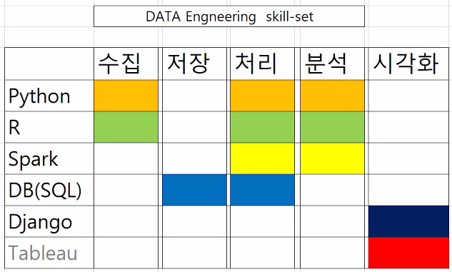
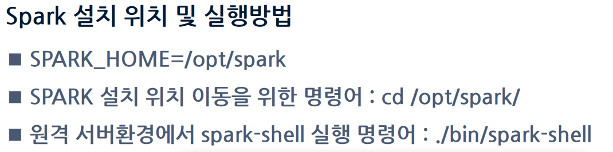

# AWS 서버 구축





- 서울 서버의 경우 과부하가 심하여 <u>**도쿄 리전 사용**</u>(실습이 아직 어려움)
- 서버 운영시간은 평일 ~18:30, 주말 추석 연휴, 멘토링 일정 없는 토요일과 일요일 사용 불가.

- 데이터 엔지니어 코드 : 665820218380 / 665820218380

- ID : de-e-lab13
- PW : multi1234

- putty 로그인시, ip, port 을 save 한뒤, auth 경로로 프라이빗키(ppk, 개별 다운로드) 지정 후 로그인
  - id : lab13 / lab30 	(패스워드는 필요 없음)
- 인스턴스 시작(자신과 맞는 이름) 후 새로고짐 진행


```
# 주피터 내에서

conda info --envs
conda activate python3 (권장)

# 백그라운드에서 실행 (입력시 port 는 개인번호 입력)
nohup jupyter-notebook --ip=0.0.0.0 --no-browser --port=8930 &

# 주피터 주소로 들어가기
 원격접속 쥬피터 노트북 접속 url : http://3.113.137.203:8930
 https://35.77.144.191:8930/
 
# 비밀번호 : multi1234!
```

- 백그라운드 실행 후 putty 는 종료해도 상관 없음
- 서버 접속 IP (putty) : 3.113.137.203
- 원격접속 쥬피터 노트북 접속 url : http://3.113.137.203:8913 / https://35.77.144.191:8930/
- python --version
- conda activate python3
- conda create -n test python=3.6 jupyter tensorflow

```
# 주피터 상에서
!pip install pandas

import pandas as pd
```

```
---------------------------------------------------------------
mysql -u user01 -p
---------------------------------------------------------------
```





------------------------------------------------------------

2번째 프로젝트 (3조 - 이현호, 권민찬, 김소영, 이세진)

## 파이썬 머신러닝 완벽가이드 (교재)


```
import pandas as pd

캐글에서 데이터를 받은 뒤 aws 에 업로드

titanic_df = pd.read_csv("./Data/titanic_train.csv")
```


## 리눅스 명령어

```
- pwd (print working directory)
현재 작업중인 디렉토리 정보 출력

$ pwd
/home/itholic
```


```
- cd (change directory)
경로 이동
절대 경로와 상대 경로로 이동 가능하다.

$ cd /home/itholic/mydir
$ pwd
/home/itholic/mydir


$ cd ..
$ pwd
/home/itholic
```


```
ls (list)
디렉토리 목록 확인

$ ls
testfile1  testfile2  testfile3


$ ls -l
total 0
-rw-r--r-- 1 itholic 197121 0 11월  6 22:08 testfile1
-rw-r--r-- 1 itholic 197121 0 11월  6 22:08 testfile2
-rw-r--r-- 1 itholic 197121 0 11월  6 22:08 testfile3


$ ls -a
./  ../  testfile1  testfile2  testfile3


$ ls -al
total 4
drwxr-xr-x 1 itholic 197121 0 11월  6 22:08 ./
drwxr-xr-x 1 itholic 197121 0 11월  6 22:08 ../
-rw-r--r-- 1 itholic 197121 0 11월  6 22:08 testfile1
-rw-r--r-- 1 itholic 197121 0 11월  6 22:08 testfile2
-rw-r--r-- 1 itholic 197121 0 11월  6 22:08 testfile3
```


```
cp (copy)
파일 혹은 디렉토리를 복사

디렉토리를 복사할때는 -r 옵션을 주어야함

$ ls
testdir/  testfile


$ cp testfile1 testfile_cp
$ ls
testdir/  testfile  testfile_cp


$ cp -r testdir testdir_cp
$ ls
testdir/  testdir_cp/  testfile  testfile_cp
```

```
mv (move)
파일 혹은 디렉토리 이동

실제로 원하는 위치로 이동할때도 사용하지만, 이름을 변경하는 용도로도 사용한다.

cp와는 달리 디렉토리를 이동할때도 별다른 옵션이 필요 없다.

$ ls
testdir/  testfile


$ mv testfile testfile_mv
$ ls
testdir/  testfile_mv


$ mv testfile_mv testdir/
$ ls
testdir/


$ ls testdir/
testfile
```

```
mkdir (make directory)
디렉토리 생성

-p 옵션을 주면 하위 디렉토리까지 한 번에 생성 가능

아래 예제중 ls -R 옵션은 디렉토리의 하위목록까지 전부 보여주는 옵션인데,

내 경우 실제로 많이 사용하진 않아서 ls 명령어에서 따로 설명하진 않았다.

mkdir -p 옵션 예제에서 실제로 하위디렉토리가 생성되었다는 것을 보여주기 위해 사용하였다.

$ ls
testfile


$ mkdir testdir
$ ls
testdir/  testfile


$ mkdir -p a/b/c/d/e/
$ ls -R a/
a/:
b/

a/b:
c/

a/b/c:
d/

a/b/c/d:
e/

a/b/c/d/e:
```

```
rm (remove)
파일이나 디렉토리를 삭제

디렉토리를 삭제할때는 r 옵션을 주어야 한다.

-f 옵션을 주면 사용자에게 삭제 여부를 묻지 않고 바로 삭제한다.

디렉토리를 삭제할 때에는 하위 디렉토리까지 모두 삭제되므로 유의하자.

$ ls
testdir/  testfile1  testfile2


$ rm -f testfile1
$ ls
testdir/  testfile2


$ rm -rf testdir/
$ ls
testfile2
```

```
touch
파일이나 디렉토리의 최근 업데이트 일자를 현재 시간으로 변경한다.

최근 업데이트 일자는 ls -l 명령을 통해 확인할 수 있다.

아래 예제에서 ‘11월 6 22:08’ 이라고 쓰여진 부분이다.

파일이나 디렉토리가 존재하지 않으면 빈 파일을 만든다.

$ ls -l
total 0
-rw-r--r-- 1 itholic 197121 0 11월  6 22:08 testfile1


$ touch testfile1
$ ls -l
total 0
-rw-r--r-- 1 itholic 197121 0 11월  6 22:43 testfile1


$ touch testfile2
$ ls -l
total 0
-rw-r--r-- 1 itholic 197121 0 11월  6 22:43 testfile1
-rw-r--r-- 1 itholic 197121 0 11월  6 22:44 testfile2
```

```
cat (concatenate)
cat 명령은 활용 방법이 꽤나 다양하다.

단순히 파일의 내용을 출력할 수도 있고,

파일 여러개를 합쳐서 하나의 파일로 만들 수도 있다.

그리고 기존 한 파일의 내용을 다른 파일에 덧붙일수도 있다.

새로운 파일을 만들때에도 사용된다.

file1, file2, file3 파일에는 각각 간단하게 숫자 1, 2, 3 이 적혀있다.

$ ls
file1  file2  file3


$ cat file1
1


$ cat file2
2


$ cat file3
3


$ cat file1 file2 > file1_2
$ ls
file1  file1_2  file2  file3


$ cat file1_2
1
2


$ cat file1 >> file2
$ cat file2
2
1


$ cat > file4
hello
world
(작성이 끝나면 ctrl +d 로 파일 저장)


$ cat file4
hello
world
```

```
head
파일의 앞부분을 보고싶은 줄 수만큼 보여준다.

옵션을 지정하지 않으면 파일 상위 10줄을 보여준다.

$ cat testfile
1
2
3
4
5
6
7
8
9
10
11
12
13
14
15


$ head -3 testfile
1
2
3
```

```
tail
파일의 뒷부분을 보고싶은 줄 수만큼 보여준다.

옵션을 지정하지 않으면 파일 하위 10줄을 보여준다.

참고로 -F 옵션을 주고 실행하면,

파일 내용을 화면에 계속 띄워주고 파일이 변하게되면 새로운 업데이트된 내용을 갱신해준다.

주로 실시간으로 내용이 추가되는 로그파일을 모니터링할때 유용하게 사용한다.

$ cat testfile
1
2
3
4
5
6
7
8
9
10
11
12
13
14
15


$ tail -3 testfile
13
14
15


$ tail testfile
6
7
8
9
10
11
12
13
14
15


$ tail -F testfile
6
7
8
9
10
11
12
13
14
15
(명령어가 종료되지 않고 계속 해당 화면을 출력하며, 파일 내용 변경시 자동으로 갱신해준다)
```

```
cat .profile | more
```

```
head .profile
```

```
find
특정 파일이나 디렉토리를 검색한다

사용법이 앞의 명령어들에비해 살짝 복잡하므로, 기본 사용법을 언급하자면 다음과 같다.

find [검색경로] -name [파일명]

파일명은 직접 풀 네임을 입력해도 되지만,

다음 예제처럼 특정 조건을 적용해 검색할수도 있다.

나같은 경우 주로 특정 확장자명을 찾기 위해 사용한다.

$ ls
dir1/  dir3/  file1  file3  picture1.jpg  picture3.jpg
dir2/  dir4/  file2  file4  picture2.jpg  picture4.jpg


$ find ./ -name 'file1'
./file1


$ find ./ -name "*.jpg"
./picture1.jpg
./picture2.jpg
./picture3.jpg
./picture4.jpg
확장자가 .jpg인 파일을 찾았다.

하지만 여기서 그치지 않고, 확장자가 .jpg인 파일만 찾아서 바로 삭제할수도 있다.

exec 옵션을 사용해 다음과 같이 처리하면 된다.

$ find ./ -name "*.jpg" -exec rm {} \;
$ ls
dir1/  dir2/  dir3/  dir4/  file1  file2  file3  file4
그리고 다음과 같이 -type 옵션을 주면, 디렉토리나 파일만 지정해서 검색할수도 있다.

$ find ./ -type d
./
./dir1
./dir2
./dir3
./dir4


$ find ./ -type f
./file1
./file2
./file3
./file4
다음과 같이 wc -l 옵션과 같이 사용하면,

특정 디렉토리에 find 조건에 맞는 결과 값이 몇개 존재하는지 숫자로 간편히 알아볼 수 있다.

$ find ./ -type f | wc -l
4
```

```
./   => 현재 디렉토리
```

```
# 현재 실행중인 파일 확인
ps -ef | more
```

참고 URL

https://towardsdatascience.com/i-have-been-using-pandas-for-3-years-here-are-the-8-functions-i-use-the-most-4e54f4db5656

- 오렌지3 - 가벼운 데이터 관리 툴


## 사이킷런으로 시작하는 머신러닝

```
사이킷런을 이용하여 붓꽃(Iris) 데이터 품종 예측하기
from sklearn.datasets import load_iris
from sklearn.tree import DecisionTreeClassifier
from sklearn.model_selection import train_test_split
import pandas as pd

# 붓꽃 데이터 세트를 로딩합니다. 
iris = load_iris()

# iris.data는 Iris 데이터 세트에서 피처(feature)만으로 된 데이터를 numpy로 가지고 있습니다. 
iris_data = iris.data

# iris.target은 붓꽃 데이터 세트에서 레이블(결정 값) 데이터를 numpy로 가지고 있습니다. 
iris_label = iris.target
print('iris target값:', iris_label)
print('iris target명:', iris.target_names)

# 붓꽃 데이터 세트를 자세히 보기 위해 DataFrame으로 변환합니다. 
iris_df = pd.DataFrame(data=iris_data, columns=iris.feature_names)
iris_df['label'] = iris.target
iris_df.head(3)
iris target값: [0 0 0 0 0 0 0 0 0 0 0 0 0 0 0 0 0 0 0 0 0 0 0 0 0 0 0 0 0 0 0 0 0 0 0 0 0
 0 0 0 0 0 0 0 0 0 0 0 0 0 1 1 1 1 1 1 1 1 1 1 1 1 1 1 1 1 1 1 1 1 1 1 1 1
 1 1 1 1 1 1 1 1 1 1 1 1 1 1 1 1 1 1 1 1 1 1 1 1 1 1 2 2 2 2 2 2 2 2 2 2 2
 2 2 2 2 2 2 2 2 2 2 2 2 2 2 2 2 2 2 2 2 2 2 2 2 2 2 2 2 2 2 2 2 2 2 2 2 2
 2 2]
iris target명: ['setosa' 'versicolor' 'virginica']
sepal length (cm)	sepal width (cm)	petal length (cm)	petal width (cm)	label
0	5.1	3.5	1.4	0.2	0
1	4.9	3.0	1.4	0.2	0
2	4.7	3.2	1.3	0.2	0
X_train, X_test, y_train, y_test = train_test_split(iris_data, iris_label, 
                                                    test_size=0.2, random_state=11)
# DecisionTreeClassifier 객체 생성 
dt_clf = DecisionTreeClassifier(random_state=11)

# 학습 수행 
dt_clf.fit(X_train, y_train)
DecisionTreeClassifier(class_weight=None, criterion='gini', max_depth=None,
            max_features=None, max_leaf_nodes=None,
            min_impurity_decrease=0.0, min_impurity_split=None,
            min_samples_leaf=1, min_samples_split=2,
            min_weight_fraction_leaf=0.0, presort=False, random_state=11,
            splitter='best')
# 학습이 완료된 DecisionTreeClassifier 객체에서 테스트 데이터 세트로 예측 수행. 
pred = dt_clf.predict(X_test)
from sklearn.metrics import accuracy_score
print('예측 정확도: {0:.4f}'.format(accuracy_score(y_test,pred)))
예측 정확도: 0.9333
```


## 주피터 노트북 mysql 연결

