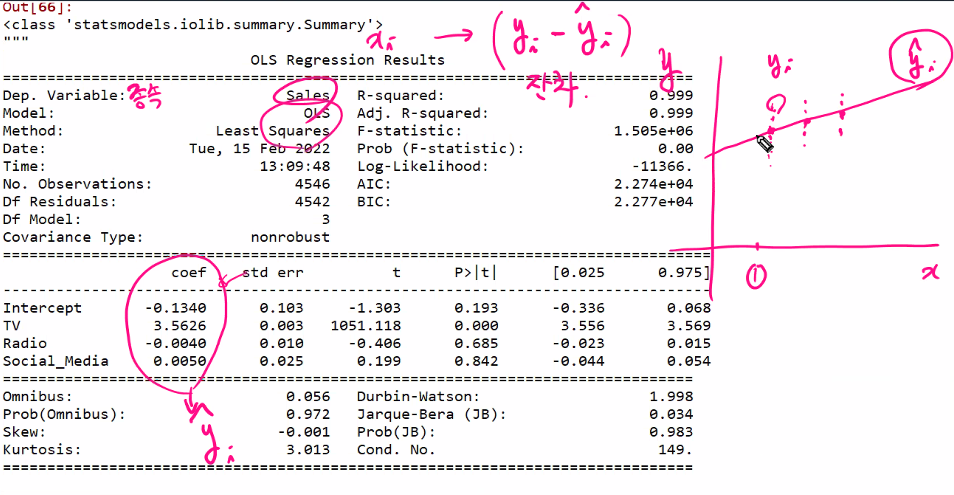

# ProDS 실기 특강 (박혜정 강사님)

hye3255@daum.net

2022-02-15


https://certi.multicampus.com/main

스파이더 환경(아나콘다3)

현재 합격률 30~40%


- ProDS , Associate (입문과정)
  - 과락은 별도로 없으며, 필기, 실기 평균 70점 이상이며, 자격증의 기한은 특별히 없음.
  - 데이터 전처리 능력은 필수
  - 문장을 보고 파악하며, 함수를 직접 찾아야 함.
- 머신러닝 알고리즘 
  - 단순회귀
  - 로지스틱 회귀(원리가 회귀이며, 본질은 분류분석 알고리즘)
  - Decision Tree


- 필기의 경우 25문제, 홈페이지에서 예시문제를 풀어볼 것.
- 실기는 아나콘다3 의 스파이더 사용

```
!pip install 

#%%	<---------- 셀(단락) 구분

```

- 스파이더에서 Variable Explorer 에서 변수 이름 확인 가능

- Ctrl + i 키 누르면 함수 설명이 나옴(도움말)

- Plots 창에 함수 보관 가능


- 지문에 대한 설명을 보고, 목적 확인 뒤, 데이터 세트에서 전처리를 해야함.
- 목적에 따라 구성이 되어 있음을 확인하고,
- 기술적인 면도 중요하지만, 마케팅의 목적을 확인하고, 비지니스 관점을 봐야함
- 이후 변수 이름이나, 목적 확인
- 원하는 셀 드래그 후, F9 키를 눌러 실행.
- 빨간불이 들어와 있다는 것은 현재 셀 실행중을 의미.(누르면 강제 종료)

```python
#%%

# =============================================================================
# 1. 데이터 세트 내에 총 결측값의 개수는 몇 개인가? (답안 예시) 23
# =============================================================================
data01.isna().sum().sum()

data01.columns
# ['TV', 'Radio', 'Social_Media', 'Influencer', 'Sales']

# [참고] 특정 열만 대상
data01[['TV', 'Radio', 'Social_Media']].isna().sum().sum()

# [참고] 결측치가 포함된 행
# data01.isna().any(axis=1).sum()   # True 가 결측치

# 답 : 26
```

```python
#%%

# =============================================================================
# 2. TV, Radio, Social Media 등 세 가지 다른 마케팅 채널의 예산과 매출액과의 상관분석을
# 통하여 각 채널이 매출에 어느 정도 연관이 있는지 알아보고자 한다. 
# - 매출액과 가장 강한 상관관계를 가지고 있는 채널의 상관계수를 소수점 5번째
# 자리에서 반올림하여 소수점 넷째 자리까지 기술하시오. (답안 예시) 0.1234
# =============================================================================

# 상관분석(문제상 가장 강한 상관관계) - 얼마나 선형관계를 가지고 있는가
# 수치적으로 보는 것을 요하고 있음.
# csv(공분산) x 변수에 대한 평균 y 변수에 대한 평균에 대한 편차
# cor(상관계수) -1 , 1 에 가까울수록 상관이 커짐.
# -0.2 < 0 < 0.2 => 무상관
# 가장 = y에 영향을 미치는 양과 음의 영향력을 가진 변수를 모두 찾아야함.
# 상관계수를 구한 뒤 절대값으로 변환.

# 정답 : 0.9995
round(data01.corr().drop('Sales')['Sales'].abs().max(),4)


# [참고]
data01.corr().drop('Sales')['Sales'].abs().max()
# Sales 행제거 이후 절대치

# 위치를 찾고 싶다면
data01.corr().drop('Sales')['Sales'].abs().idxmax()

# 상위 몇개를 찾고 싶다면
data01.corr().drop('Sales')['Sales'].abs().nlargest(2)

# 상위 몇개의 이름을 알고 싶다면
data01.corr().drop('Sales')['Sales'].abs().nlargest(2).index

# 0.6 이상의 상관계수 
data01.corr().drop('Sales')['Sales'].abs() > 0.6

# 0.6 이상의 이름
cor_dat = data01.corr().drop('Sales')['Sales'].abs()
cor_dat > 0.6

cor_dat = data01.corr().drop('Sales')['Sales'].abs()
cor_dat.index[cor_dat > 0.6]

```

 ```python
 # =============================================================================
 # 3. 매출액을 종속변수, TV, Radio, Social Media의 예산을 독립변수로 하여 회귀분석을
 # 수행하였을 때, 세 개의 독립변수의 회귀계수를 큰 것에서부터 작은 것 순으로
 # 기술하시오. 
 # - 분석 시 결측치가 포함된 행은 제거한 후 진행하며, 회귀계수는 소수점 넷째 자리
 # 이하는 버리고 소수점 셋째 자리까지 기술하시오. (답안 예시) 0.123
 # =============================================================================
 
 # 종속변수는 수치형, 이를 회귀분석이라 함.
 # 군집분석은 y값을 주어지지 않은 비지도 분석.
 # 회귀계수 즉, 기울기를 구하는 것. (절편을 포함해야 함)
 
 # 결측치가 포함된 행 제거.
 q2 = data01.dropna()
 
 # 회귀분석을 위한 대표적 패키지 2가지
 from sklearn.linear_model import LinearRegression
 from statsmodels.api import OLS, add_constant
 from statsmodels.formula.api import ols  # 추천
 
 # [풀이]
 # 변수를 만들어서 저장
 # LinearRegression
 var_list = ['TV', 'Radio', 'Social_Media']
 lm=LinearRegression(fit_intercept=True)
 # 세일즈를 제외한 나머지 변수를 가져와 주세요.
 lm.fit(q2[var_list], q2.Sales)
 
 # 오브젝트가 가지고 있는 어트리뷰트,목록들을 한번에 볼 수 있음.
 dir(lm)
 
 
 lm.intercept_ # 상수(절편)
 lm.coef_ # 회귀계수
 
 # 추천하는 방법 : ols y~x1+x2, p-value 도 나옴
 form1 = 'Sales~' + '+'.join(var_list)
 print(form1)
 # Sales~TV+ Radio+Social_Media
 # lm2 = ols(form1, data = q2)
 # lm3 = lm2.fit()
 lm2 = ols(form1, data=q2).fit()
 
 dir(lm2)
 
 lm2.summary()
 
 lm2.params.drop('Intercept')
 
 coef_value=lm2.params.drop('Intercept')
 coef_value.sort_values(ascending=False).index
 coef_value.sort_values(ascending=False).values
 
 # 답 : [3.562, 0.004, -0.003]
 
 # 참고 : p value 기분으로 변수 추출
 lm2.pvalues.index[lm2.pvalues < 0.05]
 
 
 # ----------------------------------------------------
 # [참고] 사용법, 기능 익히기
 
 # 리니어 클래스를 쓰기 위해서는 먼저 복제해야함
 lm=LinearRegression(fit_intercept=True)
 lm.fit(q2.TV, q2.Sales) # 싸이킥 런에서는 입력변수 x는 2차원 구조가 되어야함.
 
 data01['Sales'].shape
 
 # fit에 넣기 위해 넘파이 구조로 변경 후,reshape 진행
 data01['Sales'].values.reshape(-1,1)
 
 data01[['Sales']].shape
 ```



- 산점도를 통해
- 상관계수를 통해
- F-통계량(F-statistic)을 통해

- 회귀분석을 한다는 것은 미래 값을 예측하기 위함.

```
```


- 많은 내용의 강의, 집중을 해도 따라가기 힘들었으며, 비슷한 문제로 반복해주시면 더 좋을 것 같습니다. 문제해설, 강의에 대한 교안이 없어 필기를 하며 강의 내용을 듣고 이해를 해야하므로, 시간에 쫓기며 강의을 들어서 아쉬웠습니다.
- 학생과의 의사소통이 부족했고, 강의 중간중간 실습시간이 없어 아쉬웠으며, 수강생들이 전문적 용어를 이미 안다는 가정하에 수업이 진행되는 것 같습니다.
- 수업을 위한 환경구성에 많은 시간을 낭비하지 않아 좋았습니다.