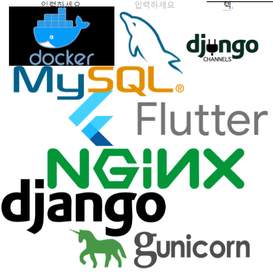

- WSGI : 웹서버 게이트웨이 인터페이스 (웹서버와 웹어플리케이션의 인터페이스를 위한 파이썬 프레임워크)
- WSGI -> gunicorn으로 바꾼 이유 :  앱과 웹서버를 구현하기 위해 변경함.
- NGINX : 웹서버(정적 파일 요청은 스스로 제어 가능)이며, http 캐시로도 쓰일수 있는 소프트웨어, 요청에 응답하기 위해 이벤트 기반 구조를 채택했고, 웹서버에서 많이 사용됨(아파치가 1등이나, NGNX 는 가벼움.)
- 아파치 서버는 서버에 요청이 들어오면 커넥션을 생성, 요청이 들어오면 새로운 커넥션을 생성(미리 만들어 놓기도 함), 개발하기 쉬운 장점이 있었음, 확장성도 좋음 (하나의 서버에서 해결하기 좋음), 다만 많은 요청이 들어오면 메모리부족 현상이 발생, CPU 부하 발생 -> 아파치 서버를 보완하기 위해 NGINX이 개발됨.
- 아파치에 요청이 들어오기전 엔진X 가 처리를 우선 적으로 함, NGINX 는 설정 파일을 읽고 워커 프로세스가 실제로 일을 하는 녀석임. 서버자원을 효율적으로 사용함. 시간이 오래 걸리는 작업은 쓰레드 풀을 만들어 처리함. CPU 컨텍스트 횟수를 줄임. 
- NGINX 가 채택한 Event -driven model, 이벤트 기반 구조, 아파치 구조와 큰 차이.

- Django Rest API ?
- gunicorn : websocket (NGINX <-> Django Rest API 를 연결해줌)

- daphne : websocket 서버 ( NGINX <-> Django Channels 를 연결해줌)
- 장고채널 < ---- Json -----> redis (메모리기반)
- 
- redis ,mysql
- yolov5 모델이 두가지?